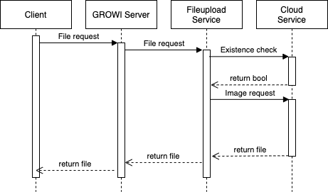
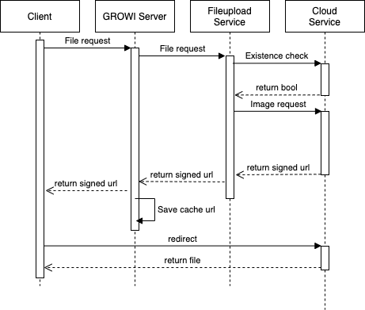

# File Upload Settings

[[toc]]

## Overview

This chapter introduces how to change the destination to upload attachment files.

## File upload method settings for attached files

The following can be used to save the attachment file of the GROWI page. See [here](/en/admin-guide/management-cookbook/app-settings.html#file-upload-settings) for details.

- Amazon S3
- Google Cloud Storage
- MongoDB
- Local File System

### Fixing file upload method for attached files with environment variables

::: danger
Warning: Changing the file upload destination will lose access to the previously uploaded files.
:::

When you want to fix the file upload method of the attached files with the environment variable, set the environment variable `FILE_UPLOAD_USES_ONLY_ENV_VAR_FOR_FILE_UPLOAD_TYPE` to `true`.

Also, set the value of the environment variable `FILE_UPLOAD` referring to the table below.

| File Upload Method | `FILE_UPLOAD` |
| --- | --- |
| Amazon S3 | `aws` |
| Google Cloud Storage | `gcs` |
| MongoDB | `mongodb` |
| Local File System | `local` |

If the file upload method is fixed by the environment variable `FILE_UPLOAD_USES_ONLY_ENV_VAR_FOR_FILE_UPLOAD_TYPE`, the function of selecting file upload method on the management page is disabled.

### Google Cloud Storage Settings with environment variable

If you don't set a value in the GCS Settings form in the File Upload Settings, use the default value below.

- API Key Json Path: `GCS_API_KEY_JSON_PATH`
- Bucket Name: `GCS_BUCKET`
- Name Space: `GCS_UPLOAD_NAMESPACE`

### Fixing GCS Settings with environment variable

If you want to fix the GCS settings with environment variables, set the environment variable `GCS_USES_ONLY_ENV_VARS_FOR_SOME_OPTIONS` to `true` and put a value in the above environment variable.  
If it is not set, null will be entered.

If pinning the GCS settings with the environment variable `GCS_USES_ONLY_ENV_VARS_FOR_SOME_OPTIONS` are enabled, the form values of the GCS settings in the file upload settings are disabled and cannot be changed.

## Attached File Size Limitation

The following environment variables allow you to set the maximum size of files that can be uploaded at one time and the cumulative size of attached files to all pages.  

In both cases, the unit is `bytes`. By default, both values are `Infinity` and the file size is not limited.

- `MAX_FILE_SIZE` : [The upper limit of uploadable file size (bytes)]
- `FILE_UPLOAD_TOTAL_LIMIT` : [The upper limit of the total size of attached files in DB (bytes)]

## How to refer to attached files

The attachment reference method has been changed from v4.2.3.

When using Amazon S3 or Google Cloud Storage, one of the following two methods can be chosen.
After v4.2.3, Redirect Mode is set as a default.

In case of the system requires advanced security, change to Relay Mode from [App settings of the Management page](/en/admin-guide/management-cookbook/app-settings.html#appsettings-tbd).

### Relay Mode (optional / default specification before v4.2.2)

<!-- https://dev.growi.org/5fd8424f2271ae00481ed2e8 -->

In Relay Mode, Cloud Service issues a signed URL for file references as a result of a request from the GROWI server.

This mode is the safest way to refer to files in terms of security since clients only communicate with GROWI server.

However, due to the characteristics of the relay, there is a disadvantage that the traffic between the GROWI server and Cloud Service increases depending on the number of images, capacity, and requests.

### Redirect Mode (default specification after v4.2.3)
<!-- https://dev.growi.org/5fd8424f2271ae00481ed2e8 -->

In Redirect Mode, Cloud Service issues a signed URL for file references as a result of a request from the GROWI server.
Also, the server notifies the client and prompts for a redirection.

The client accesses the signed URL and retrieves the image from Cloud Service directly.

Since each client receives images directly from Cloud Service without relaying traffic, the GROWI server is not overloaded with the number of images, capacity, and requests. This is the setting to achieve excellent performance.

In addition, when a signed URL is issued, a sufficiently short expiration period is set. That's why the specifications are well-balanced in terms of security.

The GROWI server caches signed URLs for the same amount of time as the expiration period (120 s by default).
The number of seconds to keep the cache can be set with [Environment Variables](/en/admin-guide/admin-cookbook/env-vars.html).

- AWS (S3)
  - `S3_LIFETIME_SEC_FOR_TEMPORARY_URL`
- GCP (GCS)  
  - `GCS_LIFETIME_SEC_FOR_TEMPORARY_URL`
