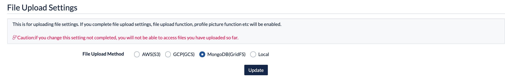
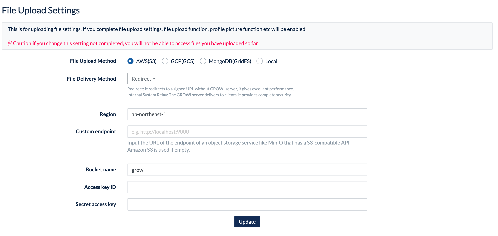
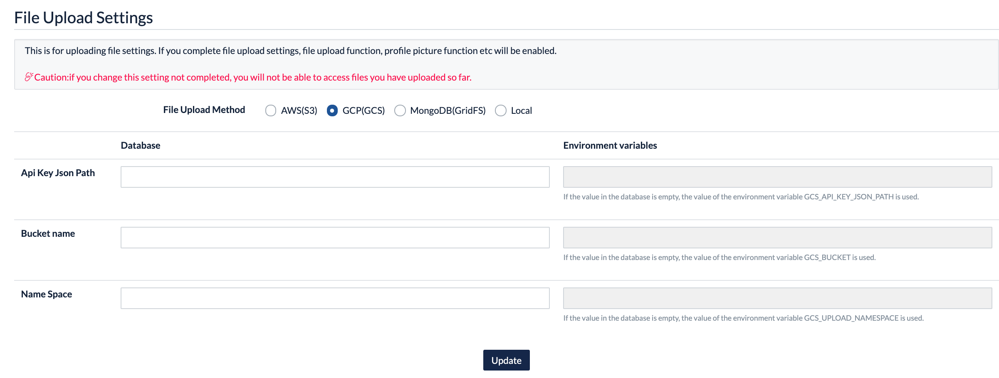

# AppSettings (TBD)

## Site URL Settings (TBD)

## App Settings (TBD)

## Email Settings (TBD)

## File Upload Settings

Make settings for uploaded attachments to the GROWI pages.

### Available file upload method

Please use the following upload systems to save attached files.

- Amazon S3
- Google Cloud Storage
- MongoDB
- Local File System

#### Upload to Amazon S3

Save files to Bucket of Amazon S3.

Please refer to [here](../management-cookbook/app-settings.html#get-aws-account-infomation) to set up Amazon S3.

#### Upload to Google Cloud Storage

Save files Bucket to Google Cloud Storage.

Please refer to [here](../management-cookbook/app-settings.html#set-up-google-cloud-storage) to set up Google Cloud Storage.

#### Upload to MongoDB

Save files to MongoDB specified as the file upload system of GROWI data with
 [GridFS](<https://docs.mongodb.com/manual/core/gridfs/>).

#### Upload to File Systems

Save files to the local file system of the GROWI server.

### Change file upload method

The file upload method can be changed in the file upload settings of the application settings.

::: danger
Please note that by changing the file upload method in the middle,
 the uploaded files so far will not be able to access.
:::

::: warning
If the file upload method is fixed by the environment variable
 `FILE_UPLOAD_USES_ONLY_ENV_VAR_FOR_FILE_UPLOAD_TYPE`, the file upload method cannot be changed here.
  See [here](../admin-cookbook/attachment) for more information.
:::

Settings are required when using Amazon S3 and Google Cloud Storage.
 Please refer to the following to complete it.

### Set up Amazon S3 Bucket

Here are the steps to set up a connection to Amazon S3 (Amazon Simple Storage Service).

#### Get AWS account infomation

1. Sign in to [AWS Management Console](https://aws.amazon.com/console/) and
 select [My Security Credentials](https://console.aws.amazon.com/iam/home?#/security_credentials)
from the dropdown that appears when clicking on the account name in the upper right corner of the navigation bar.
2. Expand "Access Key (Access Key ID and Secret Access Key)",
 create and store the Access Key ID and Secret Access Key for the AWS account.
3. Expand "Account ID" to comfirm the valid user ID.

#### Get or change permitions of Amazon S3 Bucket

1. Access to Amazon S3 [Dashboard](https://s3.console.aws.amazon.com/s3).
2. Check the region and bucket name of the S3 Bucket to register.
3. Select the S3 Bucket to register and open "Access Rights".
4. Click the edit button of "Block Public Access".
only uncheck "Block public access" through the New Access Control List (ACL) and save the changes.
5. If the valid ID of the AWS account that has been added to the "Bucket Owner Permissions" and the "Access Control List" doesn't match step 3 of the procedure "Getting AWS Account Information,
 add the account with the verified canonical ID to "Access Other AWS Accounts".
 In this case, please check all types of authority.

#### Resistor Bucket to GROWI

1. Please select AWS (S3) in the file upload settings of GROWI's app settings,
 and set the information confirmed in the above process.

2. In case of using other object storage services that have an S3-compatible API, such as MinIO,
Please enter the URL of the endpoint into the custom endpoint.

### Set up Google Cloud Storage

1. Please refer to [here](https://cloud.google.com/iam/docs/creating-managing-service-account-keys)
for more GCS information.

2. Select GCS in the file upload settings of GROWI app settings and set the information confirmed in the above process.

- Api Key Json Path: [The path to the JSON file for the GCP service account key (as seen from the GROWI root directory)]
- Bucket Name: [Bucket Name of GCS]
- Name Space: [Directory name for uploading files created in the bucket]

## Plugin Settings (TBD)
