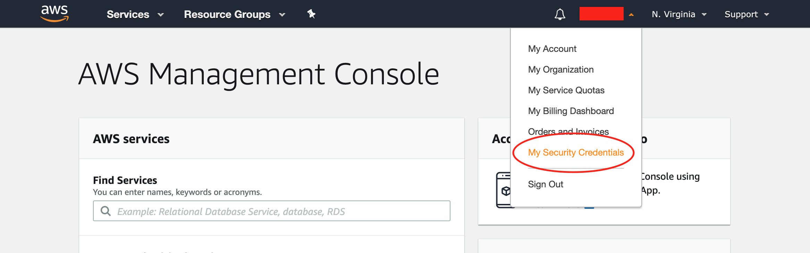

# AWS S3 Bucket Setting

[[toc]]

## Overview

This chapter introduces how to register AWS S3 Bucket to GROWI.

This setting makes uploading attachment files and profile images to AWS S3 Bucket available. If SMTP settings are not completed, e-mails will be sent via SES. You need to verify From e-mail address and production settings.
  
## How to Configure

### Get AWS Account Information

1. Sign-in [AWS Management Console](https://aws.amazon.com/console/), and click [My Security Credentials](https://console.aws.amazon.com/iam/home?#/security_credentials) in drop-down list of account information on the left side of the top bar.

2. In the Access keys (access key ID and secret access key) tab, create new access key.
3. In the Account identifiers tab, check your Canonical User ID.

### Get AWS S3 Bucket Information 

1. Access to [AWS S3 dashboard](https://s3.console.aws.amazon.com/s3).
2. Check region and name of S3 Bucket that you will register to GROWI.
3. Open Permissions page of S3 Bucket.
4. In the Block public access tab, click Edit button and turn off "Block public access to buckets and objects granted through new access control lists (ACLs)". Then, save changes.
5. In the Access Control List tab, if the Canonical User ID that you checked in Step 3 of [Get AWS Account Information](#get-aws-account-information) doesn't match Acceess for Bucket Owner, add the ID to the Access for Other AWS Account list with full permissions.

### Register your Bucket to GROWI
1. In App settings page (`/admin/app`), Input information of S3 Backet that you checked in Step 2 of [Get AWS S3 Bucket Information](#get-aws-s3-bucket-information).
2. If you use an object storage service like MinIO that has a S3-compatible API, input the endpoint URL in the Custom Endpoint form. If this form is empty, GROWI uses Amazon S3.
