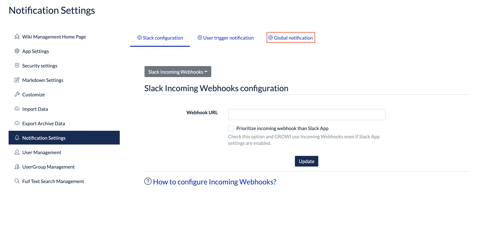
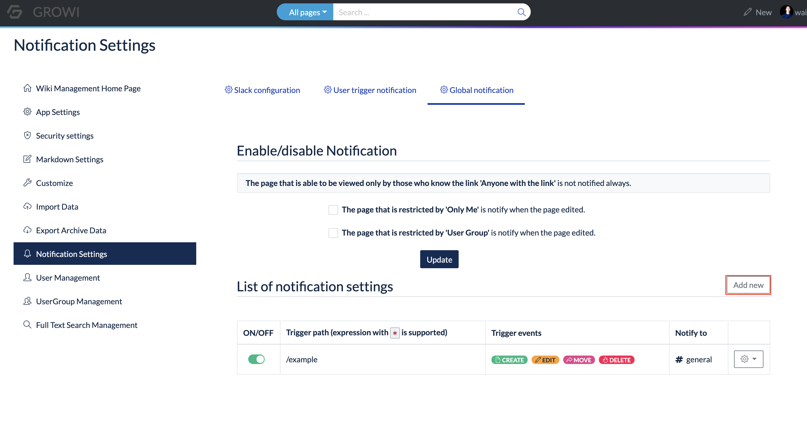
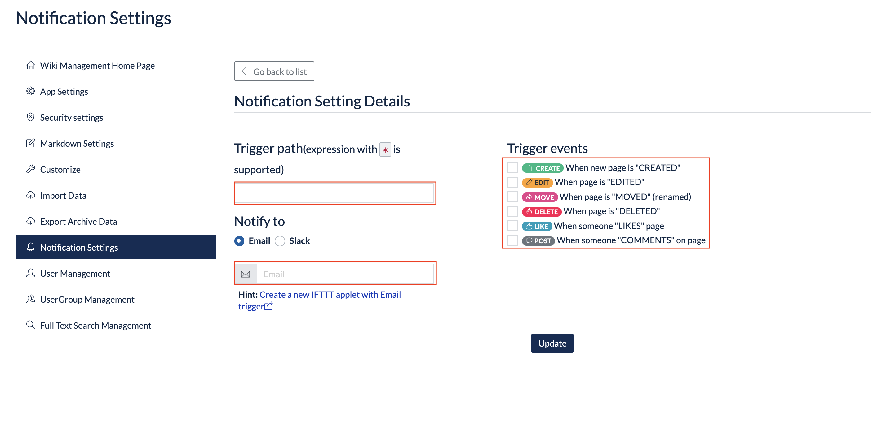

# External Notification

<!-- TODO: GW-5372 「Slack/Mattermost への通知」の内容を適切なタイトルの下に移動させる -->

## Type of notificaiton method

### Overview

### Slack bot

### Slack / Mattermost incoming webhooks

GROWI allows Slack notifications using Incoming Webhooks.
You can select one of the channels belonging to the workspace to be notified.

### IFTTT

GROWI can use IFTTT to send notifications to other web services.

- How to use IFTTT

  1. Configure the email settings from the [Application settings] of the GROWI Management page.
     - For details, see [Email Settings](en/admin-guide/management-cookbook/app-settings.html#email-settings-tbd).
  1. Click [Global notification] from [Notification settings] in the GROWI Management page.

     

  1. click **Add Notification Settings**.

     

  1. Set the trigger path.
  1. Create your original IFTTT applet from the link.
  1. Set the notification destination as **Email** and enter the Email that will be triggered by IFTTT.
     - Example: If you are using **email** for IFTTT, enter trigger@applet.ifttt.com.
  1. Set the trigger event on GROWI.

     

  1. Once you have entered the required information, press **Update** button.

## Types of notifications / How to set them

## Overview

## User Trigger Notification Settings

User Trigger Notification is a feature that allows GROWI users to be selectively notified when they edit a page or post a comment.
Basically, it is necessary to enter the channel to be notified each time, but it is possible to eliminate the input by setting a default pattern.

### How to set a default pattern

1. Access the Security Settings page (/admin/notification) in the Management page.
1. Open the User Trigger Notification tab.
1. Enter the pattern and channel name.

- The path to display the configuration value is called pattern. For example, if you set `/event/*`, only pages under event will show the default pattern you set.
- If you want to display the default pattern on all pages, please type `/*`.

### Check if the default pattern settings are reflected.

For example, if you set the pattern to `/event/*` and the channel to `general`, then
If you create a page with the path `/event/announcement`, it will go to edit mode with `general` set in the Slack notification form.

If the checkbox is enabled and the page is refreshed, the `general` channel will receive a Slack notification.

## Global Notification Setting

You can configure Slack notifications to be sent out when a GROWI user performs a certain action.

### How to set Global Notification

1. Access to the Security Settings page (/admin/notification) in the Management page.
1. Open the Global Notification tab.
1. Click the **Add Notification** button on the right side of the list of notification settings.
1. Configure various settings in Notification Advanced Settings.

- The notification mechanism detects events that occur in the trigger path.
  For example, if you set `/event/*`, Global Notification will be enabled on the pages under `/event`.

### Enable/disable notifications

Global Notifications will usually only send notifications for events in public pages.

Enabling the checkbox will detect events in the following pages.

- Pages that are restricted to 'Only me'.
- Pages that are restricted to 'Only inside the group'.

Pages that can only be viewed by people who know the link will always be unnotified, regardless of the setting.
