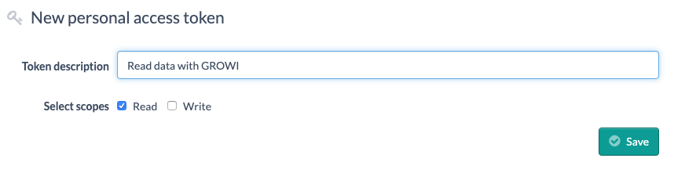
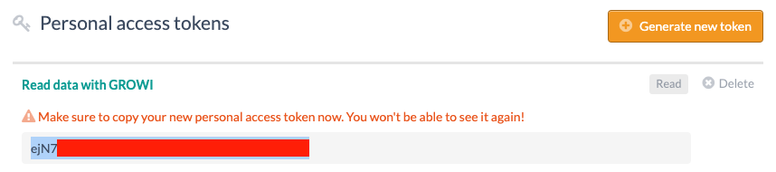

# Import Data

GROWI version 3.7.2 and later supports the ability to import data from GROWI, esa.io, and Qiita:Team.

## GROWI archive data import

Imports data from a GROWI archive data zip file.

:::warning

- GROWI archive data can only be imported from the same version of GROWI.

- In a new environment, the import operation should be performed by an Administrator whose username does not exist in the old environment.
:::

:::danger

- Since the data for the import function uses the file system, it may not work properly when the GROWI server is load balanced. For details, see [here](../admin-cookbook/loadbalance.md#cautionary-points-about-importing-exporting-data).
:::

### Importable data

The list of data that can be imported can be found in [Archive Data](./export.md#archivable-mongodb-collections). It is possible to select and import only the data collections you need from a single zip file.

### Modes

There are three different rules for importing duplicate data, one for each collection.

- Insert
  - Import only if there is no data with the same name, and skip if there is.
- "Upsert"
  - If there is data that can be determined to have the same name, that data will be overwritten.
- Flash and Insert
  - If there is data with the same name, the existing data will be completely deleted before importing.
  - This mode is not selectable in the User collection.
  - The Config collection can only be selected in this mode.
    - If you import the Config collection, you will need to restart the server.

### How to import

1. Log in to GROWI with an administrator account and go to [Admin/Import Data] (`/admin/importer`). Make sure that the `username` of the administrator user performing the import operation does not exist in the old environment.
2. Upload the GROWI archive file by clicking "Import GROWI Archive".
3. Check the collections you want to import and select a mode.
4. After running the import, the results will be displayed for each collection.

- Inserted: New data added by the import.
- Modified: Data updated by the import
- Failed: Data that failed to be imported

*If you have imported the Config collection, you will need to restart the server.

## Import Data From esa.io

Importing data from esa.io using [API v1](https://docs.esa.io/posts/102) published by esa.io.

### Import Target

| esa.io     |     | GROWI      |
| ---------- | --- | ---------- |
| Articles   | →   | Pages      |
| Category   | →   | Page Path  |

:::danger

- User data will not be imported.
- If a page with the same name already exists in the destination path of GROWI, the page will be skipped.
- If the page's path can't be created in GROWI, the page will be skipped.
- The following metadata on the esa.io page is not imported:
  - The user who created the page and the user who last updated the page.
    - On GROWI, the current user will be overwritten by the user who executed the import.
  - Page creation date and time, the date and time of the page's last update.
    - On GROWI, the previous date and time will be overwritten by the date and time when the import is executed.
  - star
  - watch
  - tag
  - comment
  - WIP/Ship it
  - revisions and change log
- Attachment will be displayed by accessing the attachment URL managed by esa.io. Therefore, if the file is deleted on esa.io, the page will be broken.
:::

### Import Method

1. Log in to esa.io with owner account and access [Settings] → [User Settings] → [Applications] from the tab on the left.
2. Click the [Generate new token] under [Personal access tokens] to issue a token to access esa.io from GROWI.
3. Enter the token, check the [Read] box under [Select scopes]  then click [Save].

  

4. Save the generated token.

  

5. Log in to GROWI with an administrator account and go to [Admin/Data Import] (`/admin/importer`).
6. In [Import from esa.io] section, enter the esa.io Team name and Access token (the token saved earlier) then update.
7. Execute [Test connection to esa], If `Test connection to esa success.` displayed then the connection is successful.
8. Execute [Import] while connected to esa.io, and the page import will start.

## Import Data From Qiita:Team

Importing data from Qiita:Team using [API v2](https://qiita.com/api/v2/docs) published by Qiita:Team.

### Import Target

| Qiita:Team     |     | GROWI      |
| ----------     | --- | ---------- |
| Articles       | →   | Pages      |

:::danger

- User data, project data and group data are not imported.
- If a page with the same name already exists in the destination path of GROWI, the page will be skipped.
- If the page path can't be created in GROWI, the page will be skipped.
- The following metadata on Qiita:Team will not be imported:
  - The user who created the page and the user who last updated the page.
    - On GROWI, the current user will be overwritten by the user who executed the import.
  - Page creation date and time, the date and time of the page's last update.
    - On GROWI, the previous date and time will be overwritten by the date and time when the import is executed.
  - Reaction to a page.
  - Public Range, Collaborative Edit Mode
  - Tag
  - Comment
  - Edit History
- Attachment will be displayed by accessing the attachment URL managed by Qiita:Team. Therefore, if the file is deleted on Qiita:Team, the page will be broken.
:::

### Import Method

1. Log in to Qiita:Team with the owner account. Click the user icon in the upper right to access [Settings] from the dropdown menu.
2. Open the [Applications] tab on the user account, and under [Personal access token], click [Generate new token]
3. Enter [Description], check [read_qiita_team] in [Scopes], then click [Generate token].

4. Save the generated token.
5. Log in to GROWI with an administrator account and go to [Admin/Data Import] (`/admin/importer`).
6. In [Import from Qiita:Team] section, enter the Qiita:Team Team name and Access token (the token saved earlier) then update.
7. Execute [Test Connection], If `Test connection to qiita:team success.` is displayed then the connection is successful.
8. Execute [Import] while connected to Qiita:Team, and the page import will start.
