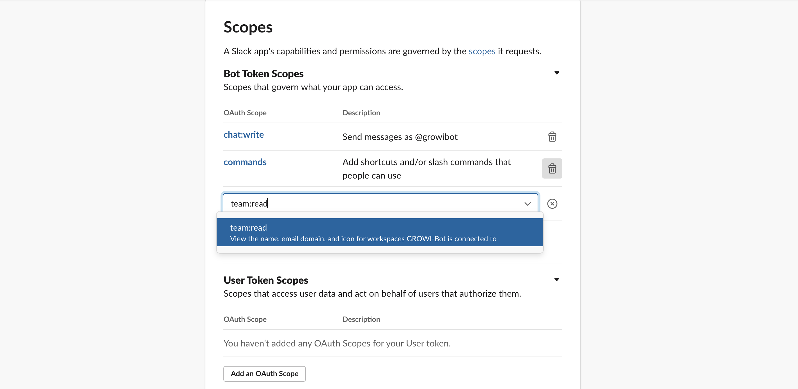
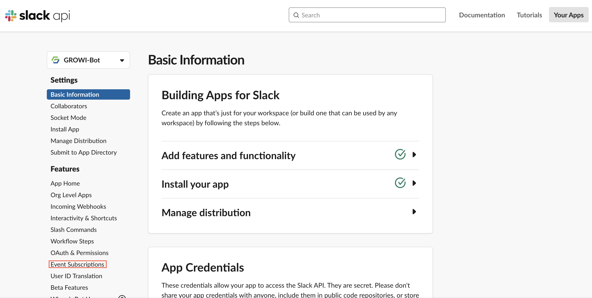
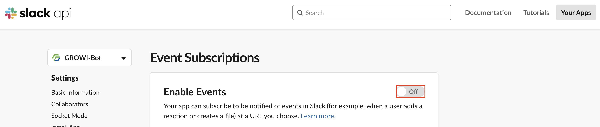
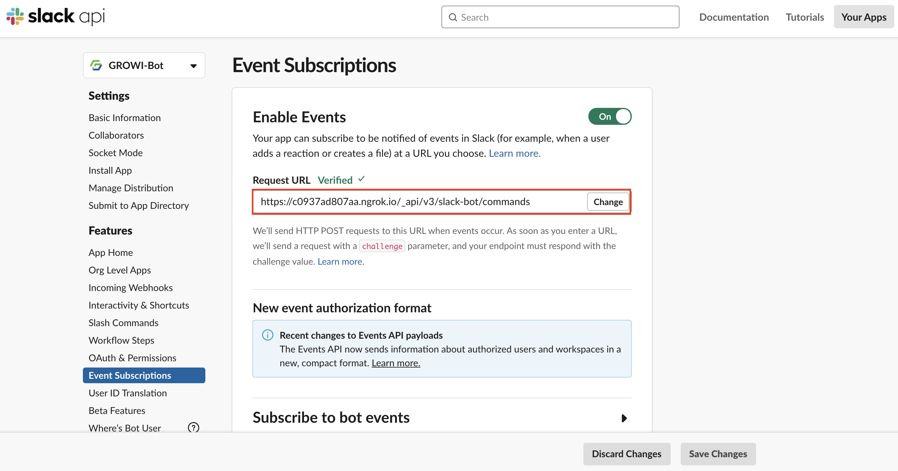
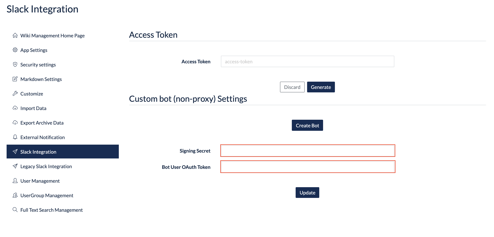

# Slack Integration

## Overview

GROWI provides two methods of Slack integration: 1. GROWI bots and 2. Incoming Webhooks.

### 1. GROWI bots

GROWI bots are Slack Apps developed by the GROWI development team. By installing it in Slack workspaces, you can not only receive notifications from GROWI, but also execute full-text searches from chats, summarize conversations, and use various other functions.

#### Official bot 【Recommended】

Official bot is a free GROWI bot provided and operated by the GROWI development team. It is available at [slack app directory](https://wsgrowi.slack.com/apps) and anyone can use this service.

【Diagram】

#### Custom bot without proxy

Custom bot without proxy allows you to create a Slack bot and link it to your GROWI so that you can use some of the GROWI features from Slack.

【Diagram】

#### Custom bot with proxy

Custom bot with proxy allows you to create a Slack bot, set up and configure a proxy server, and use some of the features of GROWI in the same way as the Official bot.

【Diagram】

### 2. Incoming Webhooks

<!-- TODO Imple link after https://youtrack.weseek.co.jp/issue/GW-5452 -->

Incoming Webhooks is another way to do Slack integration, but unlike GROWI bots, it is focused on notifications to Slack. It does not have many features like GROWI bots, such as full-text search from chat, but it is easier to set up. For more information, please click here.

<!-- [通知の種類/設定方法](/ja/admin-guide/management-cookbook/external-notification.html#通知の種類-設定方法). -->

### Custom bot without proxy Settings

To deploy a custom bot without proxy in your Slack workspace, you need to create and edit a Slack app. The steps are as follows.

#### Before creating Slack app

Start up the GROWI main server to respond to the Event Subscription described below.
#### Create a Slack app

1. Go to the [App Page](https://api.slack.com/apps) of the Slack API and click **Create New App** button.

   

1. In the [Create a Slack App] section, ① input the name of your app in the [App Name] field and ② select the workspace where you want to add the GROWI bots in the [Development Slack Workspace].

1. Click the [Create App].

   

#### Scope settings

1. In the Slack App you created, go to **Features** and click **OAuth & Permissions**.
   
1. Click the **Add an OAuth Scope** button.
   
1. Select **commands**,**chat: write** and **team:read**.
   
   
   

1. When the following OAuth Scope is displayed, the scope setting will be completed.
   

#### Request URL settings

- Set Request URL of **Event Subscriptions**

  1. In the Slack App you created, go to **Features** and click **Event Subscriptions**.
     

  1. Turn on the button to the right side of **Enable Events**.
     

  1. Input the Request URL as follows.

     - https:// your GROWI domain /\_api/v3/slack-bot/commands
       - e.g. <https://example.com/_api/v3/slack-bot/commands>

     

  1. When you are done, click **Save Changes** button.

- Set Request URL of **Interactivity & Shortcuts**

  1. In the Slack App you created, go to **Features** and click **Interactivity Shortcuts**.
     

  1. Turn on the button on the right side of **Interactivity**.
     

  1. Input the Request URL as follows.

     - https:// your GROWI domain /\_api/v3/slack-bot
       - e.g. <https://example.com/_api/v3/slack-bot/interactive>

     

  1. When you are done, click **Save Changes** button.

#### Create Slash Commands

1. In the Slack App you created, go to **Features** and click **Slash Commands**.

<!--  -->

2. Click the **Create New Command** button.

- Input /growi for Command.
- For RequestURL, input the same Request URL you set above.
- Short Description is also required, so please input an appropriate description.
- The Usage Hint is optional, so please input it accordingly.
- The Escape channels, users, and links sent to your app is optional, so input it accordingly.
- When you are done, click **Save** button.

#### Install the Bot in your Slack workspace

1. In the Slack App you created, go to **Settings** and click **Basic Information**.
1. Click the **Install your app**.
   
1. Click the **Install to Workspace**.
   
1. On the destination screen, Click the **Allow** button.
   
1. If you see a green check mark to the right of Install your app, the installation is complete in your workspace.
   
1. Invite the channel you want to use the GROWI bot on using @example.
   
   

#### Signing Secret and Bot User OAuth Token settings

Before setting Signing Secret and Bot User OAuth Token, check the values.

**How to check Signing Secret**

1. In the Slack App you created, go to **Settings** and click **Basic Information**.

   

1. Push **show** button for **Signing Secret** in App Credentials to confirm.
   

**How to check Bot User OAuth Token**

1. In the Slack App you created, go to **Settings** and click **OAuth and Permissions**.
   
1. Check **Bot User Oauth Token** in **OAuth Tokens for Your Team**.

   

There are two ways to set Signing Secret and Bot User OAuth Token: 1. Set them in the Management page 2. Set them with environment variables. It is easier to set them in the Management page. Also,
in case that you input values in both the Management page and environment variable, the Management page value will take a priority. That's why settings in the Management page is recommended.

1. How to set them in Management page

Click on Slack integration in the Management page, input Signing Secret and Bot User OAuth Token, and click **Update**.

<!-- 画像は後で差し替えます -->

1. How to set them with environment variables

Assign `SLACK_SIGNING_SECRET` and `SLACK_BOT_TOKEN` with the values you checked.

### Official bot settings

### Custom bot with proxy settings

<!-- TODO: GW-5372 「Slack/Mattermost への通知」の内容を適切なタイトルの下に移動させる -->

### Incoming webhook settings

<!-- TODO: GW-5372 「Slack/Mattermost への通知」の内容を適切なタイトルの下に移動させる -->

Set up a Slack workspace for notifications.

1. Access the security settings page (/admin/notification) in the Management page.
1. Input the required information for the Slack Incoming Webhooks setting, and click the Update button.

- **Webhook URL**  
  You can get it at [Incoming Webhooks](https://slack.com/services/new/incoming-webhook).

### Check if the settings are reflected

After the above settings, a Slack notification form will be added to the edit mode screen of the page.

When a page is saved or updated, a notification will be sent to the Slack channel you inputted.  
This notification fucntion is called as **User Trigger Notification** in GROWI.

<!-- TODO Imple link after https://youtrack.weseek.co.jp/issue/GW-5452 -->

For details on how to configure User Trigger Notification, please refer to here.

<!-- [通知の種類/設定方法](/ja/admin-guide/management-cookbook/external-notification.html#user-trigger-notification-設定). -->

## What you can do with a Slack bot ?

### Full-text search in a workspace

1. If you input /growi search [keyword(s)], the search results will be displayed.
   - e.g. /growi search example
     
   - Search results.
     
   - Click the **Next** button to display the next search result.
     
   - Click the **Share** button to share it within the channel.
     

<!-- ### 複数ワークスペースの横断検索 (TBD) -->

<!-- ### Slack ログの記録 (TBD) -->
