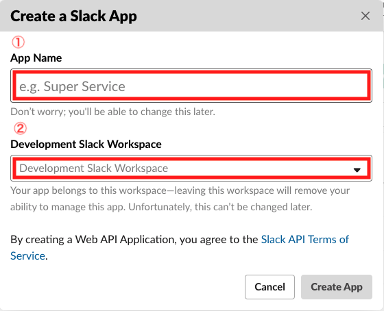
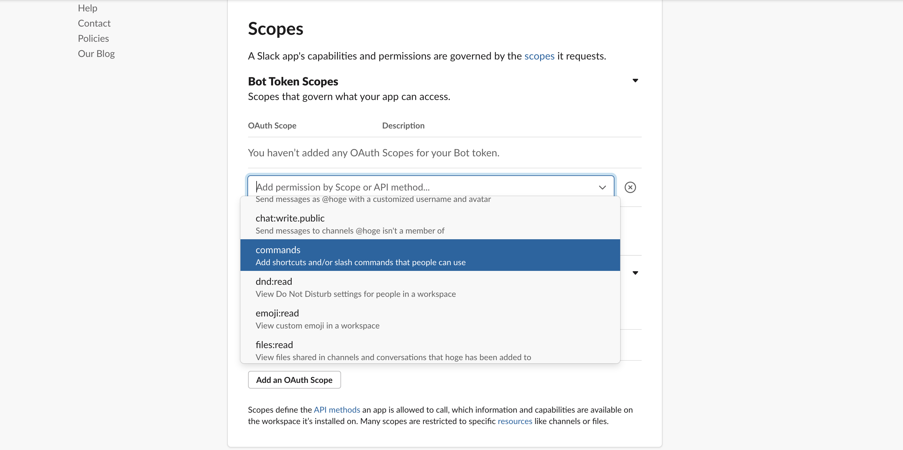
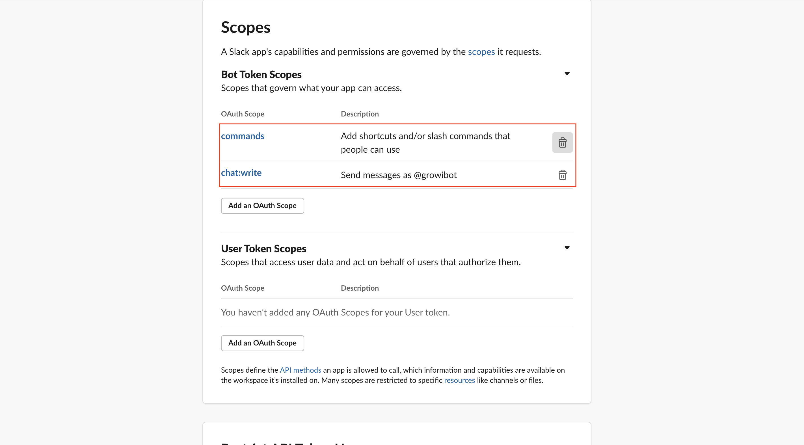
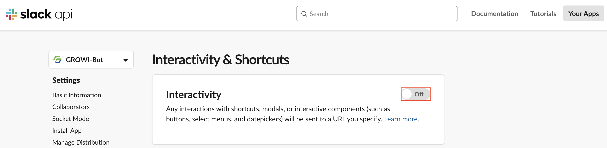

# Slack Integration

## Overview

GROWI provides two methods of Slack integration: 1. GROWI bots and 2. Incoming Webhooks.

### 1. GROWI bots

The GROWI bots is a Slack App developed by the GROWI development team. By installing it in Slack workspaces, you can not only receive notifications from GROWI, but also execute full-text searches from chats, summarize conversations, and use various other functions.

#### Official bot 【Recommended】

::: danger
This service has not been implemented yet.
:::

The Official GROWI bot is a free GROWI bot provided and operated by the GROWI development team.It is available at [slack app directory](https://wsgrowi.slack.com/apps) and anyone can use this service.

<!--以下の図は暫定的なものです。https://youtrack.weseek.co.jp/issue/GW-5421 で差し替えます。-->

#### Custom bot(non-proxy)

Custom bot(non-proxy) allows you to create a Slack bot and link it to your GROWI so that you can use some of the GROWI features from Slack.

<!--以下の図は暫定的なものです。https://youtrack.weseek.co.jp/issue/GW-5421 で差し替えます。-->

#### Custom bot(with-proxy)

::: danger
This service has not been implemented yet.
:::

Custom bot(with-proxy) allows you to create a Slack bot, set up and configure a proxy server, and use some of the features of GROWI in the same way as the Official bot.

### 2. Incoming Webhooks

<!-- TODO Imple link after https://youtrack.weseek.co.jp/issue/GW-5452 -->

Incoming Webhook is another way to do Slack integration, but unlike GROWI bots, it is focused on notifications to Slack. It does not have many features like GROWI bots, such as full-text search from chat, but it is easier to set up. For more information, please click here.

<!-- [通知の種類/設定方法](/ja/admin-guide/management-cookbook/external-notification.html#通知の種類-設定方法). -->

### Custom bot (non-proxy) Setting

To deploy a custom bot (non-proxy) in your Slack workspace, you need to create and edit a Slack app. The steps are as follows.

#### Create Slack app

1. Go to the [App Page](https://api.slack.com/apps) of the Slack API and click **Create New App** button.

   

2. In the [Create a Slack App] section, ① input the name of your app in the [App Name] field and ② select the workspace where you want to add the GROWI bots in the [Development Slack Workspace].

3. Click the [Create App].

   

#### Set the scope

1. In the Slack App you created, go to **Features** and click **OAuth & Permissions**.
   
1. Click the **Add an OAuth Scope** button.
   
1. Select **commands** and **chat: write**.
   
   

1. When the following OAuth Scope is displayed, the scope setting will be completed.
   

#### Set each Request URL

- Set Request URL of **Event Subscriptions**

  1. In the Slack App you created, go to **Features** and click **Event Subscriptions**.
     

  1. Turn on the button to the right side of **Enable Events**.
     

  1. Input the Request URL as follows.

     - https:// your GROWI domain /\_api/v3/slack-bot
       - 例 https://example.com/_api/v3/slack-bot

     

  1. When you are done, click **Save Changes** button.

- Set Request URL of **Interactivity & Shortcuts**

  1. In the Slack App you created, go to **Features** and click **Interactivity Shortcuts**.
     

  1. Turn on the button on the right side of **Interactivity**.
     

  1. For the Request URL, input the same one you inputted earlier.
     

  1. When you are done, click **Save Changes** button.

#### Create Slash Commands

1. In the Slack App you created, go to **Features** and click **Slash Commands**.

<!--  -->

2. Click the **Create New Command** button.

- Input /growi for Command.
- For RequestURL, input the same Request URL you set above.
- Short Description is also required, so please input an appropriate description.
- The Usage Hint is optional, so please input it accordingly.
- The Escape channels, users, and links sent to your app is optional, so input it accordingly.
- When you are done, click **Save** button.

#### Install the Bot in your Slack workspace

1. In the Slack App you created, go to **Settings** and click **Basic Information**.
1. Click the **Install your app**.
   
1. Click the **Install to Workspace**.
   
1. On the destination screen, Click the **Allow** button.
   
1. If you see a green check mark to the right of Install your app, the installation is complete in your workspace.
   
1. Invite the channel you want to use the GROWI bot on using @example.
   
   

### Set the Official bot

### Set the Custom bot (with-proxy)

<!-- TODO: GW-5372 「Slack/Mattermost への通知」の内容を適切なタイトルの下に移動させる -->

### Set the Incoming webhook

<!-- TODO: GW-5372 「Slack/Mattermost への通知」の内容を適切なタイトルの下に移動させる -->

Set up a Slack workspace for notifications.

1. Access the security settings page (/admin/notification) in the Management page.
1. Input the required information for the Slack Incoming Webhooks setting, and click the Update button.

- **Webhook URL**  
  You can get it at [Incoming Webhooks](https://slack.com/services/new/incoming-webhook).

### Check if the settings are reflected.

After the above settings, a Slack notification form will be added to the edit mode screen of the page.

When a page is saved or updated, a notification will be sent to the Slack channel you inputted.  
This notification fucntion is called as **User Trigger Notification** in GROWI.

<!-- TODO Imple link after https://youtrack.weseek.co.jp/issue/GW-5452 -->

For details on how to configure User Trigger Notification, please refer to here.

<!-- [通知の種類/設定方法](/ja/admin-guide/management-cookbook/external-notification.html#user-trigger-notification-設定). -->

## What you can do with a Slack bot ?

### Full-text search in the workspace

1. If you input /growi search [keyword(s)], the search results will be displayed.
   - e.g. /growi search example
     
   - Search results.
     
   - Click the **Next** button to display the next search result.
     
   - Click the **Share** button to share it within the channel.
     

<!-- ### 複数ワークスペースの横断検索 (TBD) -->

<!-- ### Slack ログの記録 (TBD) -->
