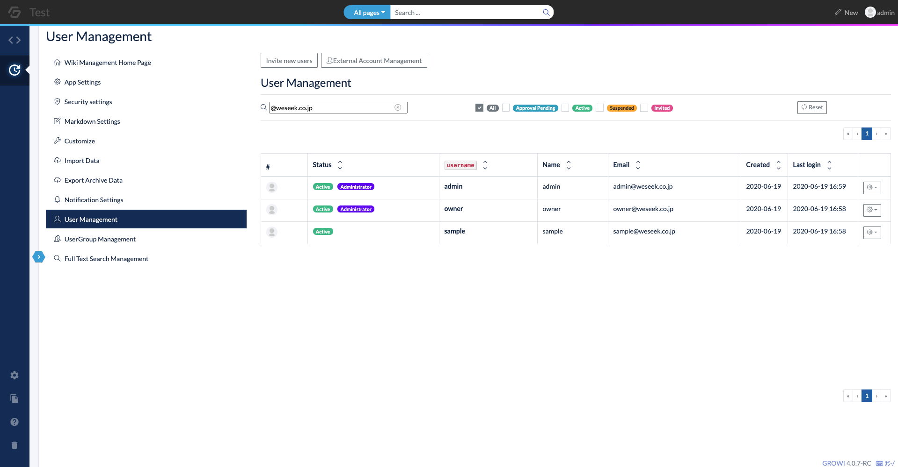
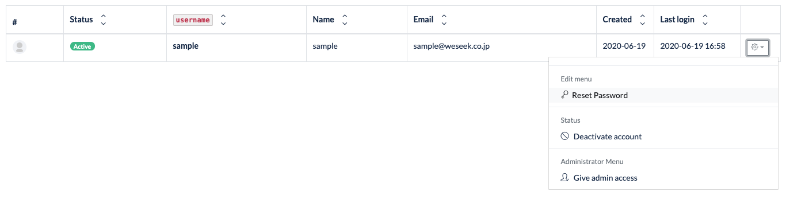
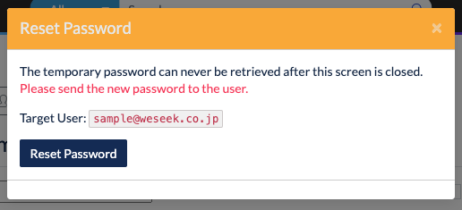
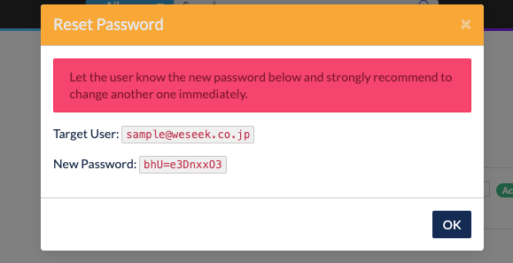
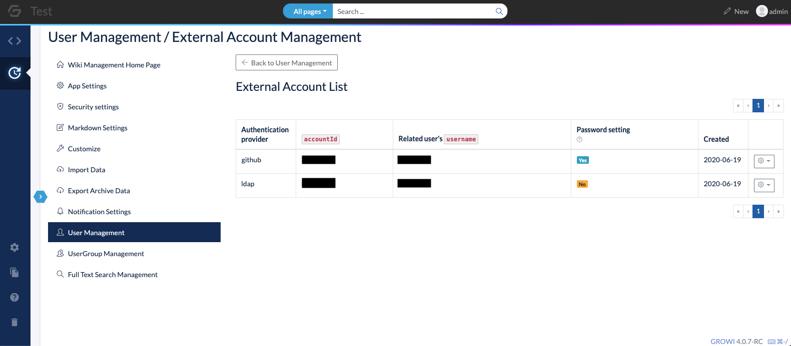

# User Management

Registered users can be managed from the User Management of the Admin page.

## User Table

Displays a list of users. Use the search filter to narrow down the users by username, name, email address, and status.

This table can also be used to reset passwords, delete or suspend accounts, and change access privileges to the admin page.

### Status

- Active
  - Authorized user
  - If the user has access to the admin page, the user will have the "Administrator" status.
- Approval pending
  - User pending approval
  - Accounts in this status cannot log in.
  - If the registration restriction is set to "Restrict" in the ID/Password authentication mechanism setting in the security settings, the newly registered user will be in this status until the administrator approves the account.
  - In order for the account to be valid, "Approve" must be executed in the same table.
- Suspended
  - A user who has been suspended by the administrator.
  - An account in this status will not be able to log in.
  - Users who have been "Suspended" in the User Settings table on the administration page will be in this state.
  - In order to activate the account, "Approve" must be executed in the same table.
- Invited
  - Users who have been invited by the administrator.
  - This status will remain until the user logs in for the first time with the email address and password used at the time of invitation.
  
### Operations

#### Reset Password

A user's password can be reset from the drop-down menu on the right side of the user table.

When the "Reset Password" from the drop-down menu has been clicked, a modal with the target user for password reset will be displayed.

When the "Reset Password" button on the modal is pressed, a new password will be issued. Tell the user to log in using this password, and then reset the password from the password settings in the user settings ( `/me` ).

#### Granting administrative privileges

Users with administrator status can access the administration screen and perform various settings.

Administrative privileges can be granted or removed from the drop-down menu on the right side of the user table.

#### Account Approval and Suspension

Accounts that are pending approval or suspended can be granted approval. Approving an account allows the user to log in with that account.

Accounts that have been approved can also be suspended. If the account is suspended, the account information will remain, but the user will not be able to log in. The administrator has to reapprove in order for that user to log in.

#### Delete account

Only accounts that are not in Active status can be deleted. Please note that deleted users cannot be restored.

#### Temporary issuance of a new user

A new user can be temporarily issued by specifying an email address.

Click the **Provisional New User** button on the User Management screen to open a modal.  
Enter the email address of the user to be issued. Multiple email addresses can be specified using line breaks.

When the **issue** button is clicked, a new user will be issued and a temporary password will be assigned to each user.  
The new user can complete the registration by logging in using the email address and temporary password.

If **Send invitation email** is enabled and issued, an invitation email will be sent to the specified email address.  
To send an invitation email, the email settings must have been completed in the application settings.

## Manage external accounts

This function manages external accounts. An external account is an information that is associated with a GROWI account when it is registered using the external OAuth. When a GROWI account is deleted, the external account associated with it is also deleted automatically.

If the password for the GROWI account is not set, the password setting status is displayed as "Not set". The GROWI account associated with the external account in this state cannot log in using regular ID and password. Log in with the external account and set the password from the personal settings screen, or let the administrator reset the password to change the status to "Set".

External accounts can be deleted from the table in the External Account Management. Deleting an external account will not delete the GROWI account.
