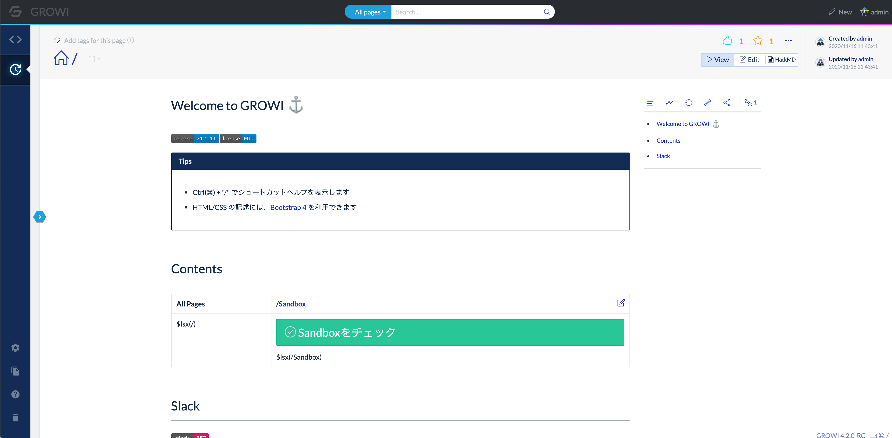
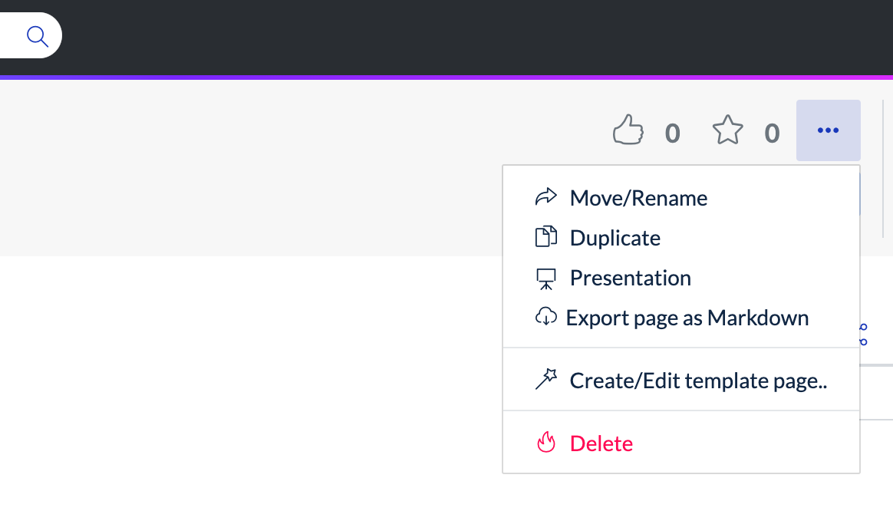
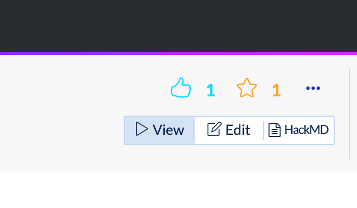
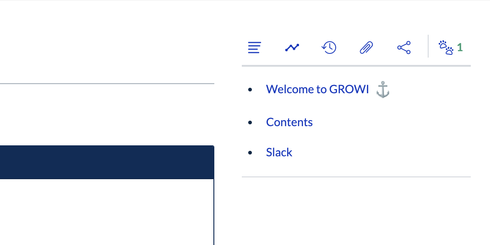

# Upgrading to GROWI v4.2.x

The content width of the page has been adjusted to be narrower and centered.  
Along with that, the location of the content related to the page has changed.

## Upgrade to MongoDB v4.4

::: warning
This is what you need to do to upgrade your GROWI version to v4.2.x.
:::

[See here](../admin-cookbook/upgrade-mongodb.md) to upgrade Mongo.

## Change the location of content related to the page

::: tip
There are no major changes.  
You can control the number of items displayed in the list on the admin page.
:::

### Operations about the page

You can operate the page by pressing the button on the upper right.  
e.g. rename, duplicate, delete

### Switching editor mode

When changing the edit mode,  
it was changed from switching by tab to switching by button.

### View information related to the page

You can display the content information by clicking the icon.

## Check before Upgrading

- [x] Check if MongoDB has been upgraded to v4.4.
- [x] Inform your GROWI users of the layout changes.
