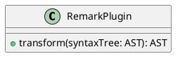

# Upgrading to GROWI v6.0.x

In v6.0, drastic changes have been made to the application framework and Markdown rendering part.
There are also multiple specification changes and deprecated features.


::: warning
Upgrading from v5.x or later to v6.x should be ensure stable operation, but there are many changes that affect users. Please make sure to fully inform your users of the changes before and after the upgrade.
:::


## Table of Contents

[[toc]]


## For Admin

### Downgrading to v5.x Series

There is nothing special to note when downgrading to v5.x series.


### [Beta] Plugin Mechanism

Added new plugin mechanism.  
Now you can see published plugins on [the official site](https://growi.org/plugins).

As of 2023.01, some features are not implemented.

- Redundancy support

  <ContextualBlock context="docs-growi-org">

  - GROWI itself [support redudancy](../admin-cookbook/loadbalance.html), but the plugin do not support.

  </ContextualBlock>

  <ContextualBlock context="help-growi-cloud">

  - GROWI itself support redudancy, but the plugin do not support.

  </ContextualBlock>

- Specifying a branch other than main
- Specify a URL other than GitHub
- One-Click Upgrade Button

### [Specification Change] CDN Usage

Up to v5.x, we had been releasing two versions of the official container image in parallel: the default version, which makes heavy use of CDN, and the nocdn version, which have minimal use of CDN.

Since v6.x, we unified this and released only one version equivalent to the old nocdn version with minimal use of CDN.

::: warning
At the time of v6.0.0 release, nocdn-ization is not complete, and CDN is used to acquire some resources, but the direction of the official container image will be to eliminate dependence on CDNs as much as possible in the future.
:::

### [Specification Change/Not Implemented] Theme Preview in Admin Panel

Up to v5.x, it was possible to preview theme changes from the custom settings page of the admin panel, but this is not implemented in v6.  
Also, you need to reload the page to apply the theme.

### [Specification Change/Not Implemented] Change Code Highlight Library and Theme

The library for code highlighting has been changed from [highlight.js](https://highlightjs.org/) to [Prism](https://prismjs.com/).

As a result, the function to select a code highlighting theme from the customization settings page of the admin panel is temporarily unavailable. In the future, the highlight.js theme will no longer be selectable, and the function to select a Prism theme will be implemented instead.


### [Specification Change Due to Deprecation/Not Implemented] XSS(Cross Site Scripting) Prevention Settings

The value of the "Prevent XSS(Cross Site Scripting)", which could be configured from the Markdown settings in the admin panel, has been changed.

- The past settings are not inherited, but are set to the default ON state and "Recommended Settings" is selected when v6.x or later is launched.
- "Remove All Tags" mode is no longer available.
- The description of allowed tag attributes is now in JSON format


### [Specification Change Due to Deprecation] Custom HTML Header

- "Custom HTML Header" which allows users to freely insert strings and tags into the head tag has been removed to protect the user environment.
- "Custom Noscript" which allows users to freely insert strings and tags into noscript has been added.

::: tip
If you want to include a link tag, please write a custom script like the following:

```javascript
var link = document.createElement('link');
link.id = 'mylink';
link.rel = 'stylesheet';
link.href = 'https://example.com/mystyles.css';
document.head.appendChild(link);
```

:::

### [Deprecated] Twitter OAuth 2 Authentication

The authentication using Twitter has been deprecated.


### [Deprecated] Full-text Search While The Admin Panel Opened

The Navbar full-text search is now hidden on pages under `/admin`.


## For User

### [Beta] Apply Templates on Edit Page Function

<!-- textlint-disable weseek/@textlint-rule/no-unmatched-pair -->
By clicking the template icon () on the edit screen, you can now apply fixed phrases to the page you are editing.
<!-- textlint-enable weseek/@textlint-rule/no-unmatched-pair -->

::: warning
The name is similar to the existing [Page Template Function](../../guide/features/template.html), the name may change in the future.
:::


### [Specification Change] Draw.io (Diagrams.net) Notation

The notation for drawing charts has been changed.

#### :no_entry_sign: Before

~~~ drawio
::: drawio
3Zhdb5swFIZ/TS4XYRswuUzSr0mtVqmtejkZOASvgJHtfO3Xz+YjgdJqiaa1SbnBvD7G9vv4IJsRmeeba8nK9E7EkI2wE29G5GKEMfa9wNyssq0VhFyvVhaSx422Fx74b2hEp1GXPAbVC9RCZJqXfTESRQGR7mlMSrHuhyUi6/dasgUMhIeIZUP1mcc6rdUA071+A3yRtj0jf1LX5KwNbmaiUhaLdUcilyMyl0LoupRv5pBZ91pf6nZX79TuBiah0G80eFIgf4S/rCfYyVhowFRBI+xFIi9FYZthr3WvVaqYGxZy2+xRsugFpCndPN7dmtu0LJtuMxZBaswE2Te4HR7ezXA3cqW3ravGi9IW883CrpsxWyt3nIuQ24BZwrNsLjIhq2CSJOBHkdGVluIFOjUxnYSOY2pWIDU30G7tPO+F4pqLwsSEQmuRmwCmynp1JHwDZoizerS2HWzeNRR1JnENIgcttyakafANuQ3aZnG7Ph37vk8d6pAgoBO3rl131k3TIO0smVZjjZGLXUd7mKbQ2Ng+dvD+M+6n7xatUqDVgXTJ8XQVGZLFlJqEeYtsUl2fRRb7Y+QEJCCIBhQ5ExL0OBPHOReyqsre6VKnRjM+Vu4dxtg9nnEkFgXXYgh6ThFBV6cHmgRj10XUo9jByA1c90vk8/TeJvQ107Bm2wNpe8fTZiX/uWg6GRD3psSZeadH/C+p7RNvTAhxzaedUuoFwbkgf34w4i3Lw5gdSNw/nnhWvf9nsiyimtWBH/TCjPSzgCP/FXH3SwC/YJqFTMGBsOnxsONtwXIRh0PK1q/Z5PRymzgni3qwfW86X7FsCS113KcSLeXKWnNhd7hQxFN7nNlnk1GuuO2yqo+ZSqtg9BYXPwogTHYuQzw49Lzy2AxELGUEnc28OXgxuQA93AF2SEjIzB5j1X/7EdYNfJqcuU/uB/nUnpfP1ijvo4xC52SUNzTK/yij8DkZ5Q+Nov/HKPO4/2lT1XX+fZHLPw==
:::
~~~

#### :white_check_mark: After

~~~ drawio
``` drawio
3Zhdb5swFIZ/TS4XYRswuUzSr0mtVqmtejkZOASvgJHtfO3Xz+YjgdJqiaa1SbnBvD7G9vv4IJsRmeeba8nK9E7EkI2wE29G5GKEMfa9wNyssq0VhFyvVhaSx422Fx74b2hEp1GXPAbVC9RCZJqXfTESRQGR7mlMSrHuhyUi6/dasgUMhIeIZUP1mcc6rdUA071+A3yRtj0jf1LX5KwNbmaiUhaLdUcilyMyl0LoupRv5pBZ91pf6nZX79TuBiah0G80eFIgf4S/rCfYyVhowFRBI+xFIi9FYZthr3WvVaqYGxZy2+xRsugFpCndPN7dmtu0LJtuMxZBaswE2Te4HR7ezXA3cqW3ravGi9IW883CrpsxWyt3nIuQ24BZwrNsLjIhq2CSJOBHkdGVluIFOjUxnYSOY2pWIDU30G7tPO+F4pqLwsSEQmuRmwCmynp1JHwDZoizerS2HWzeNRR1JnENIgcttyakafANuQ3aZnG7Ph37vk8d6pAgoBO3rl131k3TIO0smVZjjZGLXUd7mKbQ2Ng+dvD+M+6n7xatUqDVgXTJ8XQVGZLFlJqEeYtsUl2fRRb7Y+QEJCCIBhQ5ExL0OBPHOReyqsre6VKnRjM+Vu4dxtg9nnEkFgXXYgh6ThFBV6cHmgRj10XUo9jByA1c90vk8/TeJvQ107Bm2wNpe8fTZiX/uWg6GRD3psSZeadH/C+p7RNvTAhxzaedUuoFwbkgf34w4i3Lw5gdSNw/nnhWvf9nsiyimtWBH/TCjPSzgCP/FXH3SwC/YJqFTMGBsOnxsONtwXIRh0PK1q/Z5PRymzgni3qwfW86X7FsCS113KcSLeXKWnNhd7hQxFN7nNlnk1GuuO2yqo+ZSqtg9BYXPwogTHYuQzw49Lzy2AxELGUEnc28OXgxuQA93AF2SEjIzB5j1X/7EdYNfJqcuU/uB/nUnpfP1ijvo4xC52SUNzTK/yij8DkZ5Q+Nov/HKPO4/2lT1XX+fZHLPw==
```
~~~

<ContextualBlock context="docs-growi-org">

::: tip
The content of pages saved using the previous notation will not automatically change when the GROWI is upgraded.
Check out the discussion for batch rewriting of Markdown documents to the new notation.
<https://github.com/weseek/growi/discussions/7180>
:::

</ContextualBlock>

### [Specification Change] PlantUML Notation

The notation for drawing charts has been changed.

#### :no_entry_sign: Before

~~~ plantuml
@startuml
class RemarkPlugin {
    + transform(syntaxTree: AST): AST
}
@enduml
~~~

#### :white_check_mark: After

~~~ plantuml
``` plantuml
class RemarkPlugin {
    + transform(syntaxTree: AST): AST
}
```
~~~

or

~~~ plantuml

~~~

<ContextualBlock context="docs-growi-org">

::: tip
The content of pages saved using the previous notation will not automatically change when the GROWI is upgraded.
Check out the discussion for batch rewriting of Markdown documents to the new notation.
<https://github.com/weseek/growi/discussions/7180>
:::

</ContextualBlock>

### [Specification Change] Notation For Drawing Tables With CSV and TSV

#### :no_entry_sign: Before

~~~
::: tsv
Content Cell  Content Cell
Content Cell  Content Cell
:::
~~~

#### :white_check_mark: After

~~~
``` tsv
Content Cell  Content Cell
Content Cell  Content Cell
```
~~~

<ContextualBlock context="docs-growi-org">

::: tip
The content of pages saved using the previous notation will not automatically change when the GROWI is upgraded.
Check out the discussion for batch rewriting of Markdown documents to the new notation.
<https://github.com/weseek/growi/discussions/7180>
:::

</ContextualBlock>

### [Specification Change] Mathematical Drawing Library

The library for drawing mathematical expressions has been changed from [MathJax](https://www.mathjax.org/) to [KaTeX](https://katex.org/).

::: tip
For example, the notation `$~~$` could be used as an inline formula in MathJax, but in KaTex, it is possible to use a space between `$` and `$`. If you want to use `$` as it is instead of special characters, you should escape it like `\$`.
:::

::: warning
The content of pages saved using the previous notation will not automatically change when the GROWI is upgraded.
Also, please note that we do not plan to provide a method to batch rewriting to KaTeX notation.
:::


### [Specification Change] Presentation Display

The pages separator is changed to use only horizontal-ruler (`---`).

::: warning
The content of pages saved using the previous notation will not automatically change when the GROWI is upgraded.
Also, please note that we do not plan to provide a method to batch rewriting the pages separators.
:::


### [Deprecated] Footnotes Inline syntax

The following notation for footnotes that existed before v5.x has been deprecated.


### [Deprecated] GROWI Original Notation Page Link

The following unique notation that existed before v5.x has been deprecated.

`[/Sandbox/Math]`

::: tip
Instead, use one of the following notations:

- `[[/Sandbox/Math]]`
- `[[Label>/Sandbox/Math]]`
- `[Label](/Sandbox/Math)`
:::

::: tip
The content of pages saved using the previous notation will not automatically change when the GROWI is upgraded.
Check out the discussion for batch rewriting of Markdown documents to the new notation.
<https://github.com/weseek/growi/discussions/7180>
:::


### [Not Implemented] blockdiag

The function to draw charts in blockdiag notation is not planned to be implemented as of 2023.06.


### [Not Implemented] Page Draft List

The page draft feature which could be viewed by accessing `/me/drafts`, is not implemented as of 2023.01.

This function was stored in localStorage, but we plan to re-implement it as a feature to store in a database in the future.


### [Not Implemented(Under Consideration for Deprecation)] "Create Bootstrap 4 Grid" Modal

The function to insert Bootstrap 4 Grid HTML from the edit screen has not been implemented as of 2023.01 and is being considered for deprecation.


## Things To Check Before Upgrading

- [x] Replace docker image if using nocdn version.
- [x] Confirm whether you are whitelisting your own tags or attributes in your XSS Prevention Settings.
- [x] Confirm whether using a deprecated custom HTML Header.
- [x] Confirm whether using the deprecated Twitter OAuth 2 Authentication.
- [x] Draw.io (Diagrams.net) notation change.
  - [x] Inform GROWI users about the change.
  - [x] Decide on a strategy for future rewrites of existing page content.
- [x] PlantUML notation change.
  - [x] Inform GROWI users about the change.
  - [x] Decide on a strategy for future rewrites of existing page content.
- [x] Notation change for drawing tables with CSV and TSV.
  - [x] Inform GROWI users about the change.
  - [x] Decide on a strategy for future rewrites of existing page content.
- [x] Notation change for pages separator for presentation display
  - [x] Inform GROWI users about the change.
  - [x] Decide on a strategy for future rewrites of existing page content.
- [x] Deprecated or not implemented features.
  - [x] After upgrade to v6.0 the following features will not available:
    - [x] Footnotes Inline syntax
    - [x] GROWI Original Notation Page Link
    - [x] blockdiag
    - [x] Page Draft List
    - [x] "Create Bootstrap 4 Grid" modal
  - [x] Inform GROWI users about the change.

