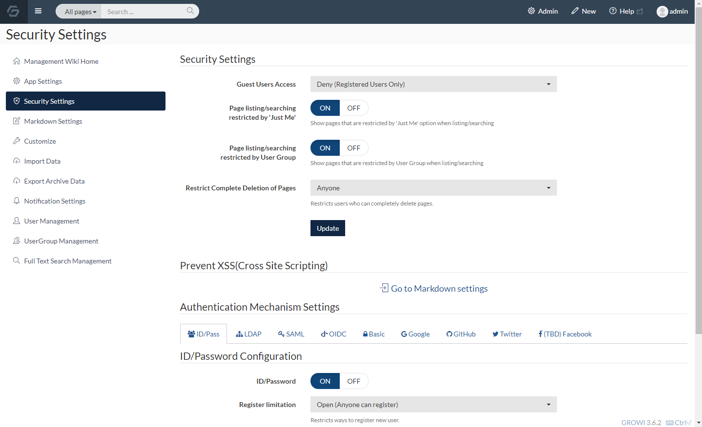
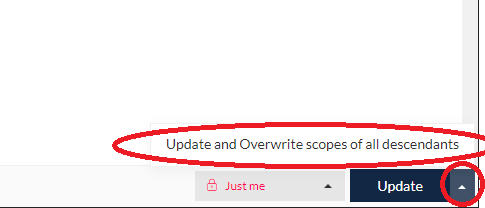

# Set Page View / Edit Authority

  GROWI has a function that only authorized users can view and edit for pages.

  This section describes the access control method that can be set for pages.

## How to set view / edit authority for pages

  In the edit mode, click the "Public" on the lower-right button, then you can see options as shown in the image below.

  

  After selecting this option, click the "Create / Update" button to apply view / edit access control for the page.

## Types that can be set as view / edit authority

  You can select one of the following options to set page restrictions.

### Public

There is no restriction for pages with this setting.
Anyone can view and edit.
This is selected by default.

`When GROWI is set up as only logged in users can view`

You will not be able to view or edit it unless you log in even if the page is public, and you will be redirected to the login page.

### Anyone with the Link

Pages with this setting will not be displayed in the page list or page search results.

Only users who know the page URL can view and edit the page.

When you don't remember where the page is, follow from "Recently Created" on the home screen.

If it's the page you created, it will be displayed in the page list.

### Just Me

Pages with this setting will not be viewed or edited by anyone except you.

Whether it's displayed or not in the page list and page search results of users except you depends on the settings on the security settings of the management page. (described later)

By default, the page you created appears in the page list and page search results.

### Only inside the Group

Pages with this setting can only be viewed and edited by users belonging to the group.

Whether it's displayed or not on the page list and page search results of users who don't belong to the group depends on the settings on the security settings of the management page. (described later)

By default, the page you created appears in the page list and page search results.

## About group management feature

Click [here](/en/admin-guide/management-cookbook/group.html) for details

## Control showing page list and search result for restricted pages

If you don't want to show search results or lists of restricted pages to an unauthorized person, switching on / off function of the corresponding setting in `Security setting` of management menu.

### Show page list and restricted pages as 'Only me'

- When the Switch is On

  List and search results of restricted pages are shown to a person who doesn't have permission to see the page details.

- When the Switch is Off

  List and search results of restricted pages are not shown to a person who doesn't have permission to see the page details.
  

### Show page list and restricted pages for specific groups

- Case of switching "ON"

  It will show restricted pages that applied as search result or page lists for the users who do not belong to any groups.

- Case of switching "off"

  It will not show restricted pages that applied as search result or page lists for the users who do not belong to any groups.

## Set viewing and editing privileges to be under the page at once

There is the case that you want to manage all privileges at once, cause pages is a hierarchical structure.

In this case, please click "▲" of "Create / Update" button which appears in the lower right corner of the screen when in create/edit.

Then, click "Update and Overwrite scopes of all descendants".

By this operation, be able to apply same privilege settings to all pages under the corresponding page.

## Example of setting privileges

Basically, you can be easy to manage if you organize pages together which needs viewing and editing privileges and then update at once under the corresponding pages.

Move the pages that need privileges like as shown example below, if Updating the studctures of the page has no problem.

- Create a group name page

- Move the page that you want to set viewing or editing privileges for only applicable group, to the under the page.

  Click [here](/en/guide/features/page_operation.html) for how to move pages

- Set privilege for group name pages at once
