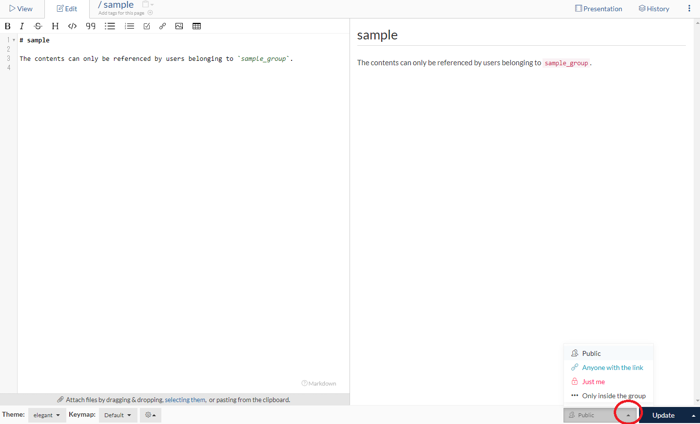

# Set Page View / Edit Authority

GROWI has a function that only autholized users can view and edit for pages.

This section describes authorization that can be set for pages.

## How to set view / edit authority for Pages

In the edit mode, click the "Public" on the lower-right button,
then you can see options as shown in the image below.

After selecting this option,
click the "Create / Update" button to apply view / edit authority for the page.

## Types that can be set as view / edit authority

You can select one of the following options to set page restrictions.

### Public

  There is no restriction for pages with this setting.
  Anyone can view and edit. This is selected by default.

  `When GROWI is set up as only logged in users can view`

  You will not be able to view or edit it unless you log in even if the page is public,
  and you will be redirected to the login page.

### Anyone with the link

  Pages with this setting will not be displayed in the page list or page search results.

  Only users who know the page URL can view and edit the page.

  when you don't remember where the page is,
  follow from "Recently Created" on the home screen.

  If it's the page you created, it will be displayed in this page list.

### Just Me

  Pages with this setting will not be viewed or edited by anyone except you.

　Whether it's displayed or not on the page list and page 　search results of users who don't belong to the group
  depends on ON / Off buttons on management screen.(describe later)

  By default, the page you created appears in the page list and page search results.

### Only inside the Group

  Pages with this setting can only be viewed and edited by users
  belonging to the group.

　whether it's displayed or not on the page list and page　search results of users who don't belong to the group
  depends on ON / Off buttons on management screen.(describe later)

  By default, the page you created appears in the page list and page search results.

TBD
