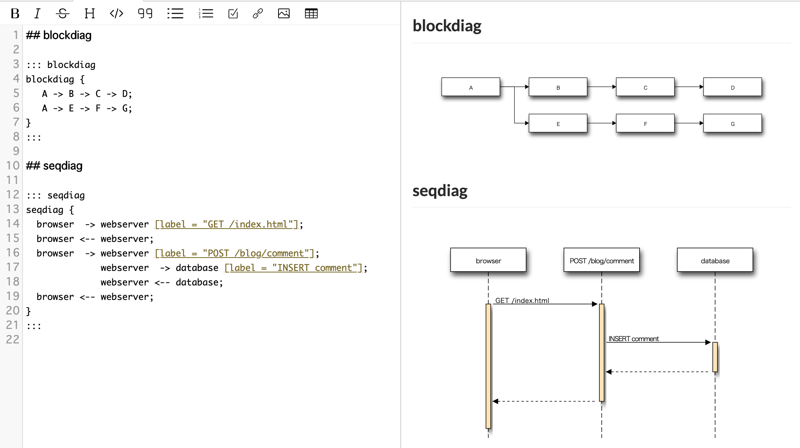

# Draw diagrams using Blockdiag



By using the following format, you can write a diagram using blockdiag.

[Click here for blockdiag](http://blockdiag.com/en/)

```markdown
::: blockdiag

(blockdiag format content)

:::
```
