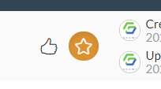
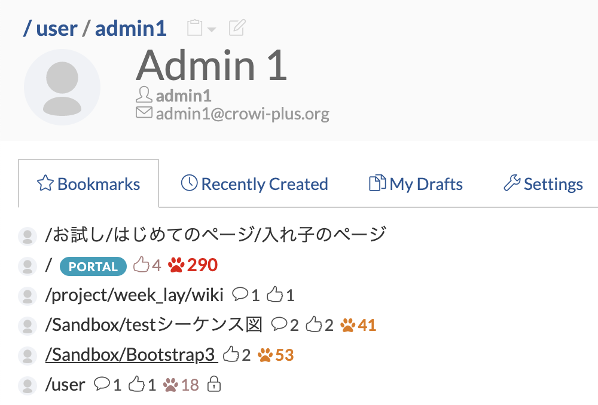

# Bookmark a page

With GROWI, you can bookmark a specific page.
You can add a page to Bookmark by clicking on the star in the upper right corner of the screen.

The added bookmark can be confirmed on the user's home screen.

