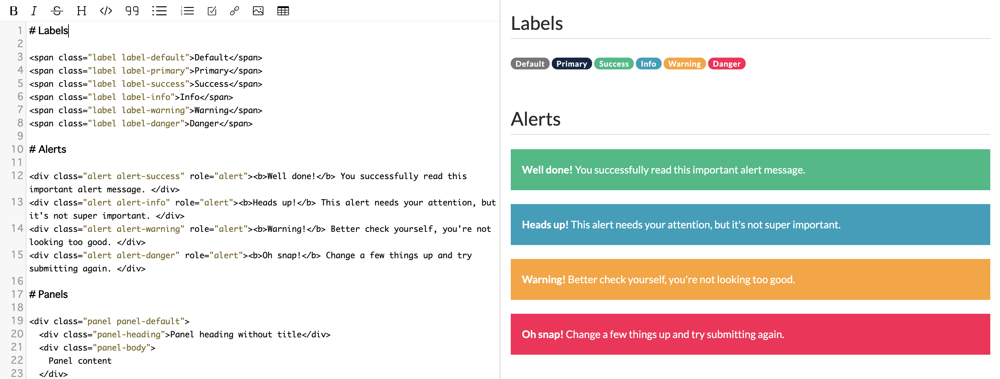

# Decorate your page with Bootstrap

GROWI allows you to decorate your pages using Bootstrap.  You can also combine HTML with Bootstrap classes to create more engaging pages.

For more details, refer to the Bootstrap documentation and [GROWI Bootstrap example page](https://demo.growi.org/Sandbox/Bootstrap3#edit).