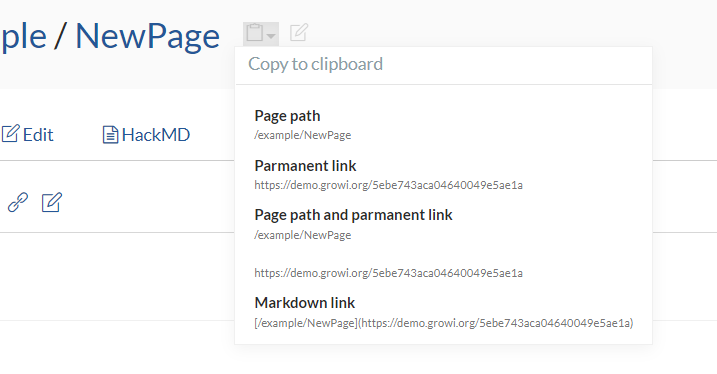

# Copy titles and URLs to the clipboard

You can copy the page title and page URL to the clipboard by clicking the clipboard icon next to the page title.

This is useful when you want to share page contents with others.

* Page name
   * Copy only the page title
* Permalink
   * Copy the URL to the page
* Page name and permalink
   * Copy page title and URL
* Markdown format links
   * Copy title and URL in Markdown link format