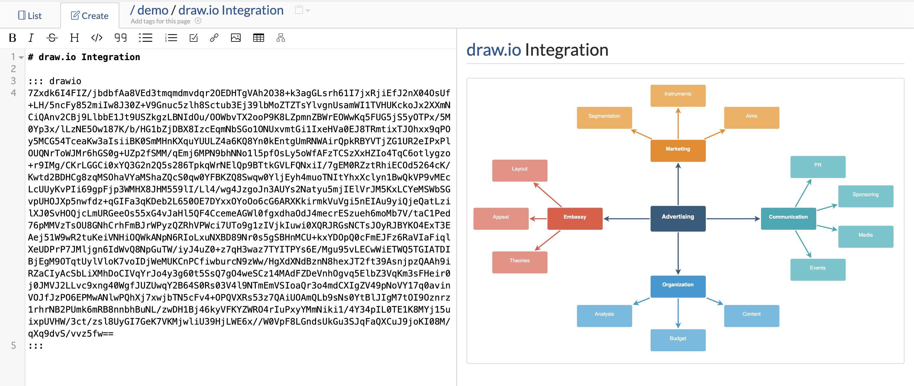
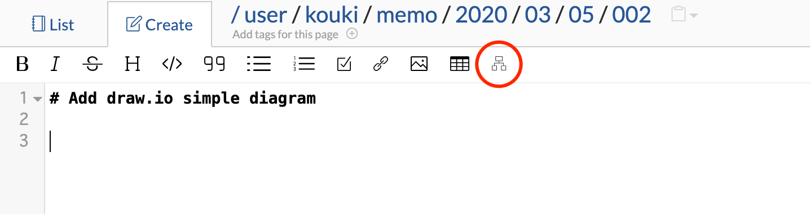
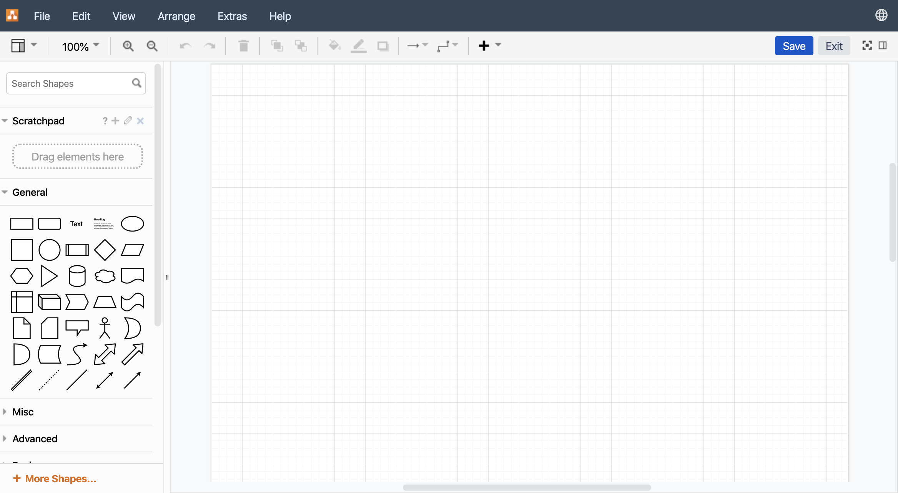
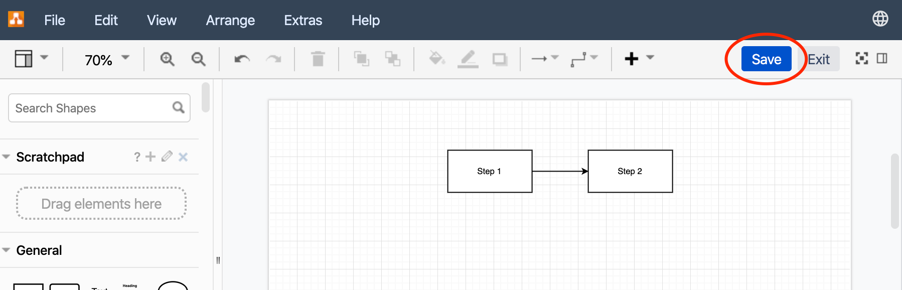
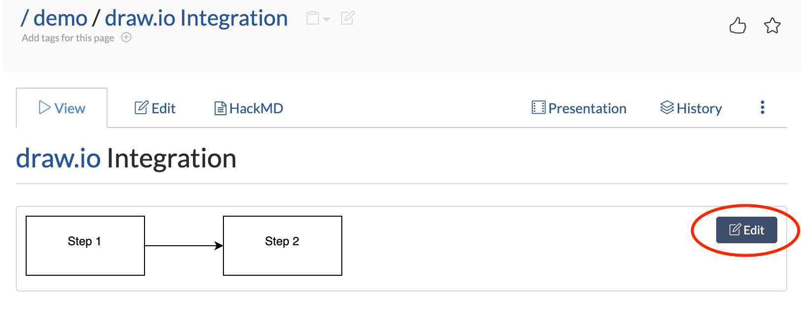

# Create diagrams with draw.io



In GROWI, you can create diagrams with draw.io by using the draw.io integration.

[draw.io (https://draw.io)](https://draw.io) is a free drawing tool that can intuitively create mock-ups, flowcharts, network diagrams, etc.

# Add draw.io diagram to GROWI page



You can add a drawing of draw.io from the toolbar icon () at the top of the page editing screen.



Press the icon on the toolbar () to display the editor screen of draw.io. From this screen you can draw the diagram you want to create.



In the above screen, a simple diagram was created. You can save the diagram by pressing the "Save" button at the top right of the screen.

# Edit an already created diagram

## Edit the diagram from the page display screen



The created diagram can be edited from the "Edit" button at the top right of the diagram.

## Editing diagrams from the editor (edit) screen

From the page edit screen, you can also edit by moving the cursor to the following block and pressing the icon () on the toolbar.

```
::: drawio
(draw.io data format)
:::
```
