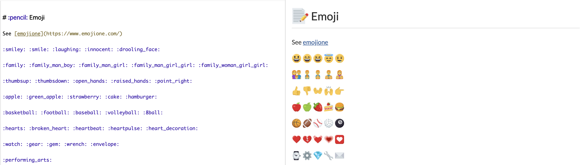

# Using emoji



A recognized emoji word can be converted into an emoji by putting colons (:) on both sides of the word. You can check the list of recognized emoji words [here](https://github.com/markdown-it/markdown-it-emoji/blob/master/lib/data/light.json).

**Examples:**

```markdown
:smiley:
:smile:
:laughing:
:innocent:
:drooling_face:
```
