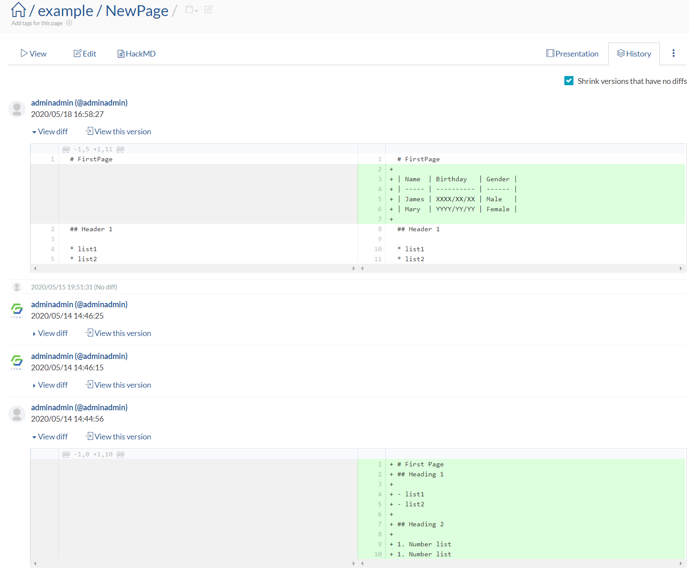

# Check page update history

Update history for a page can be viewed by selecting the “Update History” tab.

By clicking “View this version” for a particular page version, you can view the page as it existed at that time.

This is useful when you want to rollback content to a previous state.
