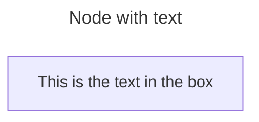
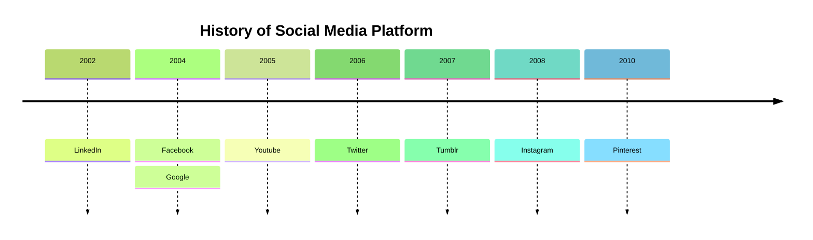

# Create diagrams using Mermaid

In GROWI, you can use [Mermaid](https://mermaid.js.org/) to create various diagrams. For specific syntax and configuration, please refer to [Syntax and Configuration](https://mermaid.js.org/intro/n00b-syntaxReference.html) for more information.

### Example 1

~~~ mermaid

~~~

### Example 2

~~~ mermaid

~~~

