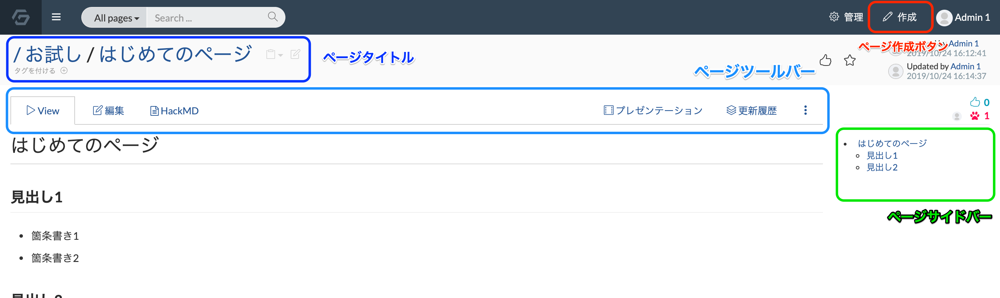

# GROWI page layout

This guide will walk you through the basic parts of a GROWI page.

## Page Title

The title of the page is displayed here.
You can [copy the page title and URL](/en/guide/features/copy_to_clipboard.html) and [create a tag for the page](/en/guide/features/tag.html) using the buttons located here.

## Page Toolbar

This toolbar allows you to perform various operations on this page.
In addition to editing the page, you can also [check the page's update history](/en/guide/features/history.html) and [move, copy, or delete this page](/en/guide/features/page_operation.html) using this toolbar.

## Page Sidebar

All page headings and subheadings are displayed here as a list of location links.
You can use the location links to quickly jump to the corresponding location in the page.

## Page Creation Button

The button for creating new pages is in the upper right corner of the screen.
You can create a blank page or create a new page using a template.