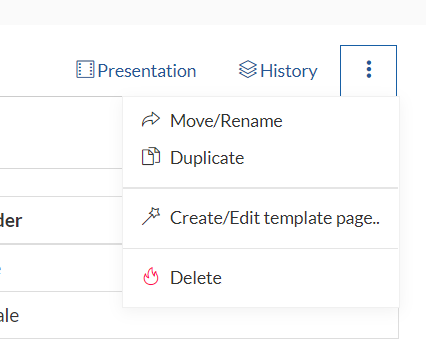

# Move / Duplicate / Delete a page

GROWI allows you to move, copy, or delete pages flexibly using the menu tab to the right of the Update History tab on the page toolbar.

[//]: <> (TODO: 英語で、presentationという言葉はその意味が表していないので変わってください)

For more details, please check the respective pages for moving, [duplicating](../tutorial/duplicate_page.md), or [deleting](../tutorial/delete_page.md) a page.