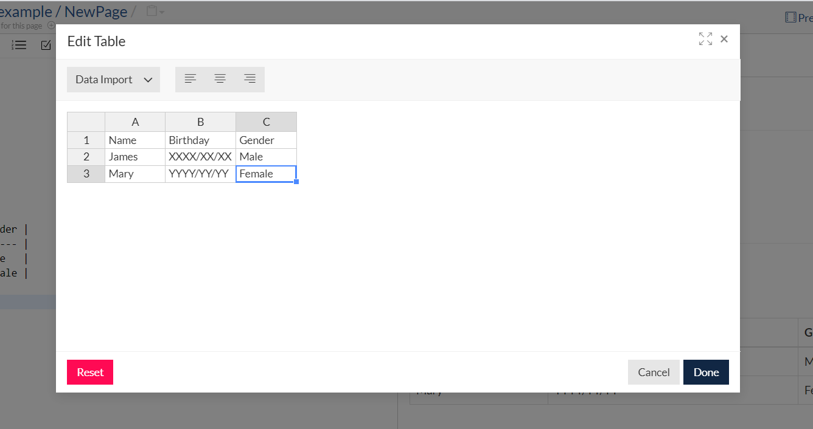
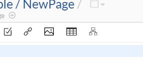
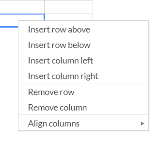
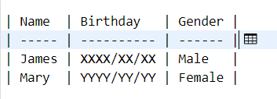

# Edit table

GROWI allows you to create and edit tables with WYSIWYG (actual output of what you see).

## Create table

You can create a table by clicking the table icon from the toolbar at the top of the page.

## Add rows and columns

You can also add rows and columns by right-clicking each row and column on the table edit dialog.

## Edit an already written table

If you click the table icon with the cursor on the table notation on the left side of the screen, you can edit the already written table.

