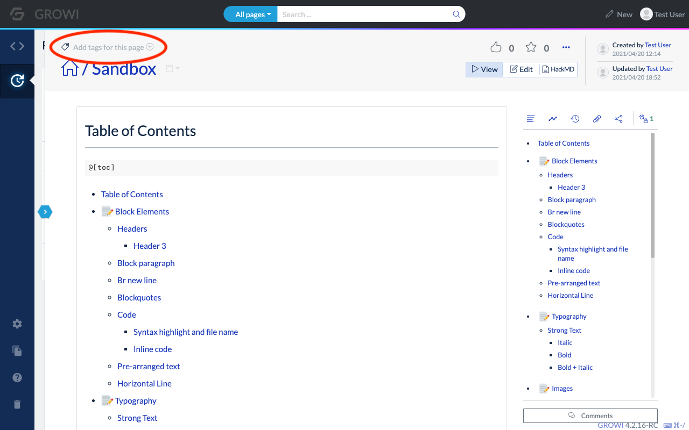
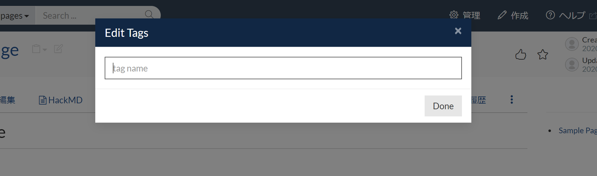
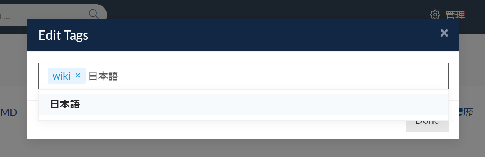
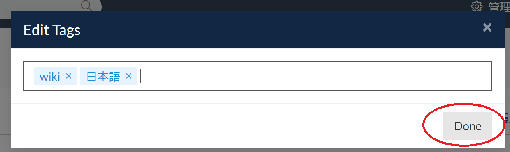
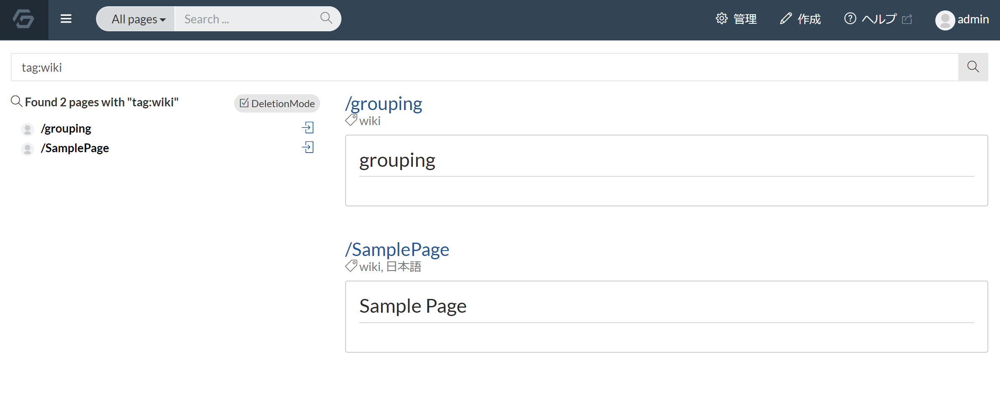
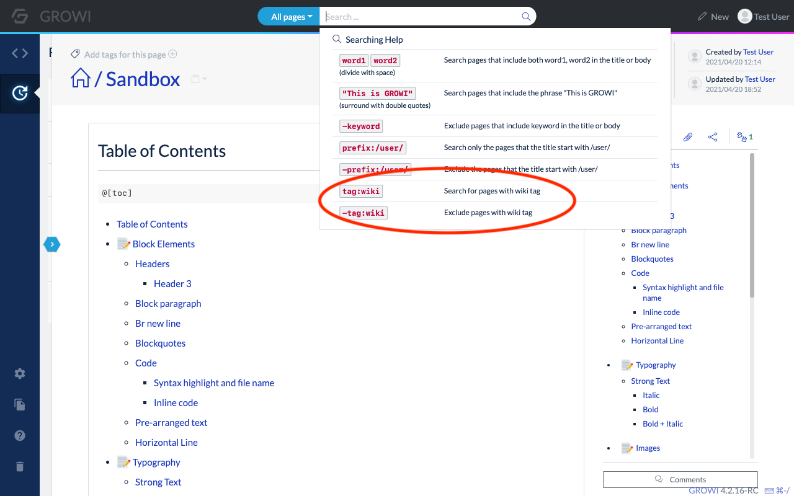
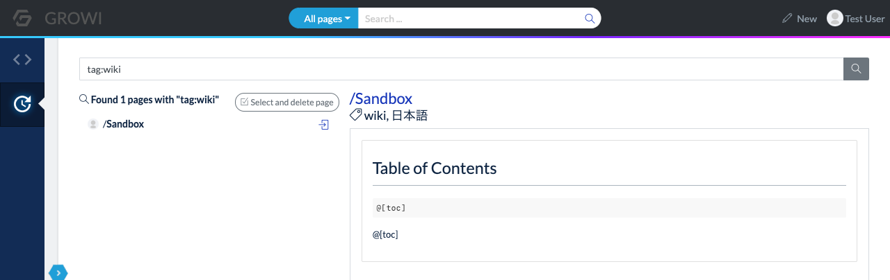

# Using Tags
In GROWI, pages are generally managed using a hierarchical structure called page paths, but it is also possible to manage pages with cross-cutting attributes by attaching tags to them.

Tags make it easier to search for specific pages.

This section explains how to use tags.

## Tagging a page
Navigate to the page where the tags are going to be added.
As shown in the image below, there is a "Add tags for this page +" button on the upper left side of the page.

Click the "Add tags for this page +" button to add tags to the page.  
When clicked, a window for editing tags will appear as shown in the image below.

In this input field, type the word to use as a tag, then click on the desired tag as shown in the red circle below, or press Enter.

The word will then be highlighted, as shown in the image below.

This is the state that can be set as a tag. Japanese tags are also available.  
You can add multiple tags at the same time, and you can delete or edit tags by clicking the X button on each tag.

You can also delete and edit tags by clicking the X button on each tag. 

Once you have set up the tags you want to add to the page, click the Done button as shown in the image below.

When you click the Done button, the page will be tagged and the link will be updated to say "Edit Tags +".  
The tags on the page will be searched when clicked.

As a result of clicking on a tag attached to a page, a page search will be performed on the tag.  
The search results will show the pages with the same tag.

## Search by tag
The search box in the header menu of GROWI also allows you to search for tags.  
Hovering over the search box will display help for searching, as shown in the image below.  

As a usage of `tag search', you can search for tags by using input format such as `tag:Japanese`.

Pages with the tags you have just set will be displayed in the search results.

Let's use the tag function to further develop GROWI.