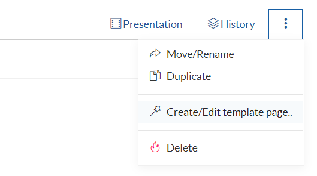
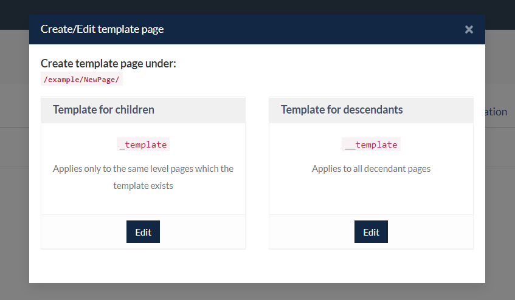
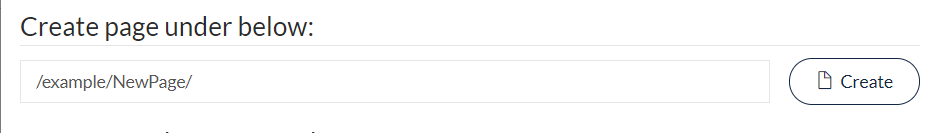
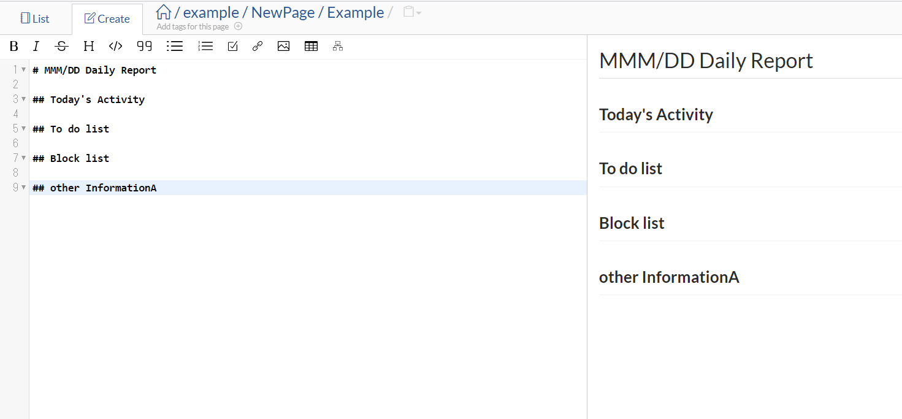

# Creating and Using Page Templates

In GROWI, you can model your new page based on a page template.
Templates make it easy to create pages that are regularly required, such as daily reports, bug reports, and meeting minutes.

This tutorial will walk you through creating a daily report template.

## Create a template page

From the page toolbar, select Create/Edit Page Template.



Select Create a Page Template at this Hierarchy Level from the displayed dialog.



Paste the following content into the template and save the template.

```markdown
# MM DD Daily Report

## What I did today

## Things to do tomorrow

## Blocked items which cannot be completed

## TODO

## Message
```

A page template for daily reports has now been created.

## Create a page using a page template

Create a new page at the same level as the template page and select the template to apply from the Apply Template box.

[//]: <> (TODO: 下のイメージは「〜にテンプレートページを作成」フィールドが入ってない。表れると使いやすい？)


You will be taken to the Edit Page screen for your new page, and it will be pre-filled with your template.
Edit the page as needed, then click Save to create your page.



## Using lower level templates

Lower level templates can be used when you want to unify the format of your entire wiki.
For example, by creating the following template at the top level, you can create a page template that always displays the child page list at the top of the page.

The notation `$lsx()` is from [weseek/growi-plugin-lsx](https://github.com/weseek/growi-plugin-lsx).

```markdown
# Related pages

$lsx()

#
```
