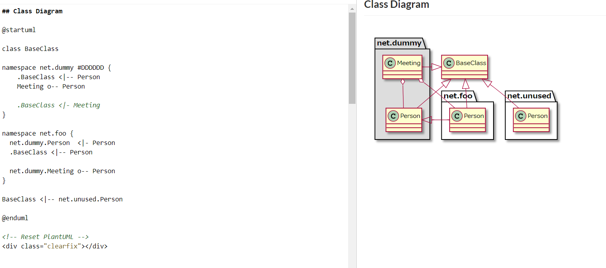

# Create UML Diagrams

GROWI can use [PlantUML](http://plantuml.com/) to draw UML diagrams.

Refer to [Real World UML](https://real-world-plantuml.com/) for some examples on how to use PlantUML.



**Example:**

```markdown
@startuml

(PlantUML content)

@enduml
```