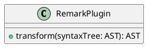

# Create UML Diagrams

GROWI can use [PlantUML](https://plantuml.com/en/) to draw UML diagrams.

Refer to [Real World UML](https://real-world-plantuml.com/) for some examples on how to use PlantUML.


**Example:**

~~~ plantuml
``` plantuml
class RemarkPlugin {
    + transform(syntaxTree: AST): AST
}
```
~~~

or

~~~ plantuml

~~~
