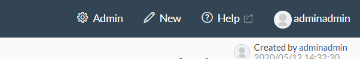
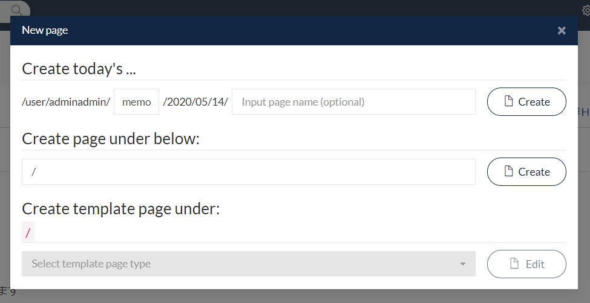
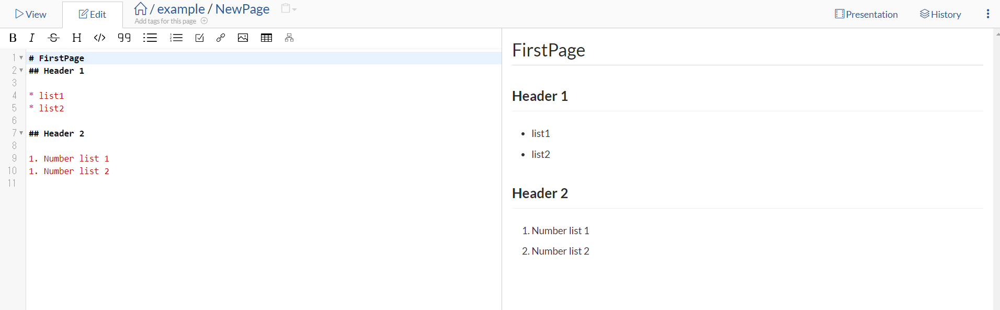
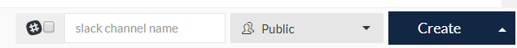
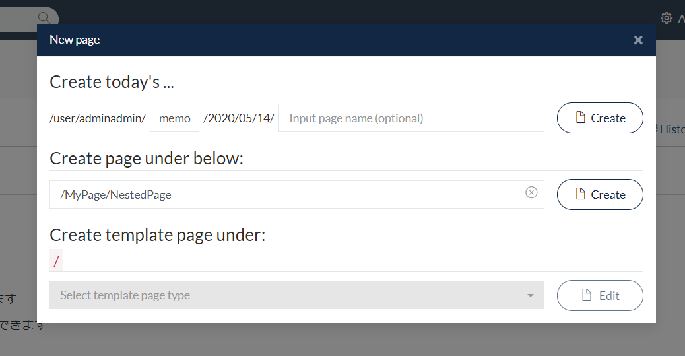
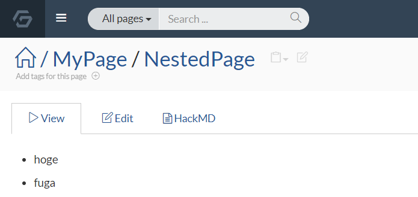
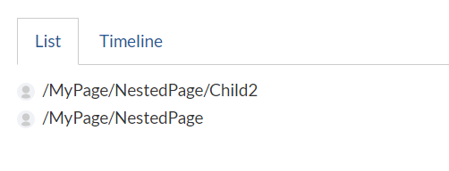

# 5 Minutes GROWI Tutorial

GROWI demo site available. You can get started easily.

[[toc]]

## Login to Demo site

[Access to demo](https://demo.growi.org/) and Login with the account listed on the demo's top.

## Create a Page

Let's create a page from the "Create" button in the upper right of the screen.



The title here is `/Trial/FirstPage`.
If it has already been created try creating a different page name.




Paste to form the following content.

```markdown
# FirstPage
## Header 1

* List 1
* List 2

## Header 2

1. Number List 1
2. Number List 2
```

When pasting, a preview reflecting the contents in real time as shown below is displayed on the right side of the screen.



Press the “Create” button at the bottom right of the screen to save the page.



::: tip
As a shortcut key, you can also save the page with **Ctrl + s**.
:::

## Create more pages under the created page

Let's add more pages under the page you created. Create a page again from the “Create” button at the top right of the screen.

This time, the page name will be `/Trial/FirstPage/NestedPage`.



Then paste the following content.

```markdown
# Nested Page
## Nested Page Header 1

* List 1
* List 2

## Nested Page Header 2

1. Number List 1
2. Number List 2
```

When you ’re done, press the “Create” button at the bottom right of the screen to save the page.


## Go to parent page

After the above work is completed, you can easily move to the parent page by clicking “FirstPage” in the displayed page.



## Check the list of pages created under the page

The page list created under the page is displayed at the bottom of the current page.

