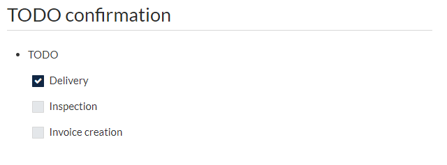

# Use checkbox

In GROWI, you can describe check boxes using markdown notation.




```markdown

# TODO confirmation
- TODO
    - [x] Delivery
    - [ ] Inspection
    - [ ] Invoice creation

```

When the above Markdown description is pasted into a GROWI article,
it will be reflected on the page like an image
