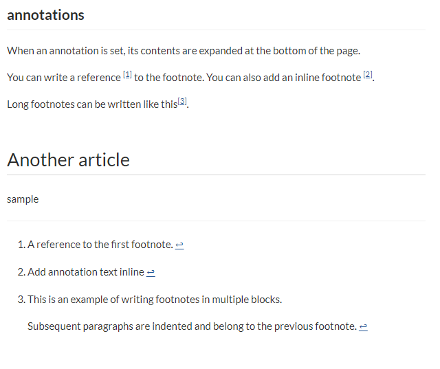

# Add annotations (footnotes)

In GROWI, annotations (footnotes) can be described.

When you add an annotation, a footnote appears at the bottom of the page.

## How to write annotations (footnotes)

- add a reference

  Like `[^1]`, you can add a reference to the footnote in the position
  where you want to add it, and write the annotations text with `[^1]:` and a colon.

  You can also use a string description for the annotation, like `[^longnote]`.

  If both the annotations reference position `[^1]` and
  the annotations text `[^1]:` arenot described, they will not function as annotations.

- writing inline

  Like `[^Add annotation text inline]` , you can add annotations inline in the text.

- writing footnotes in multiple blocks

  An annotation text following `[^longnote]:`,
  By adding indentation, the contents of multiple blocks can be commented.
   (See reference below)

Annotation number is automatically assigned a serial number in the page.

## reference



```markdown

## annotations
When an annotation is set, its contents are expanded at the bottom of the page.

You can write a reference [^1] to the footnote.
You can also add an inline footnote ^[Add annotation text inline].

Long footnotes can be written like this[^longnote].

[^1]: A reference to the first footnote.

[^longnote]: This is an example of writing footnotes in multiple blocks.

    Subsequent paragraphs are indented and belong to the previous footnote.


# Another article
sample

```

If you paste the above description into a GROWI article,
you can set an annotation (footnote) like an image.
