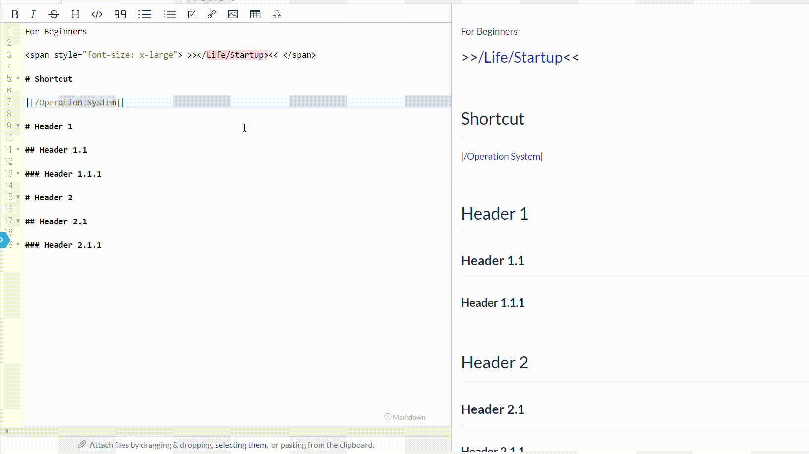

# Lsx function for organizing pages in a hierarchy

GROWI has a function to display a list of created pages.

If you write `$lsx()` (dollar sign, lsx and parentheses),
you can output a list of pages under the corresponding page.

Useful for screens that manage a large number of pages.

## Output a list of specified pages

- If you enter `$lsx(/user)`, a list of pages under the user page directly
under the top page will be output.

- If you write `$lsx (./sample)`, the list of pages
under the page `sample` under the page being edited will be output.

   When a nonexistent page name is specified
   An error message is output instead of a page list,
   as in `$lsx(/samplemiss) has no contents`.

## Useful optional features of lxs

You can set multiple options for lsx as well as page specification.

If you want to use a combination of page specifications and options,
specify them as follows, separated by a comma.

`$lsx(/page, depth=1, sort=createdAt, reverse=true)`

- List of lsx options

| Parameters    | Default value    |  Explanation   | Details |
| --- | --- | --- | --- |
|  num   |  not set   | Specify the number of output pages.| [num option details](#num-option) |
|  depth   |  not set   | Specify a hierarchy and output a page list.| [depth option details](#depth-option) |
|  sort   |  path   | Specify the order of the page list. | [sort option details](#sort-option) |
|  reverse   |  false   | Reverse the order of the page list.| [reverse option details](#reverse-option) |
|  filter   |  not set   | Filter the contents to be output to the page list. | [filter option details](#filter-option) |

### num option

You can specify the number of output pages.

You can specify the number of displays as `$lsx(num=5)`.
Displays the specified number of pages from the first to the Specified number of pages.

Specify with numbers and colons or plus signs,
such as `$lsx(num=1:10)`.

num=1:10, meaning from the first to the tenth.

num=2: means from the second to the last item.

num=5+2 means from the 5th item to the next 2 items (5,6,7).

### depth option

You can output the page list by specifying the hierarchy.

You can specify the hierarchy to display by entering a number
such as `$lsx(depth=1)`.

By default, all hierarchies are displayed.

Numbers can be specified in the same way as the num option above.

### sort option
  
The order of the page list can be specified by either of the following.

- `$lsx(sort=path)`

  Sorted in order of the name of the page name. (this setting by default)

- `$lsx(sort=createdAt)`

  List output in order of created date.

- `$lsx(sort=updatedAt)`

  List output in order of updated date.

If the sort option is not specified,
the page list is output in the order of page names.

### reverse option

You can reverse the output order.

`$lsx(sort=updatedAt, reverse=true)`

In the case of the above combination,
the page list is output in descending order of update.

### filter option

You can filter the contents to be output to the page list.

`$lsx(filter=2019)`

In this case, pages with `2019` in the page name are output as a list.

filter is a partial match.

## GitHub

This is a function built into GROWI with reference to
[Pukiwiki lsx plugin](http://ukiya.sakura.ne.jp/index.php?PukiWiki%2F1.4%2F%E3%83%9E%E3%83%8B%E3%83%A5%E3%82%A2%E3%83%AB%2F%E3%83%97%E3%83%A9%E3%82%B0%E3%82%A4%E3%83%B3%2F%E7%8B%AC%E8%87%AA%E3%81%AB%E8%BF%BD%E5%8A%A0%E3%81%97%E3%81%9F%E3%82%82%E3%81%AE%2Flsx)

[GitHub](https://github.com/weseek/growi-plugin-lsx)

