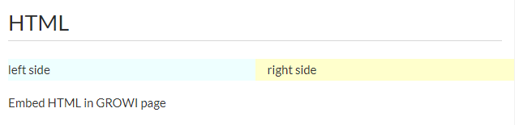

# Include HTML



```markdown
<div class="row">
    <div class="col-sm-6" style="background-color:#EEFFFF">
        left side
    </div>
    <div class="col-sm-6" style="background-color:#FFFFCC">
        right side
    </div>
</div>

Embed HTML in GROWI page
```

GROWI can also embed HTML directly in the article editing screen.

If you paste the above HTML description into a GROWI article, the HTML will be reflected like an image.

## iframe embedded


```markdown
<iframe width="30%" height="30%" src="https://www.youtube.com/embed/YE7VzlLtp-4h"
frameborder="0"
allow="accelerometer; autoplay; encrypted-media; gyroscope; picture-in-picture" allowfullscreen></iframe>

(c) copyright 2008, Blender Foundation / www.bigbuckbunny.org
```

If the above iframe description is pasted into a GROWI article, YouTube can be incorporated into the screen like an image.
