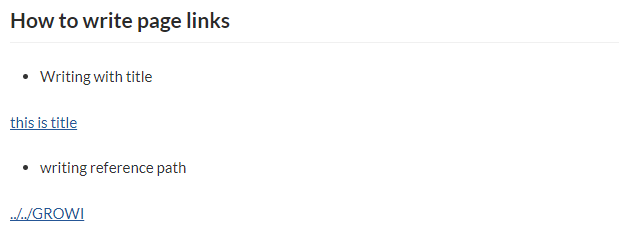

# Write a page link



In GROWI, it is possible to describe in the reference form
as follows how to write a link to each page.

## How to write page links

```markdown
## How to write page links
- Writing with title

[[this is title>../samplepage]]

- writing reference path

[[../../GROWI]]
```

If you paste the above description into a GROWI article,
a link will be generated like an image.

The format is the title and path between `[[` and `]]`.

`Title` and`Reference page` are separated by `>` symbol
and written like `Title>Reference page`.

The title is optional.
The reference page can be described as a relative link based on the page being described.


### GitHub

How to write this link is a function
that is built into GROWI as a Pukiwiki like linker.

[GitHub](https://github.com/weseek/growi-plugin-pukiwiki-like-linker)
