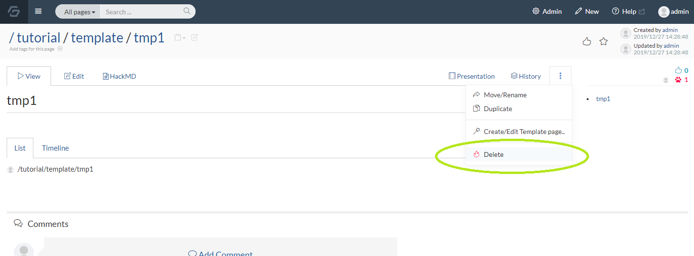
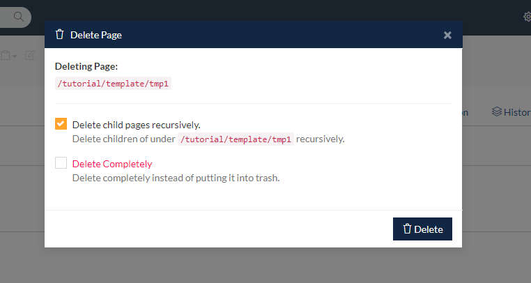
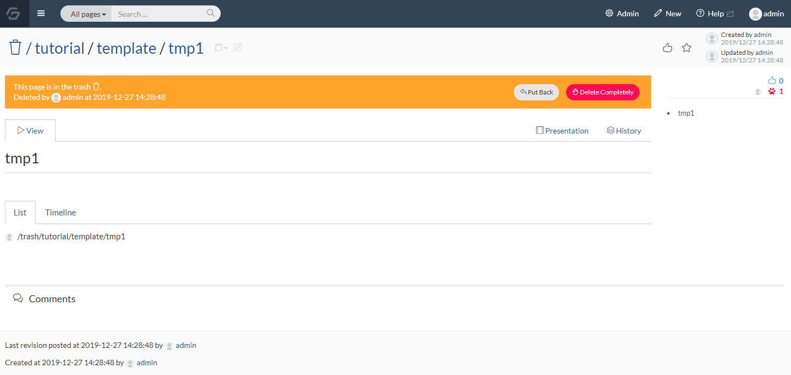
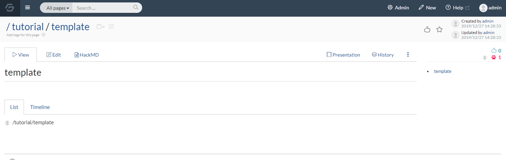
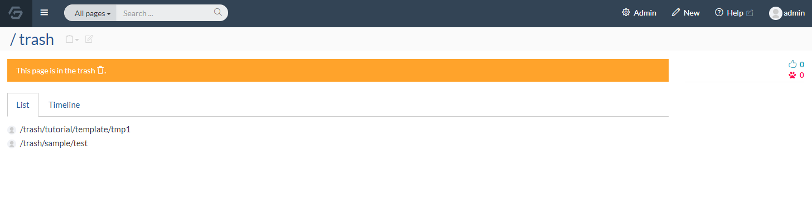
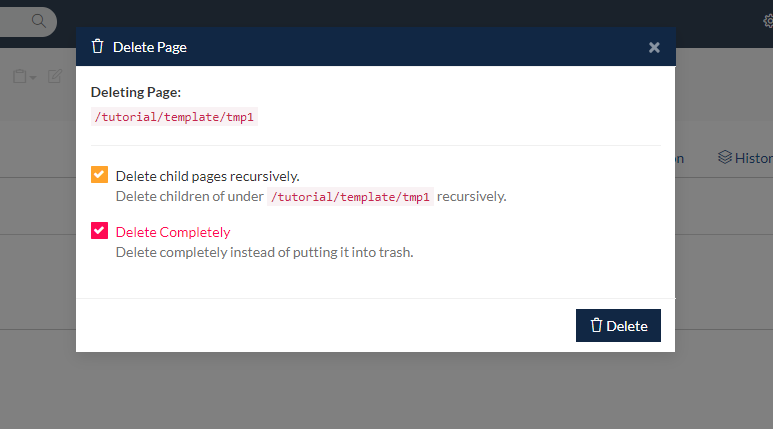
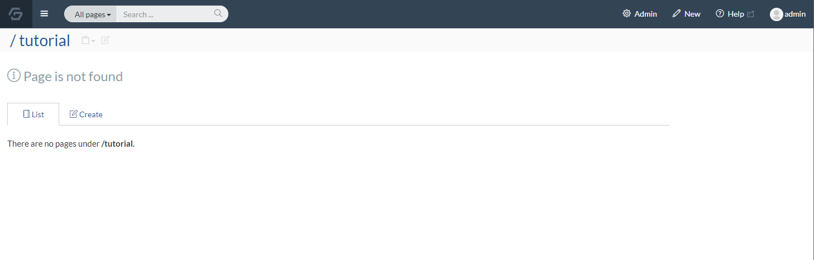
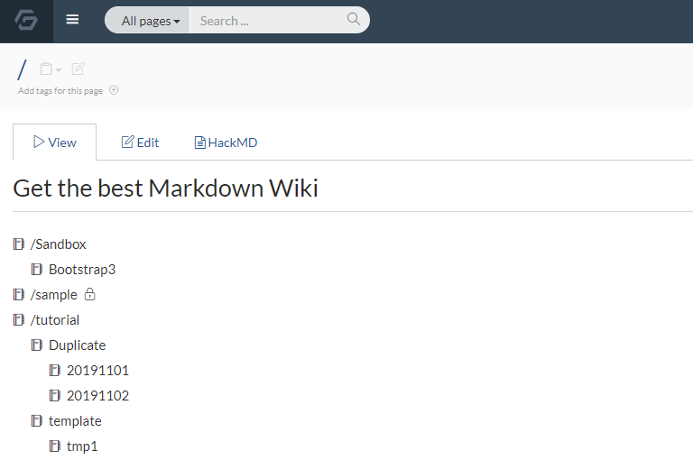
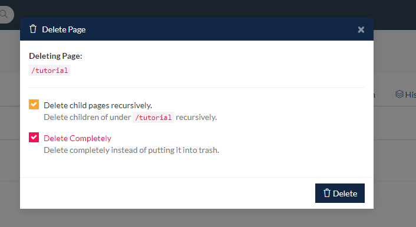
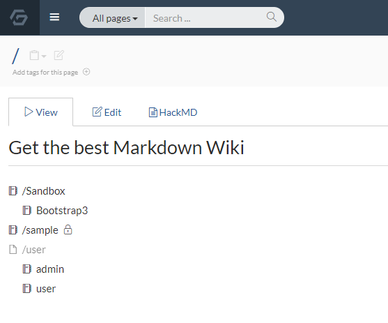

# Delete page

As your wiki becomes larger, you may want to delete unnecessary pages to clean up your wiki.

## Delete one page

Go to the page you want to delete and select "Delete" in the menu shown in the image below.

In the delete menu, you will see the options

- Delete child pages recursively.

- Delete Completely

Each option has a check box, and Delete child pages recursively is selected by default.

[//]: <> (TODO: Delete child pages recursivelyのサブタイトルは英語が間違っています。「of」か「under」一つ使って、残りを消す)

If you press the "Delete" button on a page that has no child pages, that page will be moved to the trash.

Now when you view the page you will see a trash can mark at the top of the page hierarchy path, and the message "This page is in the trash".

After deletion, the page no longer appears in its former hierarchy.

## Find deleted pages in the trash

Click "Deleted pages" in the menu that appears by clicking your username in the header.

You will see the list of deleted pages under "/trash" as shown in the image below.

Clicking on a deleted page in the list will open the deleted page with a "Put Back" button and "Delete Completely" button.

Deleted pages cannot be edited.
Click "Put Back" first if you want to edit.

## Delete completely

You can permanently delete the page by clicking "Delete completely".

You can also permanently delete a page by selecting the 
"Delete completely" checkbox when deleting a page.

"Page is not found" will be displayed if you try to view a page which has been completely deleted.

## Delete child pages recursively

When deleting a page, you can also recursively delete all child pages at the same time.

Here is an example page list:

Select the "/tutorial" page, then delete it with "Delete child pages recursively" checked.

As you can see from the parent page's page hierarchy, if you delete the "/tutorial" page with child pages deleted recursively, the pages under the "/tutorial" page will also be deleted.

