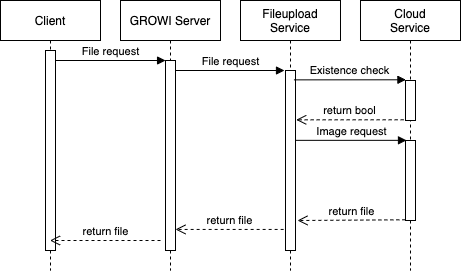

# ファイルアップロード設定

[[toc]]

## 概要

GROWI ページへのファイルアップロードに関する設定について紹介します。

## 添付ファイル保存先の指定

GROWI ページの添付ファイルの保存先は以下を利用できます。詳細は[こちら](../management-cookbook/app-settings.html#ファイルアップロード設定)を参照してください。

- Amazon S3
- Google Cloud Storage
- MongoDB
- ローカルファイルシステム

### 環境変数による添付ファイル保存先の固定

::: danger
ファイル保存先を途中で変更すると、これまでにアップロードしたファイル等へのアクセスができなくなりますのでご注意ください。
:::

添付ファイルの保存先を環境変数によって固定したい場合は、環境変数 `FILE_UPLOAD_USES_ONLY_ENV_VAR_FOR_FILE_UPLOAD_TYPE` を `true` にし、以下の表を参考に環境変数 `FILE_UPLOAD` の値を設定してください。

| 保存先 | `FILE_UPLOAD` |
| --- | --- |
| Amazon S3 | `aws` |
| Google Cloud Storage | `gcs` |
| MongoDB | `mongodb` |
| ローカルファイルシステム | `local` |

環境変数 `FILE_UPLOAD_USES_ONLY_ENV_VAR_FOR_FILE_UPLOAD_TYPE` によって保存先が固定されている場合、管理画面での保存先選択機能は無効となります。

### 環境変数による Google Cloud Storage 設定

ファイルアップロード設定内の GCS 設定のフォームで値を指定していない場合は、以下のデフォルト値を利用します。

- Api Key Json Path: `GCS_API_KEY_JSON_PATH`
- バケット名: `GCS_BUCKET`
- Name Space: `GCS_UPLOAD_NAMESPACE`

#### 環境変数による GCS 設定の固定

GCS 設定を環境変数によって固定したい場合は、環境変数 `GCS_USES_ONLY_ENV_VARS_FOR_SOME_OPTIONS` を `true` にし、上記の環境変数に値を入れてください。未設定の場合は、null が入ります。

環境変数 `GCS_USES_ONLY_ENV_VARS_FOR_SOME_OPTIONS` による GCS 設定の固定が有効な場合、ファイルアップロード設定での GCS 設定のフォームの値は無効となり、変更もできなくなります。

## 添付ファイルのサイズ制限

以下の環境変数により、一度にアップロードできるファイルのサイズ上限と全ページに添付されているファイルの累計サイズの上限を設定することができます。いずれも単位は `bytes` です。デフォルトではいずれの値も `Infinity` となっており、ファイルサイズは制限されません。

- `MAX_FILE_SIZE` : [アップロード可能なファイルのサイズ上限(bytes)]
- `FILE_UPLOAD_TOTAL_LIMIT` : [アップロードされたファイルの累計サイズ上限(bytes)]

## ファイル配信方法の設定

v4.2.3 より ファイルの配信方法に変更が加わりました。

Amazon S3, Google Cloud Storage を利用する場合、下記の2種類の方法から選択できます。  
なお、v4.2.3 以降デフォルトが Redirect Mode になります。

セキュリティを向上させる場合、
[管理画面のアプリ設定](../management-cookbook/app-settings.html#ファイルアップロード設定)から
Relay Mode に変更してください。

### Relay Mode (従来の方法)

<!-- https://dev.growi.org/5fd8424f2271ae00481ed2e8 -->

Relay Mode では GROWI サーバーが Cloud Serviceから受け取ったファイルを中継して クライアント に配信します。  
内部の機構を用いて画像を配信するため、セキュリティーを高めることができます。

### Redirect Mode (デフォルト)

<!-- https://dev.growi.org/5fd8424f2271ae00481ed2e8 -->

Redirect Mode では Cloud Serviceで署名付きURLを発行し クライアント に配信します。  
クライアントは受け取った署名付きURLにリダイレクトし、直接 Cloud Service から画像を取得します。

GROWIサーバーを介さずにファイルを配信するため、  
一度に大量のファイルを取得する場合でも優れたパフォーマンスを発揮します。

署名付きURLは 120秒間キャッシュされます。  
キャッシュを保持する秒数は[環境変数](../admin-cookbook/env-vars.html)で設定できます。

- AWS(S3)
  - `S3_LIFETIME_SEC_FOR_TEMPORARY_URL`
- GCP(GCS)  
  - `GCS_LIFETIME_SEC_FOR_TEMPORARY_URL`
