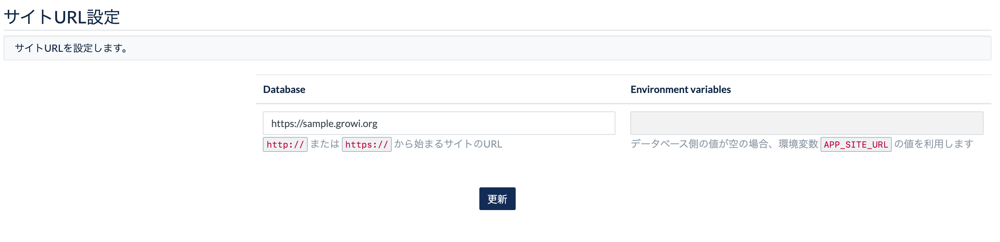

# アプリ設定 AppSettings

## サイトURL設定

この欄では、GROWI に URL を設定します。

GROWI の **サイト URL 設定は必ず行ってください**。

:::warning
サイト URL が未設定の場合は、GROWI の機能が一部正常に動作しなくなります。
:::

保有するドメインの向き先として `growi.hogehoge.com` などに DNS レコードを指定している場合は、ここに設定します。  
ドメインを DNS 設定していない場合は、任意のURLで良いので値を設定してください。

環境変数 `APP_SITE_URL` に値が設定されていると、右側の `Environment variables` の欄に設定値が表示されます。  

管理画面で編集する `Database` の欄に値が入力されていると、
`Database` の欄に設定した値が`Environment variables` の欄より優先されます。  

:::warning
サイト URL が未設定の場合は、GROWI の機能が一部正常に動作しなくなるため、エラーメッセージが表示されます。

管理画面の設定欄、ページのヘッダ部に以下のようにエラーメッセージが表示されます。  
GROWI の **サイト URL 設定は必ず行ってください**。

:::

## App settings

### サイト名

サイト名に設定をした内容は、GROWI のログイン画面及びタイトルとして表示されます。

### コンフィデンシャル表示

コンフィデンシャル表示欄に記載した内容は、GROWI のヘッダーに表示されるようになります。

### 新規ユーザーのデフォルト言語設定

この欄では、英語か日本語を選択します。

上記の設定により、GROWI で新規ユーザーを作成する際の、デフォルト設定言語が切り替わります。

### ファイルアップロード

GROWI では、ページへの画像以外のファイルのアップロードを可能とするための設定があります。

こちらにチェックをしないと、wiki ページの編集時には画像以外のファイルはアップロードできません。

また、以下の画像のように、このチェック欄がチェック出来ない場合は、  
[ファイルアップロード設定](ja/admin-guide/admin-cookbook/attachment.html) が未完了です。

ファイルアップロードの設定を行うことで、ファイルがアップロードできるようになります。

以下の表示となっている場合は、ファイルアップロードは機能していません。

## メールの設定(TBD)

## AWS 設定(TBD)

## プラグイン設定(TBD)
