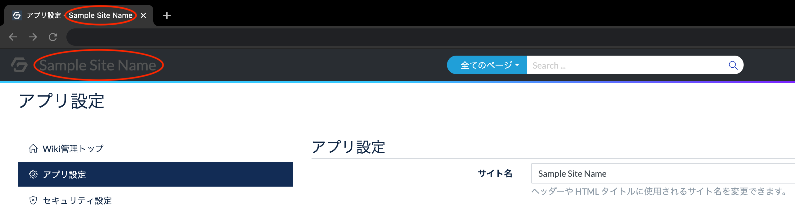
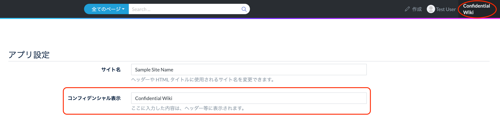
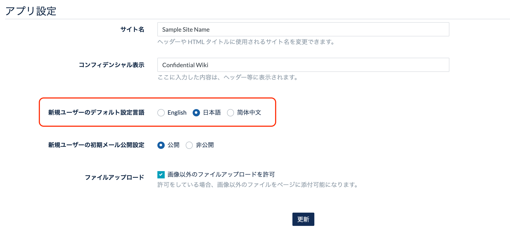
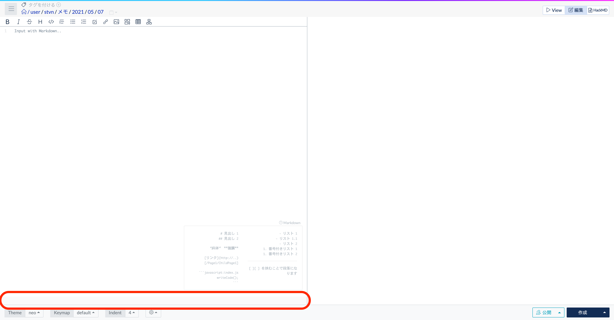
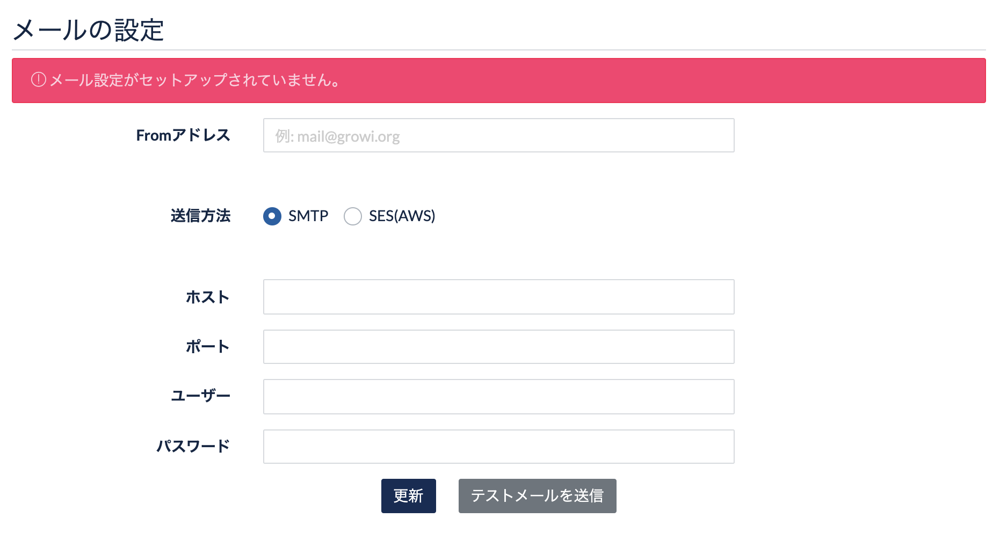

# アプリ設定 AppSettings

## サイトURL設定

この欄では、GROWI に URL を設定します。

GROWI の **サイト URL 設定は必ず行ってください**。

:::warning
サイト URL が未設定の場合は、GROWI の機能が一部正常に動作しなくなります。
:::

保有するドメインの向き先として `growi.hogehoge.com` などに DNS レコードを指定している場合は、ここに設定します。  
ドメインを DNS 設定していない場合は、任意のURLで良いので値を設定してください。


環境変数 `APP_SITE_URL` に値が設定されていると、右側の `Environment variables` の欄に設定値が表示されます。  


管理画面で編集する `Database` の欄に値が入力されていると、
`Database` の欄に設定した値が`Environment variables` の欄より優先されます。  

:::warning
サイト URL が未設定の場合は、GROWI の機能が一部正常に動作しなくなるため、エラーメッセージが表示されます。

管理画面の設定欄、ページのヘッダ部に以下のようにエラーメッセージが表示されます。  
GROWI の **サイト URL 設定は必ず行ってください**。


:::


## App settings

### サイト名

サイト名に設定をした内容は、GROWI のログイン画面及びタイトルとして表示されます。




### コンフィデンシャル表示

コンフィデンシャル表示欄に記載した内容は、GROWI のヘッダーに表示されるようになります。



### 新規ユーザーのデフォルト言語設定

この欄では、英語か日本語を選択します。



上記の設定により、GROWI で新規ユーザーを作成する際の、デフォルト設定言語が切り替わります。


### ファイルアップロード

GROWI では、ページへの画像以外のファイルのアップロードを可能とするための設定があります。


こちらにチェックをしないと、wiki ページの編集時には画像以外のファイルはアップロードできません。

また、以下の画像のように、このチェック欄がチェック出来ない場合は、  
[ファイルアップロード設定](ja/admin-guide/admin-cookbook/attachment.html) が未完了です。


ファイルアップロードの設定を行うことで、ファイルがアップロードできるようになります。


以下の表示となっている場合は、ファイルアップロードは機能していません。




## メールの設定

GROWI からのメール送信 は、どちらかの設定パターンを選択できます。

  1. SMTP サーバーの設定をする
  2. AWS の SES を利用する



### テストメールの送信(SMTPのみ実行可能)

SMTP サーバーを使用する場合、テストメールを送信しメール設定が機能していることを確認することができます。

SMTP サーバー設定の更新後、**テストメールを送信**ボタンを押します。

- 成功した場合「テストメールを送信しました」と表示されます。
- 失敗した場合「SMTPを利用したセストメール送信に失敗しました。設定をみなおしてください。」と表示されます。

メール設定が有効も場合、通知設定やユーザー管理でのメール送信が機能し、  
GROWI から メールが送信されます。

### メール送信機能の例

以下はユーザー管理メニューの新規ユーザー招待ウィンドウです。


**招待をメールで送信** にチェックをするとメールが機能します。  
メール設定が正しく出来ていない場合はメールが機能しません。

## AWS 設定

### AWS S3 Bucket のセットアップ

AWS S3(Amazon Simple Storage Service) への接続設定の手順を紹介します。

この設定を行うことにより、AWS S3 Bucket へのファイルアップロード、プロフィール写真機能、
また、SMTP 設定がない場合、SES(Amazon Simple Email Service) を利用したメール送信が行われます。  
SES を利用したメール送信には、From メールアドレスの Verify、プロダクション利用設定をする必要があります。


### AWS アカウント情報の取得

1. [AWS マネジメントコンソール](https://aws.amazon.com/jp/console/) にサインインし、
ナビバー右上のアカウント名をクリックすると表示されるドロップダウンから、
 [マイセキュリティ資格情報](https://console.aws.amazon.com/iam/home?#/security_credentials) を選択します。
2. 「アクセスキー(アクセスキー ID とシークレットアクセスキー)」を展開し、
AWS アカウントのAccess Key ID および Secret Access Key を作成、保管します。
3. 「アカウント ID」を展開し、正規ユーザー ID を確認します。

### AWS S3 Bucket 情報の取得、権限変更

1. AWS S3 の[ダッシュボード](https://s3.console.aws.amazon.com/s3)にアクセスします。
2. 登録したい S3 Bucket のリージョンとバケット名を確認します。
3. 登録したい S3 Bucket を選択し、「アクセス権限」を開きます。
4. 「ブロックパブリックアクセス」の編集ボタンをクリックし、「新しいアクセスコントロールリスト (ACL) を介して
許可されたバケットとオブジェクトへのパブリックアクセスをブロックする」のみチェックを外し、変更を保存します。
5. 「アクセスコントロールリスト」の「バケット所有者のアクセス権」に追加されている AWS アカウントの正規 ID が
手順「AWS アカウント情報の取得」の 3. で確認したものと一致していなければ、
「他の AWS アカウントのアクセス」に、確認した正規 ID でアカウントを追加します。この時、権限の種類全てにチェックします。

### GROWI に Bucket を登録

1. GROWI の App 管理画面の AWS 設定に上記過程で確認した情報を入力し、更新してください。

2. MinIO など、S3 互換 API を持つ他のオブジェクトストレージサービスを使用する場合は、
そのエンドポイントの URL をカスタムエンドポイントに入力してください。


## プラグイン設定

この欄で `プラグインを読み込む` を ON / OFF に設定することで、GROWI にインストールされたプラグインを有効化/無効化します。  
OFF の場合、GROWI にインストールされたプラグインは反映されません。


GROWI では、Node.js のモジュール解決の仕組みを利用し、 `growi-plugin-` プレフィクスを持つパッケージを自動検出します。  

詳細は[開発ガイド](/ja/dev/plugin/architecture.html) を参照してください。

### 公式プラグイン一覧

- [growi-plugin-attachment-refs](https://github.com/weseek/growi-plugin-attachment-refs)
  - 添付画像のリスト表示やギャラリー表示用のプラグイン
- [growi-plugin-lsx](https://github.com/weseek/growi-plugin-lsx)
  - pukiwiki 独自プラグインの lsx を適用するプラグイン
- [growi-plugin-pukiwiki-like-linker](https://github.com/weseek/growi-plugin-pukiwiki-like-linker)
  - Pukiwiki の Linker 書式を適用するプラグイン

### インストール方法

`growi-plugin-xxx` の部分を使用するプラグインに書き換えてください。

```
npm install --save growi-plugin-xxx
```
