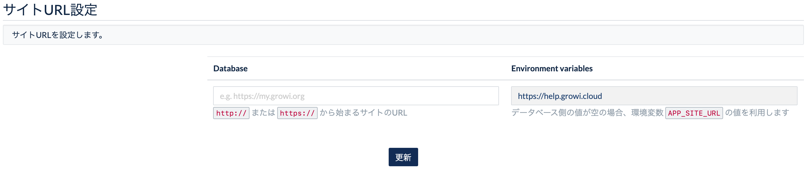
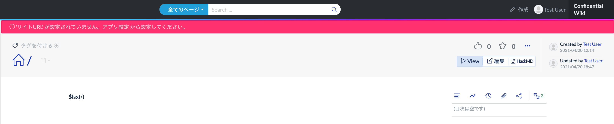
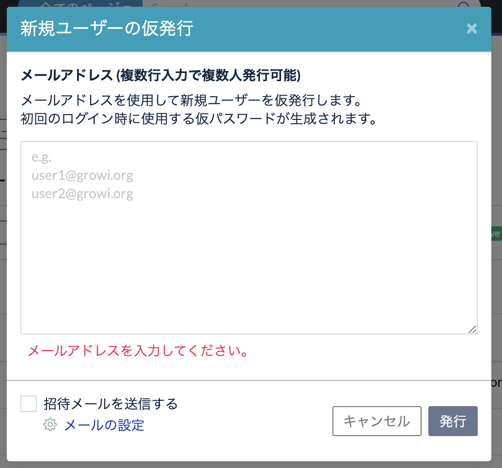
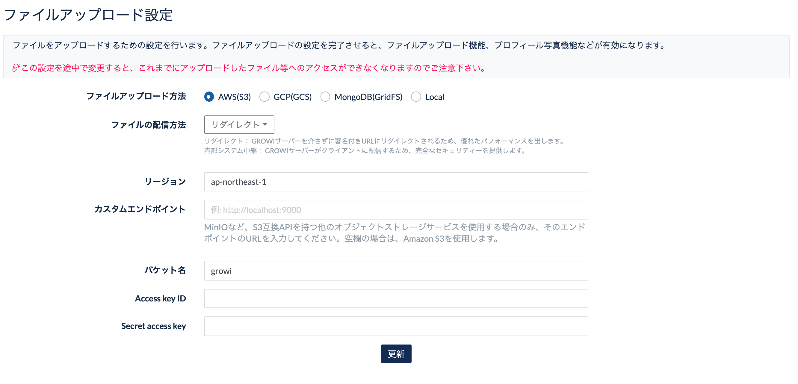
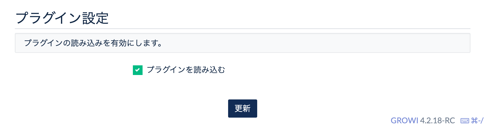

# アプリ設定

[[toc]]

## サイトURL設定

この欄では、GROWI に URL を設定します。

GROWI の **サイト URL 設定は必ず行ってください**。

:::warning
サイト URL が未設定の場合は、GROWI の機能が一部正常に動作しなくなります。
:::

保有するドメインの向き先として `growi.hogehoge.com` などに DNS レコードを指定している場合は、ここに設定します。  
ドメインを DNS 設定していない場合は、任意のURLで良いので値を設定してください。


環境変数 `APP_SITE_URL` に値が設定されていると、右側の `Environment variables` の欄に設定値が表示されます。  




管理画面で編集する `Database` の欄に値が入力されていると、
`Database` の欄に設定した値が`Environment variables` の欄より優先されます。  

:::warning
サイト URL が未設定の場合は、GROWI の機能が一部正常に動作しなくなるため、エラーメッセージが表示されます。

管理画面の設定欄、ページのヘッダ部に以下のようにエラーメッセージが表示されます。  
GROWI の **サイト URL 設定は必ず行ってください**。




:::


### サイト名

サイト名に設定をした内容は、GROWI のログイン画面及びタイトルとして表示されます。


### コンフィデンシャル表示

コンフィデンシャル表示欄に記載した内容は、GROWI のヘッダーに表示されるようになります。


### 新規ユーザーのデフォルト言語設定

この欄では、英語か日本語か中国語を選択します。


上記の設定により、GROWI で新規ユーザーを作成する際の、デフォルト設定言語が切り替わります。


### ファイルアップロード

GROWI では、ページへの画像以外のファイルのアップロードを可能とするための設定があります。


こちらにチェックをしないと、wiki ページの編集時には画像以外のファイルはアップロードできません。

ファイルアップロードの設定を行うことで、ファイルがアップロードできるようになります。


以下の表示となっている場合は、ファイルアップロードは機能していません。


## メールの設定

GROWI からのメール送信 は、どちらかの設定パターンを選択できます。

  1. SMTP サーバーの設定をする
  2. AWS の SES を利用する


**メール設定がセットアップされていません。** というアラートが表示されている場合、  
設定フォームが不十分であることを示します。  

### SES を使用する場合の注意点

GROWI では Region の設定をすることができず、us-east-1 で送信を試みます。  
us-east-1 以外の Region を使用する場合、SES 側の情報を用いて GROWI 上で SMTP の設定を行いメールを送信することをご検討ください。

### テストメールの送信(SMTPのみ実行可能)

SMTP サーバーを使用する場合、テストメールを送信しメール設定が機能していることを確認することができます。

SMTP サーバー設定の更新後、**テストメールを送信**ボタンを押します。

- 成功した場合「テストメールを送信しました」と表示されます。
- 失敗した場合「SMTPを利用したセストメール送信に失敗しました。設定をみなおしてください。」と表示されます。

メール設定が有効の場合、通知設定やユーザー管理でのメール送信が機能し、  
GROWI からメールが送信されます。

### メール送信機能の例

以下はユーザー管理メニューの**新規ユーザーの仮発行**ウィンドウです。



**招待をメールで送信** にチェックをするとメールが機能します。  
メール設定が正しく出来ていない場合はメールが機能しません。

## ファイルアップロード設定

GROWI ページへの添付ファイルのアップロードに関する設定を行います。

### 利用可能な保存先

添付ファイルの保存先は以下を利用できます。

- Amazon S3
- Google Cloud Storage
- MongoDB
- ローカルファイルシステム

#### Amazon S3 へのアップロード

Amazon S3 の Bucket にファイルを保存します。

Amazon S3 の設定方法は[こちら](../management-cookbook/app-settings.html#amazon-s3-bucket-のセットアップ)を参考にしてください。

#### Google Cloud Storage へのアップロード

Google Cloud Storage の Bucket にファイルを保存します。

Google Cloud Storage の設定方法は[こちら](../management-cookbook/app-settings.html#google-cloud-storage-のセットアップ)を参考にしてください。

#### MongoDB へのアップロード

GROWI データの保存先に指定している MongoDB に [GridFS](https://docs.mongodb.com/manual/core/gridfs/) を利用し、ファイルを保存します。

#### ファイルシステムへのアップロード

GROWI サーバーから見たローカルファイルシステムにファイルを保存します。

### 添付ファイル保存先の変更

保存先はアプリ設定のファイルアップロード設定にて変更できます。

::: danger
ファイル保存先を途中で変更すると、これまでにアップロードしたファイル等へのアクセスができなくなりますのでご注意ください。
:::


::: warning
ファイルアップロード先が環境変数 `FILE_UPLOAD_USES_ONLY_ENV_VAR_FOR_FILE_UPLOAD_TYPE` によって固定されている場合、ここでのファイルアップロード先の変更はできません。詳細は[こちら](../admin-cookbook/attachment)を参照してください。
:::

Amazon S3, Google Cloud Storage を利用する場合はそれぞれ設定が必要です。下記を参照に設定を完了してください。

### Amazon S3 Bucket のセットアップ

Amazon S3(Amazon Simple Storage Service) への接続設定の手順を紹介します。

#### AWS アカウント情報の取得

1. [AWS マネジメントコンソール](https://aws.amazon.com/jp/console/) にサインインし、
ナビバー右上のアカウント名をクリックすると表示されるドロップダウンから、
 [マイセキュリティ資格情報](https://console.aws.amazon.com/iam/home?#/security_credentials) を選択します。
2. 「アクセスキー(アクセスキー ID とシークレットアクセスキー)」を展開し、
AWS アカウントのAccess Key ID および Secret Access Key を作成、保管します。
3. 「アカウント ID」を展開し、正規ユーザー ID を確認します。

#### Amazon S3 Bucket 情報の取得、権限変更

1. Amazon S3 の[ダッシュボード](https://s3.console.aws.amazon.com/s3)にアクセスします。
2. 登録したい S3 Bucket のリージョンとバケット名を確認します。
3. 登録したい S3 Bucket を選択し、「アクセス権限」を開きます。
4. 「ブロックパブリックアクセス」の編集ボタンをクリックし、「新しいアクセスコントロールリスト (ACL) を介して
許可されたバケットとオブジェクトへのパブリックアクセスをブロックする」のみチェックを外し、変更を保存します。
5. 「アクセスコントロールリスト」の「バケット所有者のアクセス権」に追加されている AWS アカウントの正規 ID が
手順「AWS アカウント情報の取得」の 3. で確認したものと一致していなければ、
「他の AWS アカウントのアクセス」に、確認した正規 ID でアカウントを追加します。この時、権限の種類全てにチェックします。

#### GROWI に Bucket を登録

1. GROWI のアプリ設定のファイルアップロード設定にて AWS (S3) を選択し、上記過程で確認した情報を設定してください。

2. MinIO など、S3 互換 API を持つ他のオブジェクトストレージサービスを使用する場合は、
そのエンドポイントの URL をカスタムエンドポイントに入力してください。



### Google Cloud Storage のセットアップ

1. [こちら](https://cloud.google.com/iam/docs/creating-managing-service-account-keys) を参考に GCS の情報を取得してください。

2. GROWI のアプリ設定のファイルアップロード設定にて GCS を選択し、上記過程で確認した情報を設定してください。


- Api Key Json Path: [(GROWIのルートディレクトリから見た) GCP サービスアカウントキー の JSON ファイルのパス]
- バケット名: [GCS のバケット名]
- Name Space: [バケット内に作成するファイルアップロード用のディレクトリ名]

### 添付ファイル参照方法

Amazon S3, Google Cloud Storage を利用する場合、添付ファイル参照方法を設定できます。

配信方法については [添付ファイル参照方法](../admin-cookbook/attachment.html#添付ファイル参照方法) を参照ください。

## プラグイン設定

この欄で `プラグインを読み込む` を ON / OFF に設定することで、GROWI にインストールされたプラグインを有効化/無効化します。  
OFF の場合、GROWI にインストールされたプラグインは反映されません。



GROWI では、Node.js のモジュール解決の仕組みを利用し、 `growi-plugin-` プレフィクスを持つパッケージを自動検出します。  

詳細は[開発ガイド](/ja/dev/plugin/architecture.html) を参照してください。

### 公式プラグイン一覧

- [growi-plugin-attachment-refs](https://github.com/weseek/growi-plugin-attachment-refs)
  - 添付画像のリスト表示やギャラリー表示用のプラグイン
- [growi-plugin-lsx](https://github.com/weseek/growi-plugin-lsx)
  - pukiwiki 独自プラグインの lsx を適用するプラグイン
- [growi-plugin-pukiwiki-like-linker](https://github.com/weseek/growi-plugin-pukiwiki-like-linker)
  - Pukiwiki の Linker 書式を適用するプラグイン

### インストール方法

`growi-plugin-xxx` の部分を使用するプラグインに書き換えてください。

```
npm install --save growi-plugin-xxx
```
