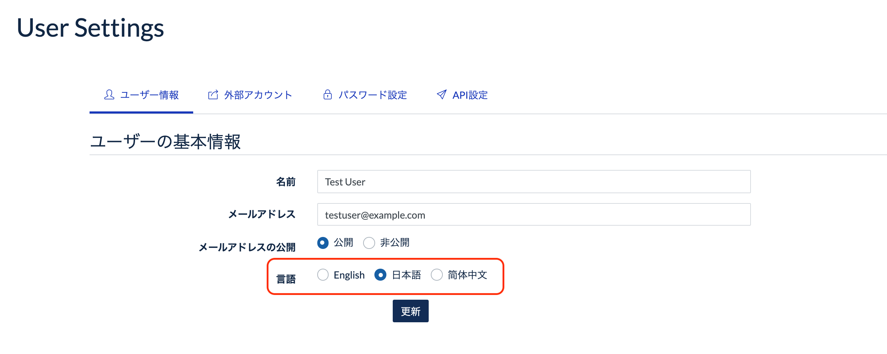

# アプリ設定 AppSettings

## App settings

### サイト名

こちらに設定をした内容は、GROWI のログイン画面及びタイトルとして表示されます。

### コンフィデンシャル表示

コンフィデンシャル表示欄に記載した内容は、GROWI のヘッダーに表示されるようになります。

### 新規ユーザーのデフォルト言語設定

この欄では、英語か日本語を選択します。

上記の設定により、GROWI で新規ユーザーを作成する際の、デフォルト設定言語が切り替わります。

### ファイルアップロード

GROWI では、ページへの画像以外のファイルのアップロードを可能とするための設定があります。

こちらにチェックをしないと、wiki ページの編集時には画像以外のファイルはアップロードできません。

また、以下の画像のように、このチェック欄がチェック出来ない場合は、  
[ファイルアップロード設定](ja/admin-guide/admin-cookbook/attachment.html) の設定が未完了です。

ファイルアップロードの設定を行うことで、ファイルがアップロードできるようになります。

以下の表示となっている場合は、ファイルアップロードは機能していません。

## サイトURL設定

## メールの設定

## AWS 設定

## プラグイン設定
