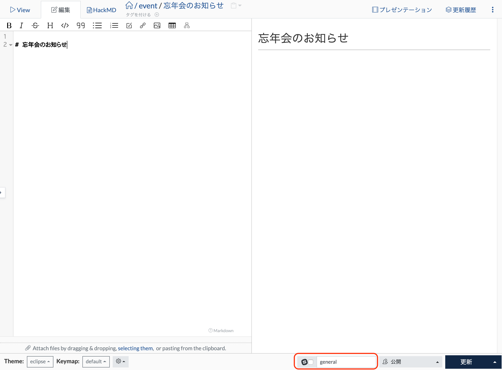

# 外部ツールへの通知
<!-- TODO: GW-5372 「Slack/Mattermost への通知」の内容を適切なタイトルの下に移動させる -->

## 通知手段の種類

### 概要

### Slack bot

### Slack / Mattermost incoming webhook

GROWI では、 Incoming Webhook を利用した Slack 通知が可能です。  
1つの GROWI につき 1つのワークスペースを登録でき、ワークスペースに属する全てのチャンネルに通知できます。

### IFTTT

## 通知の種類 / 設定方法

## 概要

## User Trigger Notification 設定

通常、通知先のチャンネルを通知する度に入力する必要がありますが、
デフォルトパターンを設定することで入力を省くことが可能です。

### デフォルトパターンの設定方法

1. 管理画面のセキュリティ設定ページ(/admin/notification)にアクセスします。
2. User Trigger Notification のタブを開きます。
3. パターンとチャンネル名を入力します。

- 設定値を表示するパスをパターンといいます。例えば `/event/*` と設定した場合 event 配下のページのみに設定したデフォルトパターンが表示されます。
- 全てのページにデフォルトパターン表示したい場合は `/*` と入力してください。

### デフォルトパターン設定が反映されているかの確認

例えば、パターンを `/event/*` チャンネルを `general` と設定した場合、  
`/event/忘年会のお知らせ`というパスのページを作成すると Slack 通知フォームに `general` が設定された状態で編集モードに遷移します。

チェックボックスを有効にした状態でページを更新した場合、 `general` チャンネルに Slack 通知が届きます。

## Global Notification 設定

Wiki 利用者が所定のアクションをしたタイミングで発信される Slack 通知を設定できます。

### Global Notification の設定方法

1. 管理画面のセキュリティ設定ページ(/admin/notification)にアクセスします。
2. Global Notification のタブを開きます。
3. 通知設定の一覧の右側にある通知設定の追加ボタンを押します。
4. 通知詳細設定で各種設定を行います。

- 通知機構はトリガーパスで起きるイベントを感知します。  
例えば `/event/*` と設定した場合、`/event` 配下のページで Global Notification が有効になります。

### 通知の有効 / 無効

Global Notification は通常 public なページ内のイベントのみ通知が届きます。

チェックボックスを有効にすることで以下のページ内のイベントを感知するようになります。

- '自分のみ'に閲覧制限をしているページ
- '特定グループにのみ'に閲覧制限をしているページ

linkを知っている人のみ閲覧できるページは設定に関わらず常に通知されません。
