# グループ管理

グループ管理機能を利用することで、ページ単位で特定のユーザーしか内容を閲覧・編集できないようにする権限を設定できます。

グループを設定するためには、管理者権限のあるユーザーで管理メニューから操作する必要があります。

## グループの作成

1. 管理メニューの「グループ管理」に移動します。

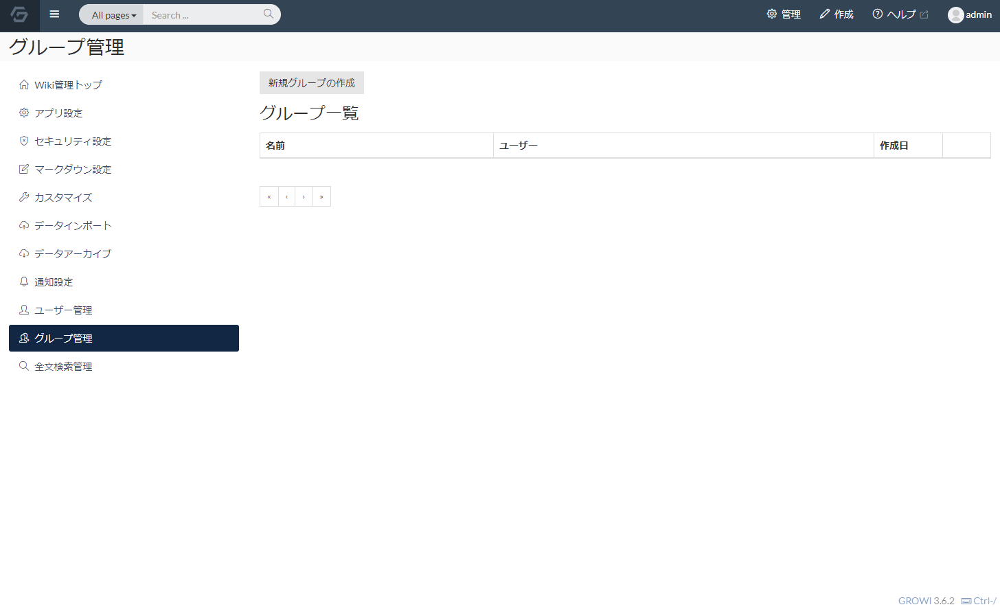

2. 「新規グループの作成」ボタンをクリックし、グループ名を入力して「作成」ボタンをクリックしてください。

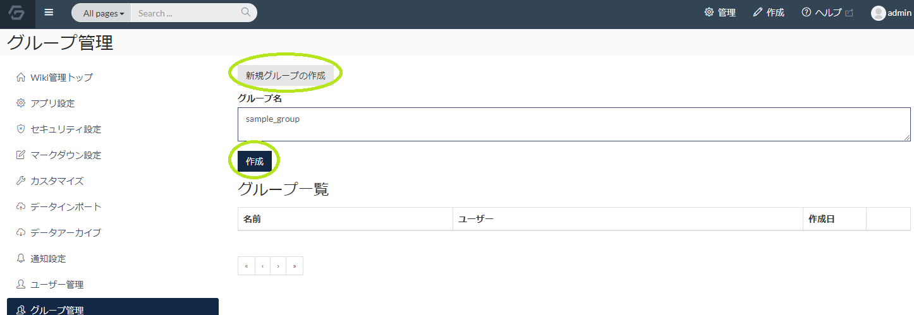

3. Success 表示され、一覧にグループが追加されます。

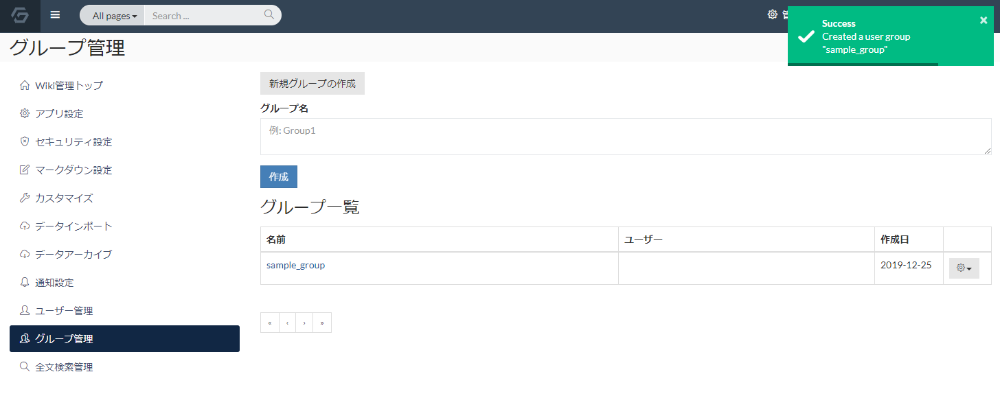

## グループへのユーザーの追加

1. グループ一覧に表示されているグループを選択します。

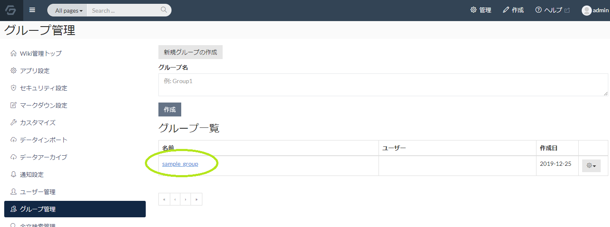

2. グループの設定としてユーザー一覧を操作することでグループにユーザーを追加できます。

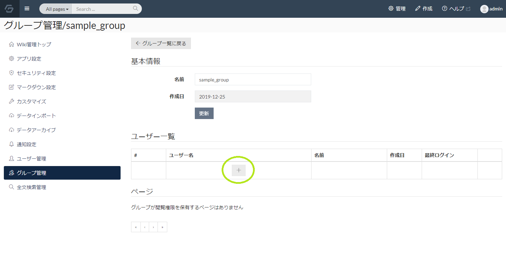

3. ユーザー名の欄の「＋」をクリックすると、グループへのユーザー追加の入力欄が表示されます。

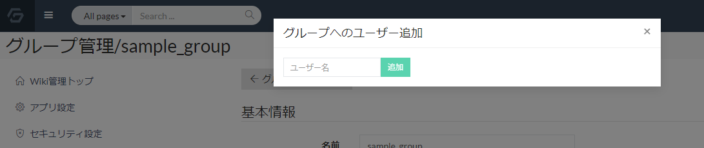

4. GROWI にユーザーとして登録されているユーザー名を入力します。

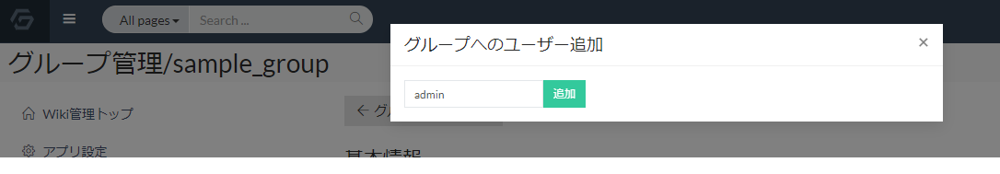

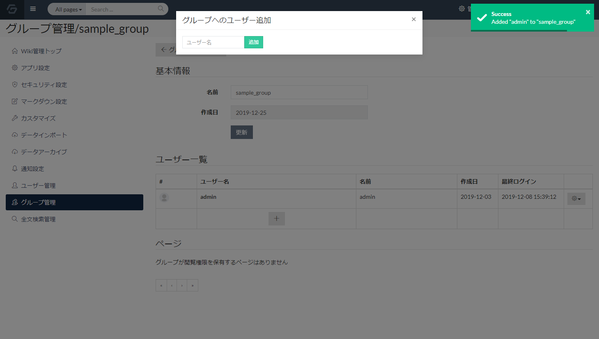

※登録されているユーザー名ではない場合、以下の画像のようにエラーとなりグループにユーザー追加できません。

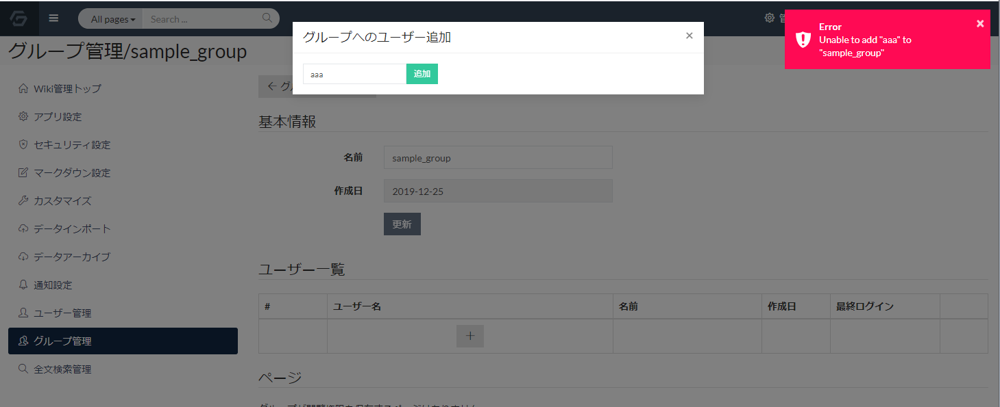

## ページに対する閲覧権限の設定

グループが作成できたら、ページに閲覧・編集権限を設定します。

1. ページの編集モードで、以下の画像のように「特定のグループのみ」を設定します。

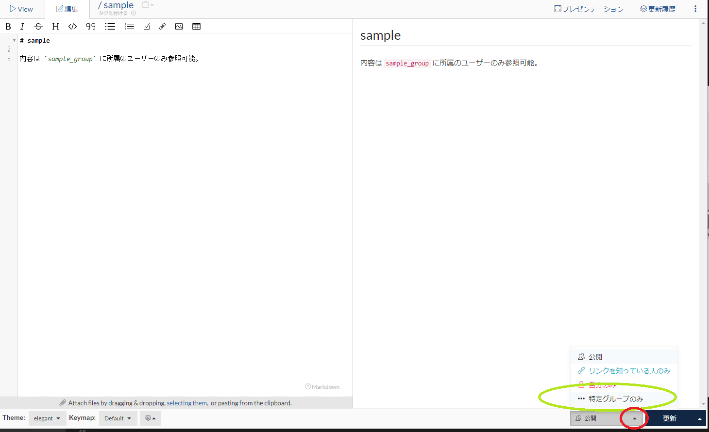

2. グループ選択メニューに自分の所属しているグループの一覧が表示されます。

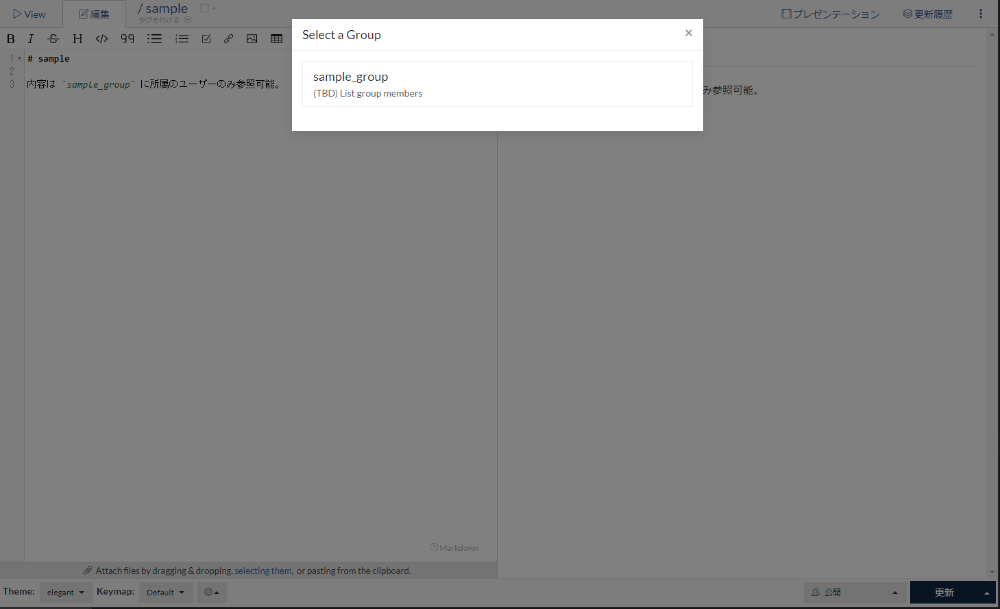

3. 対象のグループを選択し、ページを更新ボタンをクリックします。

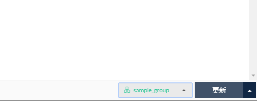

4. 画像のように、ページ上部に権限が付加されている表記が出ていれば、権限設定は完了です。

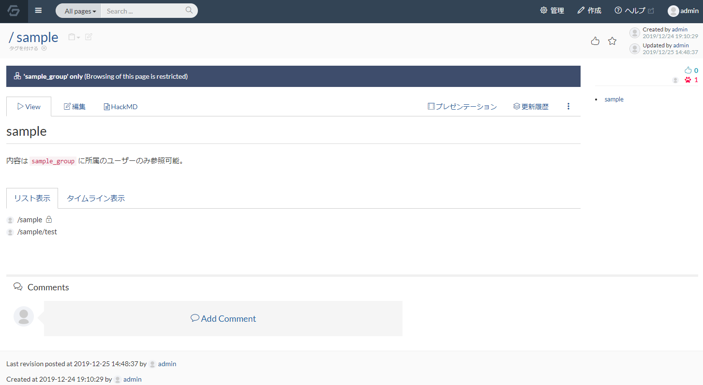

グループに所属していないアカウントで該当のページを参照すると、ページの内容を閲覧・編集できないようになっています。

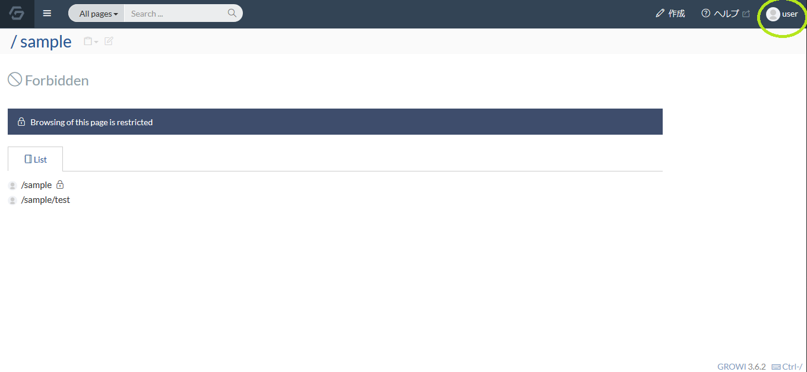

## グループ管理画面上での権限付与ページの参照

ページに対して閲覧・編集権限を設定すると、グループ管理の画面上から、対象のグループに権限設定されたページ一覧を確認できます。

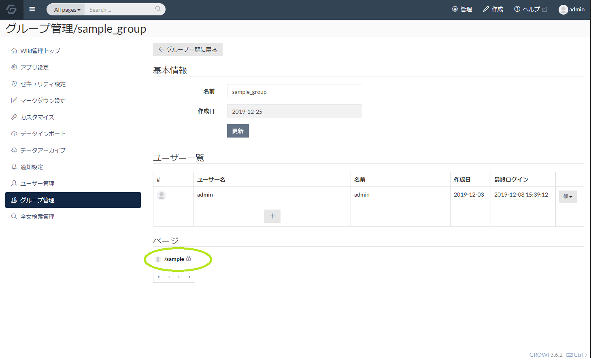
