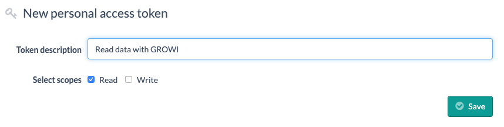
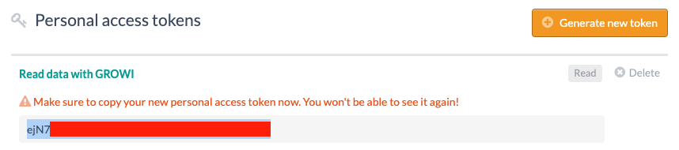
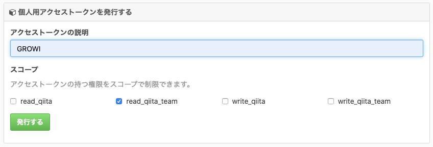

# データのインポート

GROWI v4.2.21 現在では、GROWI、 esa.io、Qiita:Team のデータをインポートする機能をサポートしています。

## GROWI アーカイブデータインポート

GROWI のアーカイブデータの zip ファイルからデータをインポートします。

:::warning

- GROWI アーカイブデータは同バージョンの GROWI のみインポート可能です。

- 新環境でのインポート操作を行う管理者ユーザーは、旧環境に存在しない username で作成してください。
:::

:::danger

- インポート機能のデータはファイルシステムを利用するため、GROWI サーバーをロードバランスしている場合は正常動作しない可能性があります。詳細は[こちら](../admin-cookbook/loadbalance.md#インポート・エクスポート機能に関する注意点)を確認してください。
:::

### インポート対象

インポート可能なデータ一覧は[データのアーカイブ](./export.md#アーカイブ可能なデータコレクション)を参照してください。一つの zip ファイルから必要なデータコレクションのみを選択しインポートすることが可能です。

### モード

重複データのインポートに関するルールはコレクションごとに以下の3つから選択できます。

- Insert
  - 同名と判断できるデータが存在しない場合のみインポートし、存在する場合はスキップします。
- Upsert
  - 同名と判断できるデータが存在する場合、そのデータを上書き更新します。
- Flash and Insert
  - 同名と判断できるデータが存在する場合、既存のデータを完全に削除した後、インポートを行います。
  - User コレクションではこのモードは選択できません。
  - Config コレクションはこのモードのみ選択可能です。
    - Config コレクションをインポートした場合、サーバー再起動が必要です。

### インポート方法

1. GROWI に管理者アカウントでログインし、[管理/データインポート] (`/admin/importer`) にアクセスします。この時、インポート操作を行う管理者ユーザーの `username` は、旧環境には存在しないことを確認してください。
2. [GROWI アーカイブをインポート] にて、GROWI アーカイブファイルをアップロードします。
3. インポートしたいコレクションにチェックを入れ、モードを選択します。
4. インポートを実行すると、各コレクションに結果が表示されます。

- Inserted: インポートによって新たに追加されたデータ
- Modified: インポートによって更新されたデータ
- Failed: インポート失敗したデータ

*Config コレクションをインポートした場合、サーバー再起動が必要です。

## esa.io のデータインポート

esa.io が公開している [API v1](https://docs.esa.io/posts/102) を利用して esa.io のデータをインポートします。

### インポート対象

| esa.io     |     | GROWI      |
| ---------- | --- | ---------- |
| 記事       | →   | ページ     |
| カテゴリー | →   | ページパス |

:::danger

- ユーザーデータはインポートされません。
- 同名ページがインポート先の GROWI にすでに存在している場合、そのページはスキップされます。
- GROWI において作成不可能なページパスの場合、そのページはスキップされます。
- esa.io のページにおける以下のメタデータはインポートされません。
  - ページ作成ユーザー、ページ最終更新ユーザー
    - GROWI 上ではインポートを実行したユーザーに上書きされます。
  - ページ作成日時、ページ最終更新日時
    - GROWI 上ではインポートを実行した日時に上書きされます。
  - star
  - watch
  - tag
  - comment
  - WIP/Ship it
  - revisions および change log
- 添付ファイルは esa.io が管理している添付ファイル用 URL にアクセスするという方法で表示されます。そのため esa.io 上でファイルが削除された場合ページはリンク切れになります。
:::

### インポート方法

1. esa.io に owner アカウントでログインし、左側のタブから [SETTINGS] → [ユーザー設定] の画面にアクセスします。
2. [Personal access tokens] の [Generate new token] ボタンをクリックし、GROWI から esa.io にアクセスするためのトークンを発行します。
3. トークン名を入力し、[Select scopes] の [Read] にチェックを入れ、[Save] します。

  

4. 生成されたトークンを保存します。

  

5. GROWI に管理者アカウントでログインし、[管理/データインポート] (`/admin/importer`) にアクセスします。
6. [esa.io からのインポート] において、esa.io のチーム名とアクセストークン（先ほど保存したトークン）を入力し、更新します。
7. [接続テスト] を実行し、`Test connection to esa success.` のアラートが表示されたら接続成功です。
8. esa.io に接続可能な状態で [インポート] を実行するとページのインポートが開始されます。

## Qiita:Team のデータインポート

Qiita:Team が公開している [API v2](https://qiita.com/api/v2/docs) を利用して Qiita:Team のデータをインポートします。

### インポート対象

| Qiita:Team     |     | GROWI      |
| ---------- | --- | ---------- |
| 記事       | →   | ページ     |

:::danger

- ユーザーデータ、プロジェクトデータ、グループデータはインポートされません。
- 同名ページがインポート先の GROWI にすでに存在している場合、そのページはスキップされます。
- GROWI において作成不可能なページパスの場合、そのページはスキップされます。
- Qiita:Team のページにおける以下のメタデータはインポートされません。
  - ページ作成ユーザー、ページ最終更新ユーザー
    - GROWI 上ではインポートを実行したユーザーに上書きされます。
  - ページ作成日時、ページ最終更新日時
    - GROWI 上ではインポートを実行した日時に上書きされます。
  - ページに対するリアクション
  - 公開範囲、共同編集モード
  - タグ
  - コメント
  - 編集履歴
- 添付ファイルは Qiita:Team が管理している添付ファイル用 URL にアクセスするという方法で表示されます。そのため Qiita:Team 上でファイルが削除された場合ページはリンク切れになります。
:::

### インポート方法

1. Qiita:Team に owner アカウントでログインし、右上のユーザーアイコンをクリックすると表示されるドロップダウンから [設定] の画面にアクセスします。
2. ユーザーアカウントの [アプリケーション] タブを開き、[個人用アクセストークン] にて [新しくトークンを発行する] をクリックします。
3. [アクセストークンの説明] を入力し、[スコープ] の [Read_qiita_team] にチェックを入れ、[発行する] をクリックします。

4. 生成されたトークンを保存します。
5. GROWI に管理者アカウントでログインし、[管理/データインポート] (`/admin/importer`) にアクセスします。
6. [Qiita:Team からのインポート] において、Qiita:Team のチーム名とアクセストークン（先ほど保存したトークン）を入力し、更新します。
7. [接続テスト] を実行し、`Test connection to qiita:team success.` のアラートが表示されたら接続成功です。
8. Qiita:Team に接続可能な状態で [インポート] を実行するとページのインポートが開始されます。
