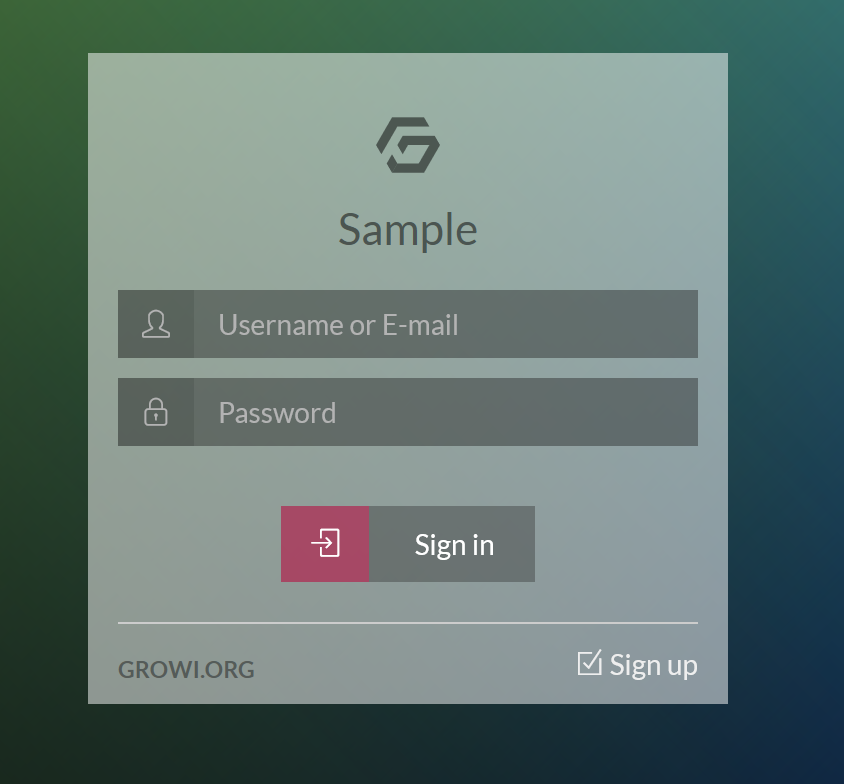
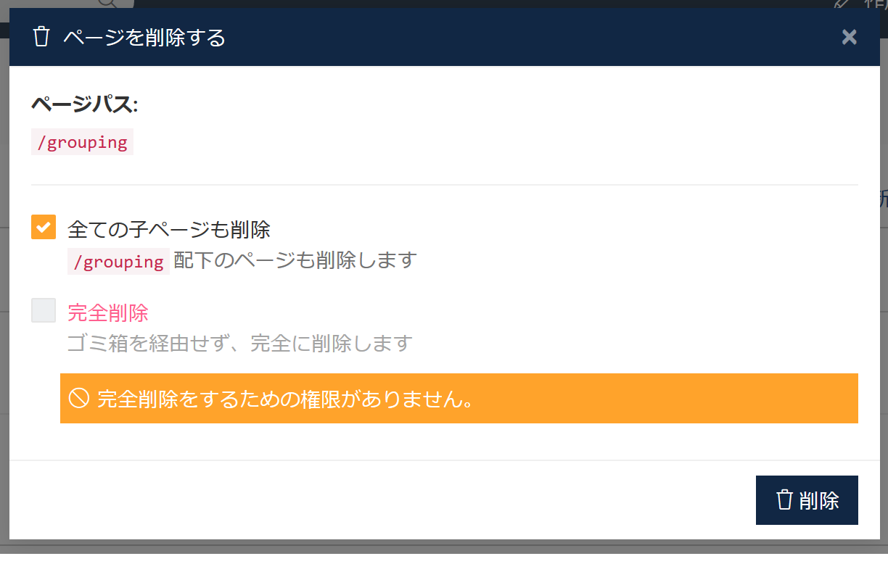
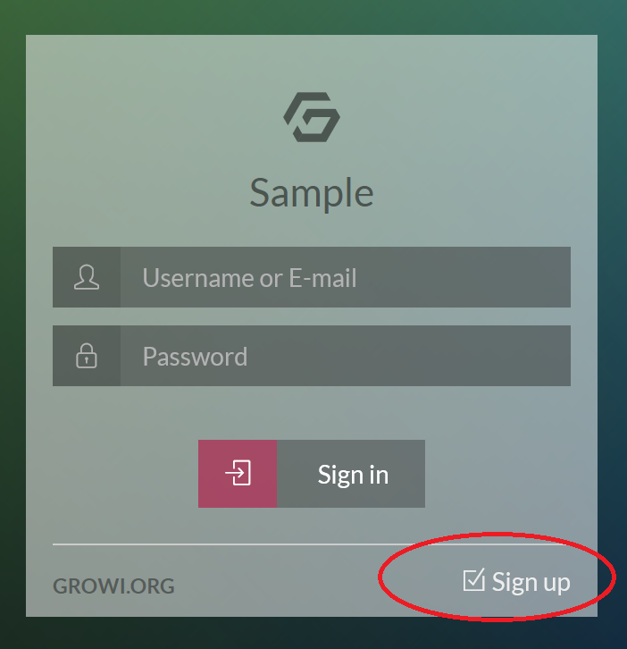
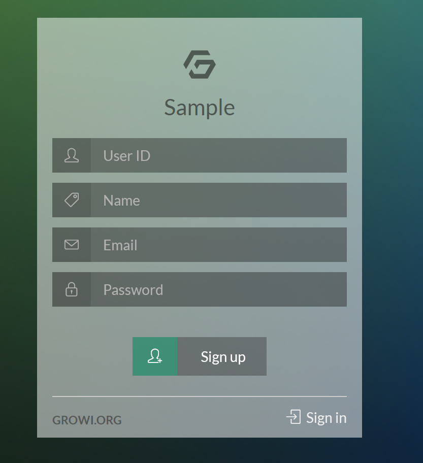
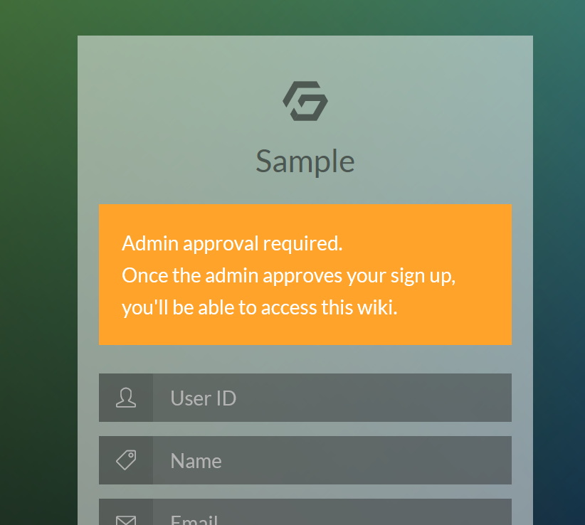
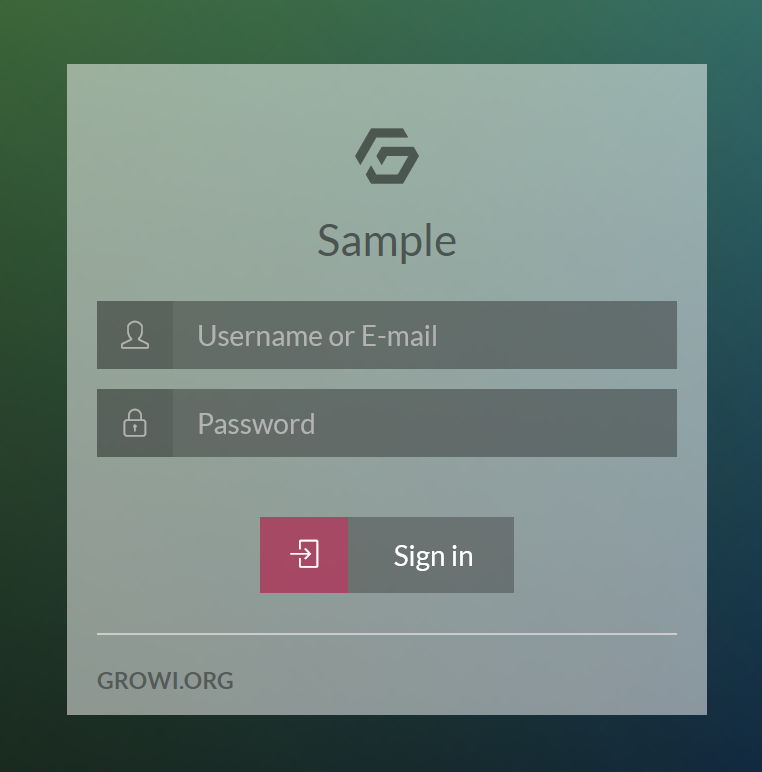
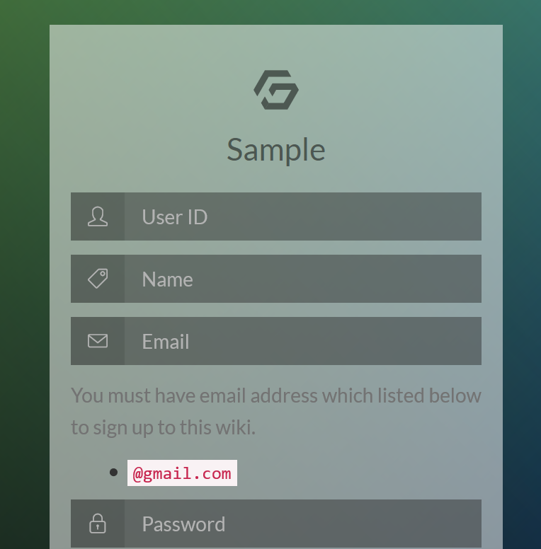
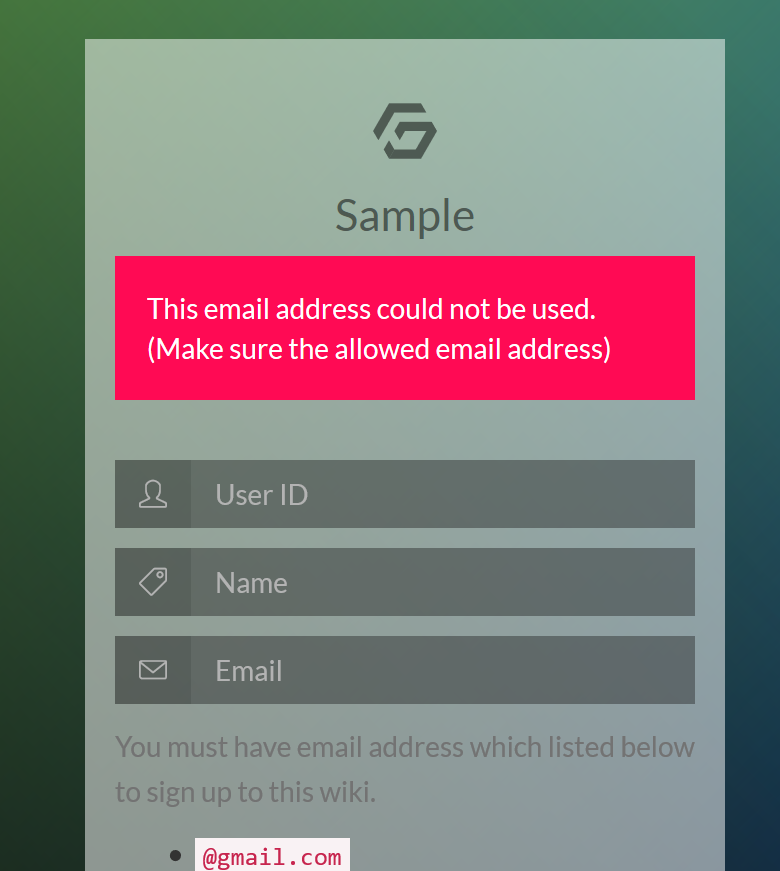

# セキュリティ設定

この欄では、ログインや表示制御に関する各種セキュリティ設定を行います。

## セキュリティ設定

それぞれの設定項目について説明します。

### ゲストユーザーのアクセス

この欄では、以下のどちらかから設定を選択します。  

- 拒否（アカウントを持つユーザーのみ利用可能）

   GROWI 全体に対して、閲覧するにはログイン必須となる設定です。プライベートwiki とも呼びます。  
   この設定の場合は、ログインしていないユーザーは以下のようなログイン画面へリダイレクトされ、
   ログインしないと GROWI の各ページの閲覧・編集が出来なくなります。

  

- 許可（ゲストユーザーも閲覧のみ可能）

   GROWI の各ページが、ログインしなくても閲覧のみ可能となり、内容が公開されます。パブリック wiki とも呼びます。

### ページのリスト表示と検索

ページのリスト表示とは、`lsx()` の記述でページを一覧表示することです。  
ページのリスト表示についての詳細は[ユーザーズガイド](/ja/guide/tips/hierarchical.html)をご参照ください。  

この欄では、以下のどちらかから設定を選択します。  

- '自分のみ'に閲覧制限しているページ

   ON の場合、ページのリスト表示や検索結果において、'自分のみ'に閲覧制限をしているページをアクセス権のないユーザーにも表示します。

- 特定グループに閲覧制限しているページ

   ON の場合、ページのリスト表示や検索結果において、特定グループにのみ閲覧制限をしているページをアクセス権のないユーザーにも表示します。

### ページの完全削除

ページを完全に削除できるユーザーを制限します。  
ここで設定するのは `完全削除` に関する制限です。ページを削除しゴミ箱(trash)へ移動する事は制限しません。

制限は以下のいずれかを選択して設定します。

- 誰でも可能
- 管理者のみ可能
- 管理者とページ作成者が可能

ここで `誰でも可能` 以外を選択すると、権限のないユーザーが完全削除をしようとしても、下記のように操作が制限されます。

  

## XSS(Cross Site Scripting)対策設定

XSS 対策設定は管理メニューのセキュリティ設定の画面ではなく、マークダウン設定の画面で行います。

説明についても、マークダウン設定のページを参照してください。

## 認証機構設定

GROWI の認証機構設定では、様々な認証機構との連携が可能です。以下に列挙します。

- ID/Pass (後述)
- [LDAP](/ja/admin-guide/management-cookbook/ldap.html)
- SAML
- OIDC (OpenID Connect)
- Basic 認証
- Google OAuth
- GitHub OAuth
- Twitter OAuth
- (TBD)Facebook OAuth

いずれかの認証を有効にして、かつ正しくセットアップしないと、他の認証の `有効にする` チェックボックスは Off に出来ません。  
デフォルト設定では、IDとパスワードによるログイン管理設定が有効になっています。

それぞれの連携設定は別途 専用の Docs ページを参照してください。

本ページでは ID/Password の設定についてのみ説明します。

## ID/Password 設定

### ID/Password

GROWI へのログインに、GROWI ログイン画面と Sign Up 画面を利用する設定です。  
以下の画像の通り、ID/Password でログインできます。

  

### 登録の制限

新しいユーザーを登録する方法を制限します。

- 公開（だれでも登録可能）

   GROWI へのユーザー登録は、以下の画像の Sign up リンクから誰でも登録できます。

  

   Sign up 画面で、User ID, Name(表示名), Email アドレス, パスワード を設定してユーザー登録となります。

  

- 制限（登録完了には管理者の承認が必要）

   GROWI へのユーザー登録は、ログイン画面の Sign up リンクから誰でも登録できますが、  
   登録後に管理者の承認がないと有効化されません。  

   この選択肢で設定した場合、以下の画像のように注意書きが表示されます。

  

- 非公開（登録には管理者による招待が必要）

   GROWI へのユーザー登録には管理者による招待が必要となり、ログイン画面に `Sign up` リンクが表示されなくなります。  
   招待はユーザー管理の画面から行います。

  

### 登録許可メールアドレスのホワイトリスト

登録可能なメールアドレスを制限することができます。

例えば、@growi.org と記載することで、そのドメインのメールアドレスを持っている人のみ登録可能になります。

1行に 1メールアドレス入力してください。

ここでホワイトリスト登録した内容は、Sign up 画面で以下の画像のように表示されます。

  

ホワイトリスト設定した場合、設定した内容以外のメールアドレスで Sign up しようとすると、以下のようにエラーとなります。

  
