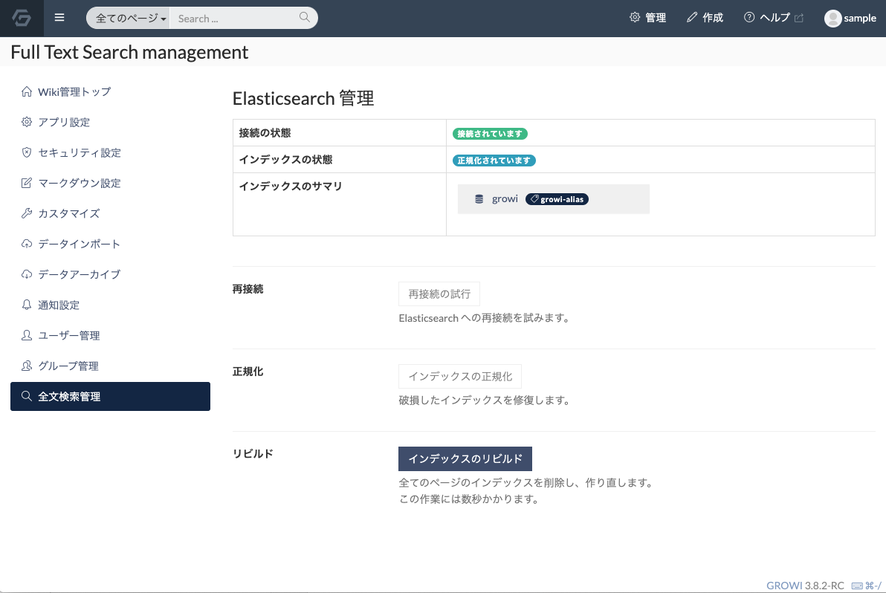
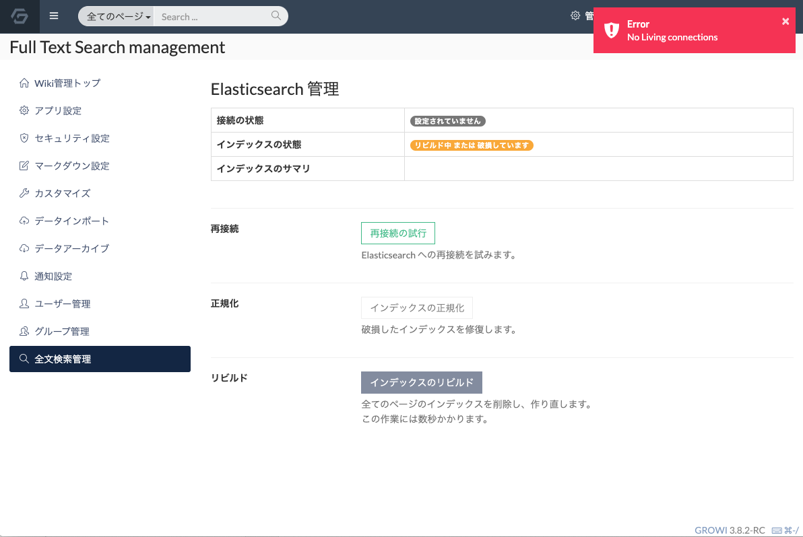
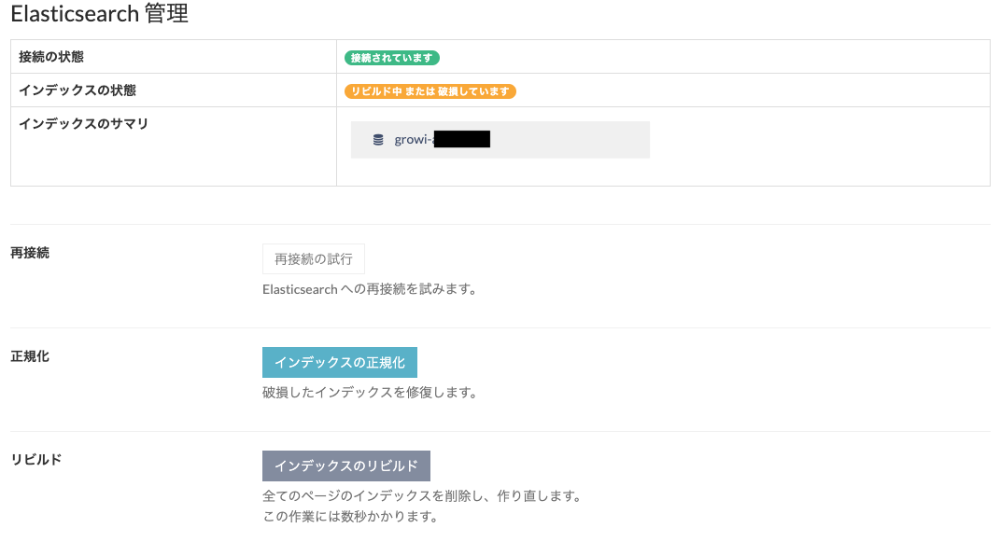

# 全文検索機能のセットアップと管理

Elasticsearch による全文検索機能を利用するための設定方法を紹介します。

## 各環境における Elasticsearch の起動と接続
Elasticsearch サーバーの起動と接続に関しては、システム管理者のページを参考にしてください。
- docker-compose
  - [weseek/growi-docker-compose](https://github.com/weseek/growi-docker-compose) を利用している場合はデフォルトで Elasticsearch が起動されるので、追加で設定する必要はありません。
- ubuntu
  - [こちら](../../admin-guide/getting-started/ubuntu-server.html#elasticsearch)を参考にインストールおよび起動してください。
  - 起動した Elasticsearch の URI を GROWI の環境変数 `ELASTICSEARCH_URI` に設定してください。
- centOS
  - [こちら](../../admin-guide/getting-started/centos.html#elasticsearch)を参考にインストールおよび起動してください。
  - 起動した Elasticsearch の URI を GROWI の環境変数 `ELASTICSEARCH_URI` に設定してください。
- Heroku
  - (TBD)

## アプリ上で接続確認
- 環境変数 `ELASTICSEARCH_URI` によって Elasticsearch の URI が指定され、正常に接続されている場合、GROWI 画面のトップバーに検索窓が表示され、管理画面の全文検索管理ページにて接続および Elasticsearch インデックスの状態を確認することができます。

  

- Elasticsearch の URI が指定されているにもかかわらず以下のような接続が確認できない旨のエラーが表示される場合は Elasticsearch の状態と URI の設定を見直してください。

  

## インデックスのリビルト
Elasticsearch による検索機能は、検索用 DB のデータと Mongo DB に存在するデータの整合が取れていることを前提として正常な検索機能を実現します。そのため DB を直接操作するなどの行為によりこれらの DB 間で不整合が起きた場合、検索機能が正常に動作しません。

そのような場合に、管理画面の全文検索管理ページにてインデックスのリビルドを行うことで、検索機能を復旧することができます。

全文検索管理ページの[インデックスのリビルド]ボタンにてインデックスのリビルドを実行することができます。この作業は完了までに数秒かかります。

## インデックスの正規化
インデックスの処理が中断された場合はインデックスは以下のように破損状態と表示されます。（リビルドが継続している場合も同様の表示になりますので継続中の場合は処理が完了するまで待ってください。）

破損したインデックスに対して、インデックスの正規化を行うことで以前のリビルド結果のインデックスで検索機能を利用可能にできます。

