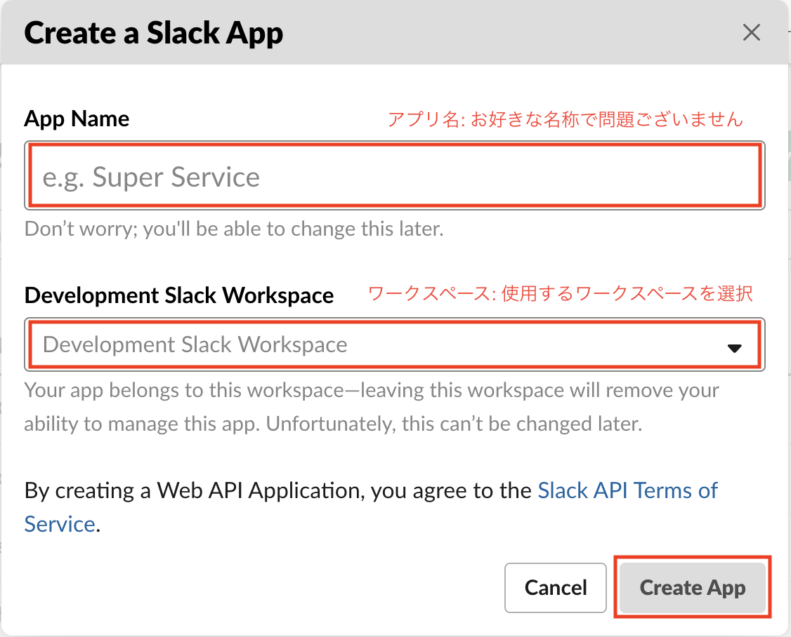

# Slack 連携

## 概要
<!-- TODO: GW-5376 作成した図を用いて、botの概要を記述する -->

### Custom bot (non-proxy) のセットアップ

Custom bot (non-proxy) を Slack のワークスペースに導入するには、Slack アプリを作成・編集する必要があります。手順は以下の通りです。

#### Slack app を作成する

1. Slack API の[アプリページ](https://api.slack.com/apps)に移動し、「Create New App」をクリックします。

    

2. 「Create a Slack App」の ①「App Name」にはアプリの名前を、②「Development Slack Workspace」には
GROWI botを追加したいワークスペースを選択します。

3. 「Creat App」をクリックします。

    

#### スコープを設定する
<!-- TODO: GW-5332 スコープの設定方法を記述する(日本語) -->

#### 各 Request URL を設定する
<!-- TODO: GW-5336 スラッシュコマンドなど各RequestURLのセット方法を記述(日本語) -->

#### Bot を Slack のワークスペースへインストールする
<!-- TODO: GW-5337 botをslackにインストールできるところまで記述(日本語) -->

<!-- ### Official bot のセットアップ -->

<!-- ### Custom bot (with-proxy) のセットアップ -->

### Incoming webhook のセットアップ
<!-- TODO: GW-5372 「Slack/Mattermost への通知」の内容を適切なタイトルの下に移動させる -->

## Slack bot でできること

### ワークスペース内の全文検索
<!-- TODO: GW-5375 全文検索の方法を記述(日本語) -->

<!-- ### 複数ワークスペースの横断検索 (TBD) -->

<!-- ### Slack ログの記録 (TBD) -->