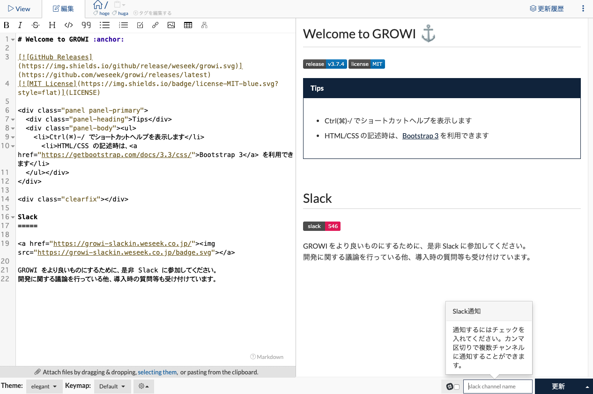

# Slack 連携

## 概要

GROWI では、 Slack 連携の方法として、1. GROWI bot と 2. Incoming Webhook の 2 種類の方法があります。

1. GROWI bot

<!-- TODO: GW-5376 作成した図を用いて、botの概要を記述する -->

2. Incoming Webhook

Incoming Webhook は、Slack への通知ができる機能です。
ワークスペースに属するチャンネルのいずれかを選択して通知を行う事ができます。

### Custom bot (non-proxy) 設定

Custom bot (non-proxy) を Slack のワークスペースに導入するには、Slack アプリを作成・編集する必要があります。手順は以下の通りです。

#### Slack app を作成する

1. Slack API の[アプリページ](https://api.slack.com/apps)に移動し、「Create New App」をクリックします。

   

2. 「Create a Slack App」の ①「App Name」にはアプリの名前を、②「Development Slack Workspace」には
   GROWI bot を追加したいワークスペースを選択します。

3. 「Create App」をクリックします。

   

#### スコープを設定する

<!-- TODO: GW-5332 スコープの設定方法を記述する(日本語) -->

#### 各 Request URL を設定する

- **Event Subscriptions** の Request URL を設定する

  1. 作成した Slack App の **Features** から **Event Subscriptions** をクリックします。
     

  1. **Enable Events** 右側にあるボタンを On にします。
     

  1. Request URL を以下のように入力してください。

     - https:// 連携させたい GROWI のドメイン名 /\_api/v3/slack-bot
       - 例 https://example.com/_api/v3/slack-bot

     

  1. 入力が完了したら、**Save Changes** をクリックしてください。

- **Interactivity & Shortcuts** の Request URL を設定する

  1. 作成した Slack App の **Features** から **Interactivity Shortcuts** をクリックします。
     

  1. **Interactivity** 右側にあるボタンを On にします。
     

  1. Request URL には先ほど入力したものと同じものを入力してください。
     

  1. 入力が完了したら、**Save Changes** をクリックしてください。

#### スラッシュコマンドの作成

1. 作成した Slack App の **Features** から **Slash Commands** をクリックします。

2. **Create New Command** をクリックします。

- Command に /growi と入力してください。
- RequestURL には、上記で設定した Request URL と同じものを入力してください
- Short Description も入力必須のため、適当なご説明を入力してください。
- Usage Hint に関しては任意なので、適宜入力してください。
- Escape channels, users, and links sent to your app に関しては任意なので、適宜入力してください。
- 入力が完了したら、**Save** をクリックしてください。

#### Bot を Slack のワークスペースへインストールする

1. 作成した Slack App の **Settings** から **Basic Information** をクリックします。
1. **Install your app** をクリックします。
   
1. **Install to Workspace** をクリックします。
   
1. 遷移先の画面にて、**Allow**をクリックします。
   
1. Install your app の右側に 緑色のチェックがつけば完了です。

<!-- ### Official bot 設定 -->

<!-- ### Custom bot (with-proxy) のセットアップ -->

### Incoming webhook のセットアップ

<!-- TODO: GW-5372 「Slack/Mattermost への通知」の内容を適切なタイトルの下に移動させる -->

### Incoming webhook 設定

<!-- TODO: GW-5372 「Slack/Mattermost への通知」の内容を適切なタイトルの下に移動させる -->

通知を行う Slack ワークスペースを設定します。

1. 管理画面のセキュリティ設定ページ(/admin/notification)にアクセスします。
2. Slack Incoming Webhooks 設定の必要事項を入力し、更新ボタンを押します。

- **Webhook URL**  
  [Incoming Webhooks](https://slack.com/services/new/incoming-webhook) で取得できます。

### 設定が反映されているかの確認

上記の設定後、ページの編集モード画面に Slack 通知フォームが追加されます。

ページの保存・更新時に 入力したチャンネルに Slack 通知が届きます。  
この方法で通知を行うことを GROWI では **User Trigger Notification** といいます。

User Trigger Notification の設定方法は[こちら](../management-cookbook/external-notification.html#user-trigger-notification-設定)を参照してください。

## Slack bot でできること

### ワークスペース内の全文検索

1. GROWI-BOT を使いたいチャンネルに招待します。
   
1. /growi search [keywords] を入力すると検索結果が表示されます。

   - 例: /growi search example
     
   - 検索結果
     
   - **Share** ボタンをクリックすると、チャンネル内に共有されます。
     
   - **Next** ボタンをクリックすると、次の検索結果を表示します。
     <!-- TODO post pictures after https://youtrack.weseek.co.jp/issue/GW-5283 -->

<!-- ### 複数ワークスペースの横断検索 (TBD) -->

<!-- ### Slack ログの記録 (TBD) -->
