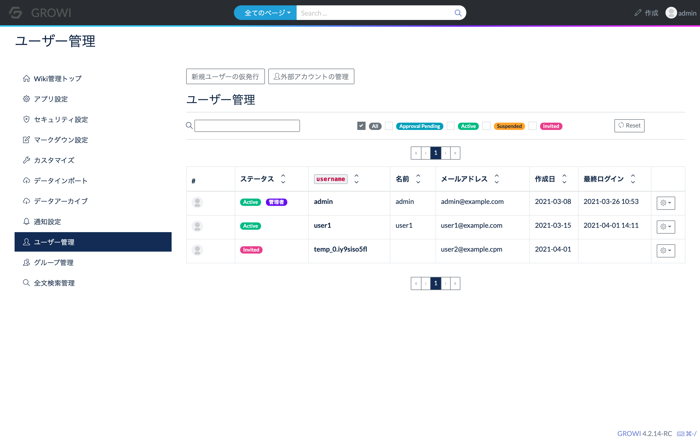

# ユーザー管理
管理画面のユーザ管理から、登録ユーザーの管理を行うことができます。

## ユーザーテーブル
ユーザーを一覧表示します。検索フィルターを用いて、username、名前、メールアドレス、ステータスにより表示するユーザーを絞ることができます。

パスワードのリセット、アカウントの削除、停止、管理画面へのアクセス権限の変更等の操作もこのテーブル上で行うことができます。

### ステータス
- Active
  - 承認済みユーザー
  - 管理画面へのアクセス権限がある場合は「管理者」ステータスがつきます
- Approval pending
  - 承認待ちユーザー
  - この状態のアカウントはログインすることはできません
  - セキュリティ設定内の ID/Password の認証機構設定にて登録の制限を「制限」にしている場合、新規登録後のユーザーは、管理者によるアカウントの承認が行われるまでこの状態になります。
  - アカウントを有効にするには同テーブルにて「承認する」が実行される必要があります
- Suspended
  - 管理者により利用を停止されたユーザー
  - この状態のアカウントはログインすることはできません
  - 管理画面のユーザー設定のテーブル上で「アカウント停止」を実行されたユーザーはこの状態になります
  - アカウントを有効にするには同テーブルにて「承認する」が実行される必要があります
- Invited
  - 管理者により招待されたユーザー
  - 招待時に利用したメールアドレスおよびパスワードで初回ログインを行うまでこの状態になります
  
### パスワードのリセット
ユーザーテーブル右側のドロップダウンから、ユーザーのパスワードをリセットすることができます。

ドロップダウンの編集メニューから、パスワードのリセットを選択するとモーダルが表示されるので、そこに表示されるパスワードリセットの対象ユーザーを確認してください。

パスワードのリセットを押すと新規のパスワードが発行されるので、対象ユーザーはこのパスワードを用いてログインしたのち、ユーザー設定( `/me` )のパスワード設定からパスワードを再設定するよう伝えてください。

### 管理者権限
管理者ステータスを持つユーザーは管理画面へのアクセスおよび各種設定を行うことができます。

ユーザーテーブル右側のドロップダウンからユーザーへの管理者権限の付与または削除ができます。

### アカウントの承認および停止
承認待ちや停止中のアカウントに対し、アカウントの承認を行うことができます。アカウントを承認することで、そのアカウントによるログインが可能になります。

承認済みのアカウントに対して停止を行うことができます。停止されたアカウントはアカウント情報は残りますがログインすることができません。管理者により再度承認が行われるとログインが可能になります。

### アカウントの削除
Active ステータスでないアカウントのみ削除することができます。削除したユーザーは復元できないので注意してください。

## 新規ユーザーの招待
メールアドレスを指定して新たにユーザーを招待することができます。ユーザー管理画面の[新規ユーザーの招待]ボタンを押すとモーダルが開くので招待先のメールアドレスを入力してください。改行により複数のメールアドレスを指定できます。

招待をメールで送信にチェックを入れて Invite を実行すると指定したメールアドレスに招待メールが送信されます（アプリ設定にてメールの設定もしくはAWS設定を完了している必要があります。詳しくはこちら）

## 外部アカウント管理
外部アカウントの管理を行います。外部アカウントとは外部認証機構を利用して登録した時に GROWI アカウントと紐づけられる情報で、紐づくGROWIアカウントが削除されるとそれに紐づく外部アカウントも自動で削除されます。

GROWI アカウントのパスワードが未設定の場合、パスワードの設定ステータスが「未設定」表示されます。その状態の外部アカウントに紐づいた GROWI アカウントは ID/Pass によるログインはできません。その外部アカウントでログインし、個人設定画面からパスワードの設定を行うか、管理者がそのアカウントのパスワードのリセットを行うと「設定済み」になります。

外部アカウント管理内のテーブルから外部アカウントの削除ができます。外部アカウントを削除しても GROWI アカウントは削除されません。