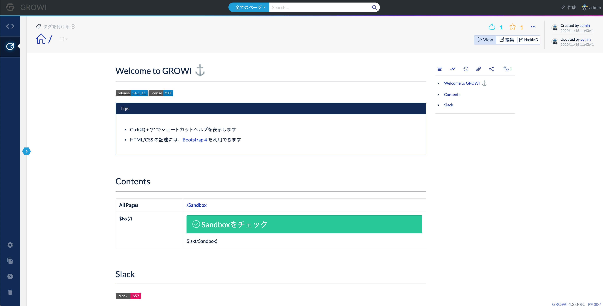

# GROWI v4.2.x へのアップグレード

v4.2 では、ページのコンテンツ幅が狭くなるように調整し、中央に配置しました。  
それに伴って、ページに関するコンテンツの設置場所が大きく変わりました。

## MongoDB v4.4 へのアップグレード

::: warning
この項目の内容は GROWI のバーションを v4.2.x にアップグレードする際に必要な操作です。  
:::

[こちらの手順を参照](../admin-cookbook/upgrade-mongodb.md)して、MongoDB をアップグレードしてください。

## ページに関するコンテンツの設置場所の変更

::: tip
仕様に大きな変更はございません。  
リスト表示に関しては管理画面で表示個数を操作できるようになりました。
:::

### ページに関する操作

ページの移動・複製・削除は右上の 3点ドットで表示されるボタンから実行可能です。

### View・編集・HackMDの切り替え

タブでの切り替えから、ボタンによる切り変えになりました。

### ページに関する情報を見る

並んでいるアイコンのいずれかをクリックすることでコンテンツの情報を表示させることができます。

## アップグレード前にチェックすべきこと

- [x] MongoDB は v4.4 にアップグレードされているか
- [x] GROWI の利用者にレイアウト変更と各種操作に関する場所の移動が周知がされているかどうか
