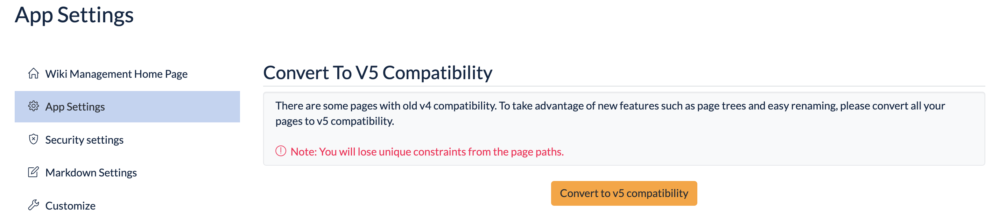
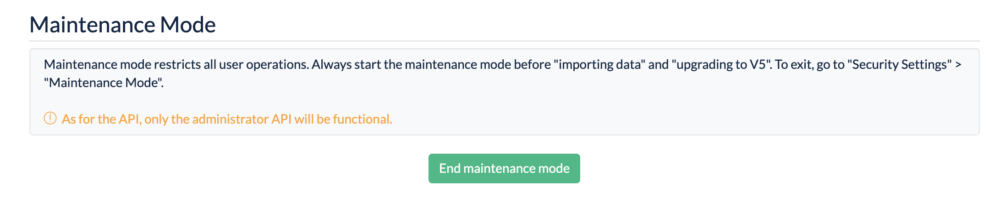
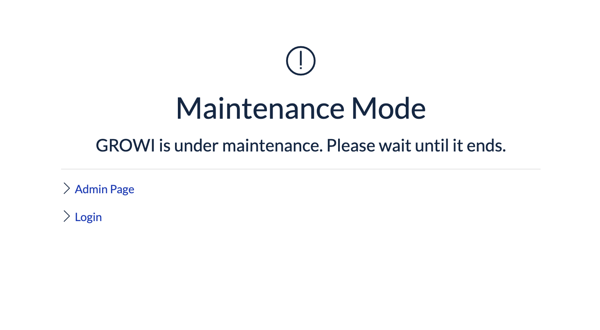

# GROWI v5.0.x へのアップグレード

v5.0 では、全ページの階層構造を表示できるページツリーがサイドバーに追加されました。  
それに伴ってページの移動・リネーム・削除時の子孫ページの取り扱いの仕様に大きな変化があります。

::: danger
「自分にのみ公開」「グループにのみ公開」ページに意図しない変更が加わることを避けるため、
管理者の方はこのアップグレードガイドをチェックし、利用者の方に変更点についての注意喚起を行ってください。
:::

またアップグレードを行う際は [アップグレード前にチェックすべきこと](#アップグレード前にチェックすべきこと) を一読することを強く推奨します。

## 目次

[[toc]]

## 新しい v5 互換形式について

v5.0 では、ページのデータ形式が内部的に大きく変わりました。

- v5.0 アップグレード後に新たに作成したページは、全て「新しい v5 互換形式」で作成されます
- v4.5 までに作成されたページは、新しい v5 互換形式には**自動では変換されません**
  - 管理者または一般ユーザーが明示的に変換操作を行うことにより、新しい v5 互換形式に変換できます

::: tip
v5 互換形式に変換されていないページに関してもこれまで通り閲覧・編集・管理が可能ですが、v5.0 で新しく実装された機能を利用できません。
:::

### 新しい v5 互換形式へのアップグレード操作

管理者ユーザーは、管理ページから全ての公開(パブリック)ページに関して v5 互換形式への変換処理を実行できます。
この操作で、ページツリーに変換済みの公開(パブリック)ページが表示されるようになります。




プライベートページに関しては、ページツリーの最下部にある「旧形式のプライベートページ」のリンクをクリックするか、
あるいは `/_private-legacy-pages` に直接アクセスすることで、新しい v5 互換形式に変換できます。
ログイン中のユーザーが閲覧可能なページの一覧が表示されるので、その中から変換したいページを選択し、
「一括変換」ドロップダウンを利用して変換してください。


### 変換前後の挙動の差異

|  | v4.5 以前に作成されたデータ | 新しい v5 互換形式のデータ |
|:--|:------------:|:------------:|
| **ページツリーへの表示** | 表示されない | 表示される |
| **子孫ページを伴う移動・削除** | 閲覧可能なページのみ処理 | 配下の全てのページを処理<br>(ただし新しい v5 互換形式のページに限る) |
| **子孫ページに設定可能な閲覧権限** | 全ての種類の権限を設定可能 | 親ページよりも範囲の狭い権限のみ設定可能 |


## [新機能] メンテナンスモード

管理ページからの操作でシステムをメンテナンスモードに入れることが可能になりました。

メンテナンスモードでは一般ユーザーによるアクセスが不可となり、また管理者ユーザーも管理ページと一部の API エンドポイントを除いてアクセスができなくなります。この機能によって、ページデータやユーザーデータの作成・編集・削除操作によるデータの変更全般を抑制できます。

インポート・エクスポート機能や管理ページからの新しい v5 互換形式へのアップグレード操作の際に活用してください。

メンテナンスモードは管理画面のアプリ設定にて有効にできます。



【メンテナンスモード有効時の表示】



## [新機能] ページツリー

v5.0 では、全ページの階層構造を表示できるページツリーがサイドバーに追加されました。ツリー状の UI になっているので、
配下ページを開閉して表示させたり、ドラッグ＆ドロップでページを移動させることが可能になりました。

::: warning
ページツリーに表示されるデータは、新しい v5 互換形式のページのみです。
:::


## [仕様変更] ページの移動・リネーム・削除の仕様変更

新しい v5 互換形式のページは、移動・リネーム・削除処理を行ったときの挙動が v4.5 以前とは異なっています。

v4.5 までは「子孫ページを伴って処理する」選択をしても、操作するユーザーにより閲覧できないページが配下にあった場合、それらは処理されないまま残る仕様でした。  
<div style=" font-weight:bold;color:#900">
    v5.0 では、例え子孫ページの閲覧権限がなくとも一緒に移動・リネーム・削除されます。
</div>
※ ただし「リンクを知っている人のみ」に設定されたページは、移動・リネーム・削除の対象に含まれません。


詳しくはユーザーズガイドの [ページの閲覧・編集権限を設定する](/ja/guide/features/authority.html) をご覧ください。

また、v4.5 までは、移動・リネーム処理時に「子孫ページを伴って処理するか」を選択可能でした。
v5.0 では、移動・リネームは基本的に子孫ページを伴う操作になります(選択不可)。削除処理に関しては引き続き「子孫ページを伴って処理するか」を選択可能です。

## [新機能] ページの削除処理に関するオプションの追加

v5.0 では、ユーザーが誤って大量のページを削除してしまう事態を防ぐために、管理ページから「子孫ページを伴って処理するか」「完全削除するか」の操作の許可・不許可を従来より細かく選択することが可能になりました。

詳しくは管理者ガイドの [セキュリティ設定](/ja/admin-guide/management-cookbook/security.html) をご覧ください。


## [仕様変更] ページパスとパーマリンク

v4.5 までは、ページパスはシステム内でユニークなものであり、同じページパスのページは作成が不可能でした。

v5.0 ではページツリーの実装に伴い、ページの移動やリネームをこれまでよりも高速に処理する必要がありました。そのトレードオフとして、
これまでユニークだったページパスは重複を許容するように変更されました。その影響を以下に列挙します。

### ブラウザのアドレスバーに表示される URL がパーマリンクに

v4.5 までは、ページ閲覧・遷移時の URL は `/Page1/Page1-1/...` というページパスベースでした。ページのIDで表現されるパーマリンクによるアクセスも、ページパスにリダイレクトされていました。

v5.0 では完全に逆になり、ページ閲覧・遷移時の URL はページのIDで表現されるパーマリンクになります。一方ページパスでのアクセスは、ページのIDで表現されるパーマリンクにリダイレクトされます。

この仕様変更は、利用時に意識する必要はありません。URL を共有する際は、ページパスベースの URL、パーマリンクいずれも問題なく共有していただいて構いません。

### 重複検知

v5.0 では同一のページパスを持つ複数のページが存在しうることになります。
そのため、例えば `/Page1/Page1-1/...` というページパスベースの URL でアクセスした際に、当該パスに紐付くページが複数存在した際は、
重複している旨を表す以下のようなページが表示されます。ユーザーはリスト内から一つを選ぶことで、そのページに遷移できます。

::: tip

- ページパスの重複は、「副作用的に起こってしまう状態」です
- ユーザーが意図的にページパスが重複するページを作成することは想定しておらず、そのような操作をするための機能は用意しておりません
:::

## [仕様変更] ページの削除権限

新しく v5 から、ページの削除権限をさらに細かく指定できるようになりました。

詳しくは管理者ガイドの [セキュリティ設定](/ja/admin-guide/management-cookbook/security.html) をご覧ください。


## [新機能・仕様変更] ユーザーグループの親子設定

v5.0 では、ユーザーグループ同士で親子関係を設定できるようになりました。

例えば「技術部」グループの子グループとして「デザインチーム」を作成し、技術部グループ内の一部のメンバーを登録できます。

詳しくは管理者ガイドの [グループ管理](/ja/admin-guide/management-cookbook/group.html) をご覧ください。

## [仕様変更] ページに対する閲覧権限の設定の仕様変更

v4.5 までは、どのページに対しても自由に閲覧権限を設定可能でした。

v5.0 では、あるページ `/Page1` の配下ページには、同じ閲覧権限か、またはより強い制限となるような閲覧権限しか付けられないようになりました。

詳しくはユーザーズガイドの [ページの閲覧・編集権限を設定する](/ja/guide/features/authority.html) をご覧ください。

### ページに対する「特定グループのみ」設定の仕様変更

「特定グループのみ」設定の場合も、配下ページには親ページと同じ閲覧権限か、またはより強い制限(メンバーの範囲の狭いグループ)となるような閲覧権限のみ可能です。

詳しくはユーザーズガイドの [ページの閲覧・編集権限を設定する](/ja/guide/features/authority.html) をご覧ください。

### 新しい v5 互換形式のデータに変換する際の諸注意

v5.0 での新たな仕様変更に伴い、v4.5 までの閲覧権限のままでは変換できない場合があります。例えば、`/Page1` が「特定グループのみ」設定、その子ページの `/Page1/Page1-1` が「公開」設定であるようなケースです。そのような場合は以下のような手順を踏む必要があります。

1. 変換する前に、`/Page1` と `/Page1/Page1-1` のどちらかを、親子関係が伴わないパスに移動させる
1. `/Page1` と `/Page1/Page1-1` を個別に新しい v5 互換形式に変換する
1. 必要があれば、v5.0 以降の仕様通りの閲覧権限に設定し直した上で、親子関係を修復(移動)する


## [UI変更] ページの付属コンテンツへの導線となる UI の変更

v5.0 では、ページの付属コンテンツへの導線となる UI が変更されました。

具体的には、まず目次上部に配置されていた以下のアイコンが、三点リーダードロップダウン内に移動しました。

- ページリスト(子孫のページ一覧表示)
- タイムライン(子孫のページのコンテンツの一覧表示)
- 更新履歴
- 添付データ
- 共有リンク管理

また、以下のリンクボタンの位置が変わりました。

- ページ閲覧ユーザー一覧を表示するためのあしあとアイコン
- コメントリストにスクロールするためのリンクボタン

これまでのバージョンの UI に慣れているユーザーはこれらの変更に戸惑う可能性があります。アップグレード前後での周知をおすすめします。


## アップグレード前にチェックすべきこと

- [x] **システム管理者のうち最低 1 名はこのアップグレードガイドを全て読み、影響を理解したか**
- [x] GROWI の利用者にアクセス URI の変更に関する周知をしたか
- [x] GROWI の利用者に移動・リネーム・削除の挙動の変更に関する周知をしたか
- [x] GROWI の利用者に「旧形式のプライベートページ」に関する周知をしたか
- [x] GROWI の利用者にページの付属コンテンツへの導線となる UI の変更に関する周知をしたか

### 利用者への周知内容例

以下のテキストをコピーして周知に利用できます。

```
利用中の GROWI を v5.0.0 にアップグレードしました。利用者向けにいくつか変更点があるので、各自チェックをしてください。

公式アップグレードガイド  
https://docs.growi.org/ja/admin-guide/upgrading/50x.html


アクセスURIが変更されました
---------------------------

- 新しいバージョンではブラウザのアドレスバーに表示される URL が、ページパスの URL ではなく、パーマリンクになります
    - Before: http://example.com/Page1/Page1-1
    - After: http://example.com/61d04d3aecc2ec9f6cce3d3e


移動・リネーム・削除の挙動が変わりました
----------------------------------------

- 新しいバージョンでは親ページを移動・リネーム・削除をすると、配下のページも全て影響を受けます
    - ただし「自分のみ」や「特定のグループのみ」設定にしてあるプライベートページは旧形式のままの状態なので、今は影響を受けない状態になっています
    - 各自、管理可能なプライベートページを http://example.com/_private-legacy-pages から新しい形式に変換してください
    - 変換すると、**移動・リネーム・削除については親ページの影響を受けることに注意してください**


ページツリーが追加されました
----------------------------

- サイドバーから利用可能です


UIが変わりました
----------------

- 目次上部に配置されていた以下のアイコンが、三点リーダードロップダウン内に移動しました。
    - ページリスト(子孫のページ一覧表示)
    - タイムライン(子孫のページのコンテンツの一覧表示)
    - 更新履歴
    - 添付データ
    - 共有リンク管理
- また、以下のリンクボタンの位置が変わりました
    - ページ閲覧ユーザー一覧を表示するためのあしあとアイコン
    - コメントリストにスクロールするためのリンクボタン
```
