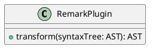

# GROWI v6.0.x へのアップグレード

v6.0 では、

::: danger
:::


## 目次

[[toc]]


## [仕様変更] Draw.io (Diagrams.net) 記法

### Before

~~~ drawio
::: drawio
3Zhdb5swFIZ/TS4XYRswuUzSr0mtVqmtejkZOASvgJHtfO3Xz+YjgdJqiaa1SbnBvD7G9vv4IJsRmeeba8nK9E7EkI2wE29G5GKEMfa9wNyssq0VhFyvVhaSx422Fx74b2hEp1GXPAbVC9RCZJqXfTESRQGR7mlMSrHuhyUi6/dasgUMhIeIZUP1mcc6rdUA071+A3yRtj0jf1LX5KwNbmaiUhaLdUcilyMyl0LoupRv5pBZ91pf6nZX79TuBiah0G80eFIgf4S/rCfYyVhowFRBI+xFIi9FYZthr3WvVaqYGxZy2+xRsugFpCndPN7dmtu0LJtuMxZBaswE2Te4HR7ezXA3cqW3ravGi9IW883CrpsxWyt3nIuQ24BZwrNsLjIhq2CSJOBHkdGVluIFOjUxnYSOY2pWIDU30G7tPO+F4pqLwsSEQmuRmwCmynp1JHwDZoizerS2HWzeNRR1JnENIgcttyakafANuQ3aZnG7Ph37vk8d6pAgoBO3rl131k3TIO0smVZjjZGLXUd7mKbQ2Ng+dvD+M+6n7xatUqDVgXTJ8XQVGZLFlJqEeYtsUl2fRRb7Y+QEJCCIBhQ5ExL0OBPHOReyqsre6VKnRjM+Vu4dxtg9nnEkFgXXYgh6ThFBV6cHmgRj10XUo9jByA1c90vk8/TeJvQ107Bm2wNpe8fTZiX/uWg6GRD3psSZeadH/C+p7RNvTAhxzaedUuoFwbkgf34w4i3Lw5gdSNw/nnhWvf9nsiyimtWBH/TCjPSzgCP/FXH3SwC/YJqFTMGBsOnxsONtwXIRh0PK1q/Z5PRymzgni3qwfW86X7FsCS113KcSLeXKWnNhd7hQxFN7nNlnk1GuuO2yqo+ZSqtg9BYXPwogTHYuQzw49Lzy2AxELGUEnc28OXgxuQA93AF2SEjIzB5j1X/7EdYNfJqcuU/uB/nUnpfP1ijvo4xC52SUNzTK/yij8DkZ5Q+Nov/HKPO4/2lT1XX+fZHLPw==
:::
~~~

### After

~~~ drawio
``` drawio
3Zhdb5swFIZ/TS4XYRswuUzSr0mtVqmtejkZOASvgJHtfO3Xz+YjgdJqiaa1SbnBvD7G9vv4IJsRmeeba8nK9E7EkI2wE29G5GKEMfa9wNyssq0VhFyvVhaSx422Fx74b2hEp1GXPAbVC9RCZJqXfTESRQGR7mlMSrHuhyUi6/dasgUMhIeIZUP1mcc6rdUA071+A3yRtj0jf1LX5KwNbmaiUhaLdUcilyMyl0LoupRv5pBZ91pf6nZX79TuBiah0G80eFIgf4S/rCfYyVhowFRBI+xFIi9FYZthr3WvVaqYGxZy2+xRsugFpCndPN7dmtu0LJtuMxZBaswE2Te4HR7ezXA3cqW3ravGi9IW883CrpsxWyt3nIuQ24BZwrNsLjIhq2CSJOBHkdGVluIFOjUxnYSOY2pWIDU30G7tPO+F4pqLwsSEQmuRmwCmynp1JHwDZoizerS2HWzeNRR1JnENIgcttyakafANuQ3aZnG7Ph37vk8d6pAgoBO3rl131k3TIO0smVZjjZGLXUd7mKbQ2Ng+dvD+M+6n7xatUqDVgXTJ8XQVGZLFlJqEeYtsUl2fRRb7Y+QEJCCIBhQ5ExL0OBPHOReyqsre6VKnRjM+Vu4dxtg9nnEkFgXXYgh6ThFBV6cHmgRj10XUo9jByA1c90vk8/TeJvQ107Bm2wNpe8fTZiX/uWg6GRD3psSZeadH/C+p7RNvTAhxzaedUuoFwbkgf34w4i3Lw5gdSNw/nnhWvf9nsiyimtWBH/TCjPSzgCP/FXH3SwC/YJqFTMGBsOnxsONtwXIRh0PK1q/Z5PRymzgni3qwfW86X7FsCS113KcSLeXKWnNhd7hQxFN7nNlnk1GuuO2yqo+ZSqtg9BYXPwogTHYuQzw49Lzy2AxELGUEnc28OXgxuQA93AF2SEjIzB5j1X/7EdYNfJqcuU/uB/nUnpfP1ijvo4xC52SUNzTK/yij8DkZ5Q+Nov/HKPO4/2lT1XX+fZHLPw==
```
~~~

## [仕様変更] PlantUML 記法

### Before

~~~ plantuml
@startuml
class RemarkPlugin {
    + transform(syntaxTree: AST): AST
}
@enduml
~~~

### After

~~~ plantuml
``` plantuml
class RemarkPlugin {
    + transform(syntaxTree: AST): AST
}
```
~~~

or

~~~ plantuml

~~~


## [仕様変更] CSV, TSV によるテーブル描画記法

### Before

~~~
::: tsv
Content Cell  Content Cell
Content Cell  Content Cell
:::
~~~

### After

~~~
``` tsv
Content Cell  Content Cell
Content Cell  Content Cell
```
~~~


## [仕様変更] 数式描画ライブラリ

[MathJax](https://www.mathjax.org/)

to

[KaTeX](https://katex.org/)


##


| Before | | After |
|:--:|:--:|:--:|
|| ⇒ ||


## アップグレード前にチェックすべきこと

- [x]
